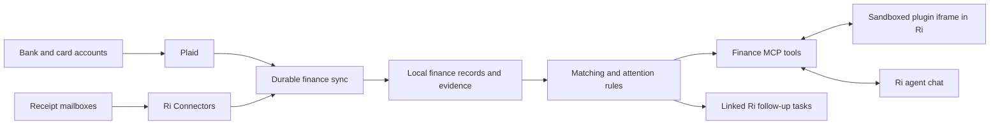

# Finances plugin proposal

Research date: October 6, 2026. Status: historical research. The later independent-app decision and implementation scope are recorded in implementation.md.

Task: `01a10e4d-2c6a-7aef-a675-73ff8e4960d8`, “Set up personal finance stuff - connect banks, email, credit cards and track spending. VISUALIZE WITH MCP PLUGIN? Test ChatGPT too.”

**Scope authority:** The task body now contains the complete specification, including budgeting as a first-release feature and agent-composed interactive views. Read that body before implementation. This earlier proposal supplies research context and does not override the task's scope.

The initial CLI failure was caused by sandbox restrictions on Ri's activity-lock file, which the CLI reported as an update in progress. Task access was restored through authorized CLI access, and the task specification was saved and verified by an exact readback. No accounts were connected, no mailbox was read, and no financial activity was tested. Source inspection and provider documentation establish feasibility, not live account coverage.

## Recommendation

Build an optional first-party **Finances** plugin in Ri with a persistent, embedded MCP Apps iframe, useful tools for the agent, and a local finance data layer. Lead with a short queue of things worth acting on. Charts support investigation.

The distinguishing workflow is a continuous connection between **purchase evidence, money movement, and follow-up**. A spending dashboard alone already exists in ChatGPT. Ri can add receipts, return deadlines, refund reconciliation, subscription evidence, and tasks that remain connected to the underlying records.

Interpret “tomorrow my emails” as “monitor my emails” on an ongoing basis. This proposal does not create a reminder for tomorrow. Assume U.S. personal accounts until confirmed. The bank/issuer list and receipt mailboxes are still needed to qualify coverage.

## What ChatGPT provides

OpenAI documents a Finances dashboard with spending, subscriptions, upcoming payments, investment and net-worth views, plus finance-specific memory. Account linking uses Plaid. Its launch article is a useful product reference, not a Ri integration contract. [OpenAI announcement](https://openai.com/index/personal-finance-chatgpt/).

The current help page lists availability for U.S. Free, Go, Plus and Pro users. Setup is **Finances → Get started → Connect with Plaid**, followed by institution sign-in and account selection. Experian credit reports are an optional, separate connection. [Current setup and availability](https://help.openai.com/en/articles/20001222-finances-in-chatgpt).

No public API for reusing ChatGPT's connected finance data was established in this research. Plan an independent Ri authorization and data store. A successful link in ChatGPT is a useful coverage test, but does not establish Ri's Plaid client access. The documented feature set also does not establish a persistent receipt-to-refund monitoring workflow.

Suggested comparison once account access is authorized: link one bank and one card in ChatGPT, inspect its subscription results and source transactions, then test a known refund. Record missing accounts, history depth, duplicate handling and whether email evidence can actually be joined. This comparison has not been run.

## Connections and setup

| Source                 | Required setup                                                                                                                                      | Role                                                                               |
| ---------------------- | --------------------------------------------------------------------------------------------------------------------------------------------------- | ---------------------------------------------------------------------------------- |
| Banks and credit cards | A Plaid developer account for this Ri installation, production access through the eligible Trial or paid plan, then Plaid Link for each institution | Transactions, account identities, balances and actual posted refunds               |
| Receipt mailboxes      | Existing Ri Google or Microsoft connection, or a new OAuth connection with read access                                                              | Orders, item details, return notices, promised refunds, renewals and cancellations |
| Merchant evidence      | Start with emails and user-supplied invoices or order pages                                                                                         | Fill gaps such as split shipments, gift-card refunds and policy terms              |
| Ri                     | Install/open the plugin and authorize its selected connections                                                                                      | Embedded UI, scheduled monitoring, agent investigation and follow-up tasks         |

Plaid's current Trial supports eligible new U.S./Canadian developers and up to 10 Items. An Item is a user's connection to an institution, potentially containing several accounts. Removing one does not replenish the trial allocation. The plan includes Transactions and several other data products, with broad but incomplete bank OAuth availability. Eligibility and terms must be checked at signup. [Trial details](https://support.plaid.com/hc/en-us/articles/39994173227159-What-is-the-Plaid-Trial-plan).

Start at [Plaid Dashboard signup](https://dashboard.plaid.com/signup). After account approval, configure the client ID and production secret through Ri's sealed credential setup. Keep Sandbox separate. Link each institution, select the intended accounts, and verify history and freshness. Credentials and MFA belong in the provider's flow, never in chat.

Request Transactions first. Add Liabilities only if APRs, statement balances and due dates become part of the agreed scope. Account/routing-number access and payment initiation are unnecessary for this workflow. Bank authentication still happens through Link. [Plaid Link](https://plaid.com/docs/link/).

Request enough transaction history to observe annual renewals, ideally 24 months where available. Plaid supports requesting up to 730 days, with actual coverage dependent on the institution. Its normal updates are periodic, commonly one to four times daily. Recurring Transactions is a separate add-on whose entitlement must be checked. The core subscription feature must also work from local transaction history and email evidence. Paid Transactions pricing is subscription based and exact rates require the developer's plan. [Transactions documentation](https://plaid.com/docs/transactions/).

For Gmail, `gmail.readonly` supplies bodies but grants broad mailbox read access. Filtering for receipts is an application rule, not a provider-enforced receipt-only permission. Public distribution has a different verification burden from a personal installation. Google documents a personal-use exception to verification. Reuse Ri's configured OAuth client where suitable. [Gmail scopes](https://developers.google.com/workspace/gmail/api/auth/scopes), [personal-use exception](https://developers.google.com/identity/protocols/oauth2/production-readiness/restricted-scope-verification).

A ChatGPT/Codex Gmail connection is not evidence that Ri already has its own usable connection. Confirm in Ri before requesting another authorization. Additional mailbox providers need their own qualified adapter. Generic IMAP is not established by the existing Gmail/Outlook code.

## The product

One plugin destination, with four compact views:

| View            | Contents and actions                                                                                                                                                                               |
| --------------- | -------------------------------------------------------------------------------------------------------------------------------------------------------------------------------------------------- |
| Needs attention | Overdue refund, unexplained deduction, renewal approaching, changed subscription price, possible duplicate, or connection requiring repair. Resolve, snooze, investigate, or create a linked task. |
| Activity        | Searchable charges and credits with receipt evidence. Spending trends, merchant/category breakdowns and transfers excluded from spending.                                                          |
| Subscriptions   | Confirmed and suspected recurring payments, cadence, next estimated charge, annualized cost, price changes and cancellation evidence.                                                              |
| Accounts        | Connected institutions and mailboxes, account coverage, last successful sync, history start, reconnect, disconnect and export/delete controls.                                                     |

A detail panel shows the complete purchase or subscription timeline. “Ask about this” supplies the selected records and evidence to the existing Ri chat. Example: “Why did I only get $96 back?” should open the $120 purchase, refund notice and $96 credit together.

The UI must distinguish no findings from incomplete coverage, failed sync, unavailable evidence and first import still running. Display “as of” dates and excluded accounts on aggregates. Keep small-screen layouts usable and make the investigation workflow keyboard accessible.

### Refunds and returns

Track orders and individual items, charges, return requests, promised refund amounts, posted credits and any later reversal or recharge. Allow several charges per order and several credits per return. Store credit and gift-card refunds are separate destinations, not missing bank credits.

Maintain two different comparisons:

1. **Purchase versus refund promise:** why is the merchant offering less than the amount allocated to the returned items?
2. **Refund promise versus settlement:** did the promised amount reach the stated destination?

Example using synthetic data: a returned item cost $120, the email promises $96 and the card receives $96. Settlement is complete. The $24 deduction remains unexplained unless order-specific evidence identifies it. If the card receives only $80, the settlement gap is another $16. Do not merge these into one inaccurate alert.

Account for tax, discounts, shipping, mixed payment methods, partial quantities, exchanges and processing delays. A disappeared pending authorization is not automatically a refund. An instant refund can later be reversed. A matching amount alone cannot prove that two records belong together.

No universal Amazon “20% after 30 days” rule was verified. Amazon's customer help pages failed to load, and accessible seller discussions are not sufficient authority for a current blanket rule. Save the actual order's return deadline and refund breakdown, link supporting evidence, and mark inferred terms as uncertain. Obtain missing order details through an explicit user-assisted lookup or import. Do not promise complete consumer Amazon order data from a seller API.

### Subscriptions and spending

Detect monthly, annual and variable recurring bills. Combine charge patterns with receipt, trial, renewal and cancellation messages. Separate confirmed subscriptions from recurring-payment candidates. Show price increases, trial deadlines and continued charges after cancellation. Spending data cannot establish whether a service is unused.

Use exact currency amounts in minor units, explicit currency codes and a defined sign convention. Preserve source IDs and corrections. Handle pending-to-posted changes, duplicate imports, transfers between owned accounts and credit-card bill payments without counting spending twice. Keep cash-flow reporting distinct from purchase spending. Do not aggregate currencies without a disclosed conversion basis.

## Plugin architecture and existing code

Package the finance UI and MCP capability as a first-party plugin with a stable launch entry. Use the standard MCP Apps resource and bridge so the UI can later be qualified in other hosts. Tools remain useful without a renderer. Hosting in ChatGPT would still require its own authentication, endpoint deployment and compatibility testing. [MCP Apps UI guidance](https://developers.openai.com/plugins/build/chatgpt-ui).

For the first Ri version, use namespaced finance tables in the Home SQLite database and the existing migration/backup lifecycle. Keep finance operations in a dedicated domain module, derive types from the central Drizzle schema, and expose them through the shared query/operation layer. This is an optional first-party plugin, not a claim that Ri already supports arbitrary downloadable backend packages. Its UI bundle is separate from the main app view tree.

| Existing foundation                                                                                                                               | What the source actually establishes                                                                                        | Work still needed                                                                                                                               |
| ------------------------------------------------------------------------------------------------------------------------------------------------- | --------------------------------------------------------------------------------------------------------------------------- | ----------------------------------------------------------------------------------------------------------------------------------------------- |
| [Plaid provider](../packages/integrations/src/providers/plaid/provider.ts) and [toolkit](../packages/integrations/src/providers/plaid/toolkit.ts) | Four account/balance/date-range transaction/item reads. Provider defaults to Sandbox. Item access tokens are action inputs. | Production configuration, Link, server-side token exchange and item credential binding, sync, reconnect and removal.                            |
| [Gmail](../packages/integrations/src/providers/google/gmail.ts) and [Outlook](../packages/integrations/src/providers/microsoft/mail.ts)           | Search/read actions and scope-aware OAuth foundation                                                                        | Finance filtering, attachment/HTML-only receipt handling, durable incremental ingestion and evidence extraction.                                |
| [Connector runtime](../src/lib/integrations/runtime.ts)                                                                                           | Sealed credentials, connection selection, scopes, approvals and revocation                                                  | Finance-specific account grants and a restricted background worker identity.                                                                    |
| [October 5 iframe evaluation](plugins-evaluation-agent-views.md)                                                                                  | Real public examples and controlled account tests, isolated iframe bridge and original-result capture                       | Persistent launch/reopen, packaged sandbox, supported lifecycle and finance view qualification. Demo state currently expires on reload/restart. |
| [Agentex types](../../code/agentex/packages/agent/src/types.ts)                                                                                   | Normalized tool result content is a string                                                                                  | Preserve structured UI results at the Ri runtime capture seam, without relying on transcript text or changing the read-only agentex reference.  |

Do not pass Plaid item tokens into model-visible tools or iframe payloads. Add account-bound finance operations that resolve sealed credentials on the server. Review the existing low-level toolkit before enabling it for this workflow, preserving established public action contracts where applicable.

The iframe gets bounded data and scoped operations. It never receives the Home bearer credential, bank tokens or a desktop bridge. Reuse isolated-origin hosting, strict CSP and source/origin validation. Bank linking opens through an explicit host-controlled setup flow so bank OAuth does not depend on running inside a nested finance iframe. Closing the UI must not stop syncing.

A minimal tool surface would cover account status, filtered transactions, purchase evidence, refund cases, recurring payments, attention items and opening the view. Review actions can confirm/reject a match, correct a category, snooze a finding and create a linked task. New public names should follow the existing action naming conventions. Retried mutations must be idempotent.

## Durable processing and privacy

Use per-connection sync cursors, durable work records, retry backoff and catch-up after restarts. A webhook is a prompt to sync, not the sole durable record of a transaction. Verify provider webhooks, deduplicate deliveries and retain scheduled catch-up for missed events. A local-only installation can poll outbound without exposing the entire Home. Monitoring runs while the Home service is available and catches up after downtime.

Plaid sync supplies added, modified and removed records. Retrieve a full update batch before applying it and advancing the cursor. Restart pagination from the original cursor on the provider's mutation-during-pagination error. Preserve any human categorization or match override when source fields change. [Plaid sync guide](https://plaid.com/docs/transactions/sync-migration/).

For email, do a bounded historical import, then incremental changes. Gmail history can expire, requiring a resync rather than silently skipping messages. Extend the existing adapter and retain stable message IDs. [Gmail synchronization](https://developers.google.com/workspace/gmail/api/guides/sync).

AI extracts candidate receipt fields and helps investigate ambiguity through Ri's subscription harness helper. Deterministic code owns totals, transaction lifecycle and settlement comparisons. Keep the evidence, extraction version and confidence with every proposed match. A correction must survive a subsequent extraction run.

Treat email content as untrusted data. Extraction has no tools for sending mail, fetching arbitrary email links, changing grants or moving money. Send the harness only relevant text and selected records. Local storage does not mean local-only inference: the configured harness provider receives those excerpts. Financial evidence should not automatically enter general embeddings, daily-deck prompts or unrelated chats.

Retain only necessary receipt evidence and selected attachments. Use Ri's generic attachment references, explicit access checks and deletion/export behavior. Define retention for source bodies, derived records and backups. Disconnect revokes future reads, stops the worker and offers a clear choice about retained history. Disabling the plugin stops its background work without silently deleting records.

Emit one stable attention item per issue, with updates as evidence arrives. Default to an in-app queue and a concise digest. Creating tasks automatically should be an explicit user preference with deduplication. Initial scope reads accounts and prepares follow-up work. Sending claims, cancelling services, disputing charges and moving money require separately authorized actions and are outside this first release.

## Delivery and acceptance

| Work package                   | Deliverable                                                                                                                                   | Acceptance                                                                                                                                   |
| ------------------------------ | --------------------------------------------------------------------------------------------------------------------------------------------- | -------------------------------------------------------------------------------------------------------------------------------------------- |
| 1. Coverage and setup          | Confirm institutions, mailbox providers, Plaid plan and OAuth setup. Compare ChatGPT with two representative connections after authorization. | Account/product coverage matrix, known history limits and actual plan costs. No claim of “all accounts” from catalog presence alone.         |
| 2. Finance foundation          | Local schema, account-bound credentials, Link, sync and import/export.                                                                        | Counts and sample totals match source statements, restart/retry causes no loss or duplicates, disconnect prevents access.                    |
| 3. Evidence and reconciliation | Receipt extraction, purchase matching, returns and subscription detection.                                                                    | All edge-case fixtures below pass, ambiguous matches enter review, each finding links to evidence.                                           |
| 4. Persistent plugin UI        | Installed/openable finance plugin, iframe views and contextual agent tools.                                                                   | Survives reload and service restart, remote/mobile work, repeated rendering never repeats an action, revoked connections stop serving data.  |
| 5. Continuous monitoring       | Catch-up jobs, attention lifecycle, digest and optional task handoff.                                                                         | Works with the iframe closed, deduplicates alerts, handles stale/disconnected sources honestly, resolves findings when new evidence arrives. |

These are stages of one complete release, not disconnected dashboard demos. They can share the existing Plugins work where it provides a production-ready seam. The uncertainty is concentrated in real institution access, missing merchant evidence and durable iframe packaging.

Required regression fixtures: pending-to-posted replacement, changed/removed transaction, sync pagination interruption, repeated webhook, reconnect, duplicate CSV, transfer/card-payment exclusion, same-amount ambiguous purchases, split charge/refund, mixed card/gift-card refund, promised-versus-posted shortfall, reversal after instant refund, annual renewal, cancellation followed by another charge, HTML-only receipt, expired mail cursor, malicious receipt text, stale UI result and cross-connection access denial. Verify backups/restore and deletion semantics with synthetic data. Live verification follows account authorization and must never use production database resets.

Do not quote a calendar delivery date until the account coverage and iframe production boundary are checked. This is several substantive engineering work packages. The personal Trial may eliminate initial bank-data fees, but does not guarantee all institutions or an indefinitely unchanged plan. Before paid rollout, confirm Plaid rates/add-ons and any public-email OAuth verification costs. Harness usage and always-on hosting are additional operating considerations.

## Review decision

Recommended first release: **bank/card spending + receipt evidence + return/refund tracking + subscription monitoring + persistent plugin iframe + Ri follow-up tasks**. Investments, credit reports, tax preparation and payment execution are separate expansions.

Still needed from the owner: institution/issuer names, receipt mailbox providers, and whether the initial deployment is just their personal Home or intended for other Ri users immediately. Default recommendation is personal use first, with the account and plugin boundaries designed to support later distribution.
