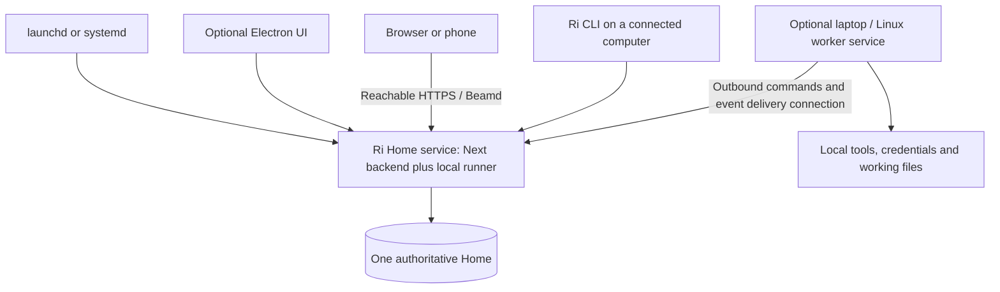

# Ri desktop, headless service, and multi-device delivery plan

Updated: 25 September 2026. This is the single desktop reference: what is built, how to run it, the research and audit evidence, the target architecture, and the remaining build and acceptance work. It consolidates and replaces the earlier desktop recommendation, demo guide, integration checklist, readiness review, final audit, and Home/worker addendum. The separate [One Ri specification](homes-spec.md) remains authoritative for Home, worker, and team semantics. This document supplies its desktop and service integration requirements.

Quick navigation: [Status](#status-and-landing-boundary), [Run the demo](#what-is-built-and-how-to-run-it), [Home and team architecture](#home-worker-service-and-team-architecture), [Open findings](#open-findings-and-implementation-requirements), [Audit coverage](#audit-verification-and-product-coverage), [Delivery plan](#delivery-sequence-and-effort), [Build checklist](#build-checklist-after-the-multi-deviceteams-work), [Acceptance](#combined-release-acceptance), [Landing checks](#landing-verification).

## Status and landing boundary

**Land this as an opt-in developer demo and implementation foundation. Do not treat landing on main as a production desktop release or a migration of the current Home.** The standard web/CLI launch commands remain the default. Desktop starts only through explicit desktop commands or the packaged app. There is no new schema migration, service registration, automatic data adoption, public callback deployment, or production cutover in this change.

The demo is deliberately separate from the existing CLI data home. It is not yet the final shared-service design. Do not point `RI_DESKTOP_ROOT` at a production Home, enable it as the phone's dependable host, or distribute the unsigned bundle as a supported release. Immediate quit can lose pending edits, desktop-hosted remote OAuth is incomplete, and closing the GUI stops its backend. The full security and durability findings below remain open unless explicitly marked otherwise.

Landing order: preserve this foundation on main, finish and land the existing multi-device/teams work against its own contract, then implement the combined service/desktop release work here. Integrate with the existing Home role, worker protocol and P5.4 companion layer. Do not create a competing service/identity architecture. Shared web security defects can be fixed independently and need not wait for packaging. Landing this branch does not mark any Homes phase complete.

The reviewed desktop source began at `dc318c5` on `ai-task-manager/session-ca52f4`. The related multi-machine implementation was reviewed at `183391a` on `ai-task-manager/session-e4aa22`. Landing preparation also adopts its `@agentex/workspace` 0.0.5 dependency fix and repairs a pre-existing connector-test typecheck error. Its results are identified separately from tests run here. These are dated snapshots, not claims about the future state of either branch.

## Framework decision and delivered assets

Keep **Electron**. The existing application depends on Next request-time routes, ordinary Node, SQLite/vector native modules, PTYs, harness subprocesses, and streaming. Electron gives it a consistent Chromium UI and a TypeScript shell. Next.js alone does not require Electron.

Tauri's strongest benefit would be avoiding bundled Chromium and using the OS webview, potentially reducing shell size and resource use. It would still need this Node backend as a sidecar, or a substantial backend rewrite. It introduces WebKit/WebView differences across systems. A static Next export would remove required server functionality. There is no measured whole-app memory or performance win here, and switching shells would not fix the audit findings. [Tauri Node sidecars](https://v2.tauri.app/learn/sidecar-nodejs/), [Next integration](https://v2.tauri.app/start/frontend/nextjs/), [WebView versions](https://v2.tauri.app/reference/webview-versions/), [Electron process model](https://www.electronjs.org/docs/latest/tutorial/process-model).

The implementation keeps one React/Next application and its query layer. Electron owns the window, menus, narrow native bridge and demo backend lifetime. A separately bundled ordinary Node runs the backend, so SQLite/vector/PTY modules use that Node ABI rather than Electron's ABI. The current packager stages production dependencies and Next output explicitly. It does not depend on a static export or require a Rust backend.

Branding is already on main. [The asset guide](../assets/brand/README.md) and [preview](../assets/brand/preview.png) cover the supplied logo's path-based SVG trace, tightly cropped mark with no square image padding, color variants, browser/touch assets, and desktop icon sizes including ICNS/ICO. Runtime assets live in `public/brand`, and source/packaging assets live in `assets/brand`. The mark is used sparingly in onboarding and desktop startup. No website-style branding expansion is required.

## What is built and how to run it

### Run from this checkout

Building from source requires pnpm and Node 22.12 or later for the pinned Electron tooling. The dependency build allowlist includes Electron's runtime download. End users of the packaged app need neither Node nor pnpm.

```sh
pnpm desktop:demo                       # Build the shell and production Next, then open
node desktop/launch.mjs --skip-build     # Reopen the current build
pnpm desktop:dev                        # Development server with hot reload
```

These commands must run in the worktree containing `desktop/`. Source runs default to `.electron-demo/home`. An explicit `RI_DESKTOP_ROOT` chooses another desktop home. Other database/config/work path overrides are cleared, so the normal CLI home is not silently inherited.

The server prefers `https://localhost:42242`, choosing a free port if occupied. It uses `.next-desktop` or `.next-desktop-dev`, separate from ordinary web development. The existing authentication cookie is established before the page loads. The renderer has no Node access and receives only a platform string and an origin-checked system-browser opener through preload.

### Standalone macOS app

```sh
pnpm desktop:package
# Output: release/Ri-darwin-arm64/Ri.app
```

The first package target is macOS arm64. The app carries Electron, an official portable Node distribution matching the build machine's Node version, production dependencies, Next output, matching Ri CLI, migrations, icons, and shipped skills. Node downloads are checked against the official SHA-256 checksum. All packaged dependency links are rebased and checked to resolve inside the bundle before the temporary build folder is removed. SQLite, sqlite-vec, node-pty, and the CLI are checked during packaging. pnpm deploy creates a self-contained dependency tree without copying local `.env` files or data homes. File-tracing reports and build caches are excluded.

Move `Ri.app` to its lasting location before installing the optional terminal command. A source checkout, pnpm, and a system Node installation are not needed to run the package. Harness executables and their account logins remain user-provided, as in the CLI app. Docker STT is still optional and is not included. This development package keeps the complete production dependency tree. The audited bundle measured approximately 2.1 GiB with `du`, before speech models.

The packaged app defaults to `~/Library/Application Support/Ri/home`. `RI_DESKTOP_ROOT` can select an existing desktop demo home when launching the app executable from a terminal. The CLI's normal home and any separately running CLI instance remain separate. Closing the last window or choosing Quit stops the backend owned by the desktop app.

This is a local unsigned build. Public distribution still needs developer signing, notarization, an update policy, and validation on the additional operating systems/architectures you intend to support.

### Matching CLI and agent setup

The app includes its matching `dist/cli/index.mjs` and Node executable. App-generated harness instructions name those exact paths and the desktop data root. Database migrations resolve from the bundled server even when an agent invokes the CLI from another folder.

Use **Tools > Install Terminal Command…** to install an optional command. The suggested name is `ri-desktop` in `~/.local/bin`. You can choose another location or name, including `ri`, if it is free. An existing file or symlink is never overwritten. Add the chosen directory to PATH if needed. **Tools > Remove Terminal Command…** removes only the exact command this app installed. Reinstall it after moving the app. The command uses this desktop home's data, so ordinary `ri` continues to target its existing installation.

Desktop onboarding installs shipped skills only inside the desktop home. The global skill setting is disabled in the desktop UI, and that API cannot install/remove global skills or clean other project links in desktop mode. Existing global harness logins and executables are still shared system resources.

### Connector sign-in

From Connectors, sign-in opens the system browser. Native clients supporting PKCE receive a temporary `http://127.0.0.1:<port>/oauth/callback` listener. This is the standard native OAuth loopback pattern and needs no certificate or OS trust change. State and PKCE are checked, states are single-use, and waiting listeners expire after ten minutes. A new attempt replaces the previous waiting attempt for that provider. Cancel is available in the connector screen.

The callback exchanges the code server-side and saves credentials through the existing encrypted store. An authenticated event stream informs Electron, which restores/focuses the window and returns to the connector screen. The system browser does not need the app's cookie. OAuth-protected MCP servers use the same return mechanism, dynamic client registration, and their own persisted single-use state.

OAuth clients still need to be registered with each provider. No provider client IDs or secrets are invented or bundled by this change. For native clients, use a desktop/native registration that supports loopback redirects with dynamic ports. The Advanced setup panel explains the required callback for each provider. A return relay is implemented for fixed HTTPS redirects, as described below. This is not proof that every provider permits that client/deployment configuration. An OAuth process interrupted by quitting the app must be started again.

### Hosted HTTPS callback relay

`desktop/relay/server.mjs` is a dependency-free, stateless callback landing page. `desktop/relay/Dockerfile` can deploy it behind an HTTPS-capable container host. It receives an authorization code and state and renders an **Open Ri** link using the registered `ri://oauth/callback` protocol. It never accepts an arbitrary destination, stores credentials, or exchanges provider tokens. The desktop app validates the state before exchange. Replayed, expired, foreign-instance, or malformed callbacks are rejected.

```sh
pnpm desktop:relay
# Local health check: http://127.0.0.1:8080/health
# Build a deployment image:
docker build -t ri-oauth-relay desktop/relay
```

Deploy the container with HTTPS termination and register `https://YOUR-DOMAIN/oauth/callback` with the provider's OAuth app. Disable query-string logging at the hosting/CDN layer because callbacks carry short-lived authorization codes. There is no database or provider client secret to configure on the relay.

Bake the public address into a desktop build, or set these variables when launching its executable:

```sh
RI_DESKTOP_OAUTH_RELAY_URL=https://YOUR-DOMAIN/oauth/callback pnpm desktop:package
```

The demo routes providers without PKCE through the hosted return page. Production still needs provider-specific client registration and policy validation. A relay alone does not make a desktop app a confidential client. Some providers require a hosted token exchange, while others permit a user-owned client configuration. To force selected PKCE providers through the relay, set `RI_DESKTOP_OAUTH_RELAY_PROVIDERS=google,microsoft` (use `mcp` for all OAuth MCP servers). Register matching callback URLs with those clients. Client secrets belong in the app's encrypted BYO configuration, never in a distributed desktop binary or relay.

The source demo deliberately does not claim the `ri://` system handler. Test relay returns with the packaged app, whose Info.plist declares the scheme. Use one installed Ri app per OS protocol registration.

The service and deployment files are ready, but no public relay has been published. A domain and hosting target must be supplied first.

### Webhooks and HTTP/2

OAuth callbacks and webhooks have different reachability requirements. OAuth returns through a browser on your machine. Remote webhook senders cannot reach a loopback address. Use the existing Remote Access/tunnel settings for incoming webhooks. The existing optional auto-tunnel boot behavior is retained. The callback relay does not proxy webhooks or expose the local app.

Electron trusts only the generated localhost leaf certificate inside its dedicated session. Other hosts retain Chromium's standard verification. The app does not install an OS certificate or disable TLS verification. Permission grants and main-window navigation also require the exact app origin, including the port.

The connection is `Electron → HTTPS/HTTP2 gateway → HTTP/1.1 Next server`. HTTP/2 lets concurrent streams share a connection with ordinary requests. It does not remove React work, database latency, or harness latency. An ordinary browser still applies its own trust rules to the local HTTPS URL.

### Window and shortcuts

On macOS, `hiddenInset` removes the separate title strip while preserving the native close/minimize/zoom controls. The top HUD provides the drag region and leaves room for those controls. Interactive controls opt out of dragging. Onboarding and other full pages get a small fallback drag region. Web-only rendering keeps its normal layout.

Existing application hotkeys and the standard Electron editing/window menus remain in place. External HTTP/HTTPS links open in the system browser. There is no new global OS hotkey registration.

### Code footprint and isolation

Most new code is in `desktop/`: launcher, backend process, certificate policy, preload, OAuth event handling, CLI installer, packager, relay and probes. Shared changes add connector/MCP initiation and state validation, desktop-only authenticated API endpoints, skill/onboarding isolation, drag regions, and packaged migration-resource lookup. The task/note domain model and database schema remain unchanged.

The initial audit counted 22 modified shared `src/` files, 226 added and 94 removed lines, excluding new files and build configuration. This is a historical size reference, not the total final diff. The release work will also touch shared attachment/auth boundaries, editor save lifecycle, OAuth initiation, voice configuration, and remote-client behavior. It cannot all be implemented inside a window wrapper.

Desktop endpoint handlers return 404 when desktop mode is off. The renderer remains sandboxed with Node integration off, context isolation on, and no webview tag. The native opener verifies the sender, main frame, app origin and allowed HTTP(S) scheme. Electron's embedded Chromium does not replace the separately discovered agent automation browser.

## Home, worker, service and team architecture

**The related work is identifiable.** Ri's recent activity reports “Implement Homes Spec Clarifications,” session `01a0d523-f451-7690-828a-e4aa221862b3`, on `ai-task-manager/session-e4aa22`. Its worktree is `../ai-task-manager-e4aa22` relative to this worktree. At inspection it was clean at `183391a`, tracking its origin branch. The latest session message reports the P2 review fixes pushed at that commit. Ri has no associated PR number recorded, and searches of the two configured GitHub repositories did not find a matching PR.

The main-branch contract is [docs/homes-spec.md at 200fb36](https://github.com/treyhuffine/ai-task-manager/blob/200fb36/docs/homes-spec.md). The local main checkout was `c42e77d` at that review. The implementation's [build notes](https://github.com/treyhuffine/ai-task-manager/blob/183391abead0ef42469ec5a199f1c39042b16691/docs/homes-build.md) and [updated checklist](https://github.com/treyhuffine/ai-task-manager/blob/183391abead0ef42469ec5a199f1c39042b16691/docs/homes-spec.md) give the phase status.

| Work in the Homes branch | Observed state |
| --- | --- |
| P0 and P1 | Marked complete: isolated development, recovery tools, stable Home/computer identity, connected installations, CLI routing and machine-local setup files |
| P2.1-P2.6 | Implemented: runner separation, enrollment, outbound connection, durable commands/events, placement routing, input attachments and actor/permission checks, plus review fixes |
| P2.7-P2.9 | Still unchecked: remaining environment/persona/remote session integration, complete outage/crash acceptance and selected terminal history import |
| P3/P4 | Still unchecked: complete location/delivery UI and explicit Git-based continuation |
| P5.4 | Still unchecked: packaged companion, start at login, reconnect/update and local stop controls |
| Reported verification | Build notes report 2,536 tests passing on the branch, real MacBook/iPhone gate-A checks, and later real-harness tests using a stand-in worker on the Mini. I did not rerun or independently certify those results. |

One phase caveat matters: P2.5 has working input-attachment materialization, but its notes explicitly defer a retained-output artifact producer/upload until a producer is integrated. A checked phase should not be read as evidence that every future artifact flow already exists.

**Your proposed model matches the specification.** A Home is a role, not necessarily another physical computer or a cloud account. One Mac can be the Home, run executions and show the desktop UI. Later, a Mac Mini or Linux server can be the Home while a laptop is a connected viewer and optional worker.

| Responsibility | Where it belongs |
| --- | --- |
| Canonical tasks, notes, agent identities, Ri conversations, execution records, schedules, deck and personal orchestration | Home |
| Harness process, working files, native session history, tools and local credentials | Computer owning that execution |
| Windows, navigation, focus and unsent UI drafts | Viewing surface |
| Restarting background processes after failure or login/boot | Operating-system service manager |

New executions should normally use the Home when it has the required setup, while respecting an explicitly saved agent default or one-off selection. Scheduled new executions stay on the Home in the current contract. Existing replies and controls always follow their execution's owner. Opening an execution on the laptop does not move it. A remote worker receives defined operations over an outbound authenticated SSE/HTTP connection and does not need an inbound network listener.



**Yes, the server can run with no GUI open. That should be the normal always-on mode.** Keeping the existing app open is sufficient only while its process and backend remain healthy and the computer stays awake. A hidden window or menu bar process can extend that lifetime, but does not provide independent service supervision. In the current desktop demo, quitting Electron stops its child backend.

Use the same installed runtime from both UI and CLI. The CLI is a way to install, inspect, start, stop and diagnose the service, not another authority or daemon alongside it. On a Home machine, one supervised service owns the backend and its child processes. On an enrolled remote execution machine, one supervised worker owns its local harnesses and journals. A viewing-only installation needs neither a local database nor a worker.

The branch already has the long-running `ri worker run` entry point and its shutdown behavior. Its connected `ri start` checks/opens the saved Home address. Inspecting the function body shows that it does not yet start a supervised worker, despite a forward-looking comment. Neither branch currently implements a Home/worker service installer for launchd or systemd.

A proposed shared management surface could be `ri service install`, `status`, `start`, `stop`, `logs` and `uninstall`, with the installation's Home/worker role resolved explicitly. These are proposed commands, not commands available today. The GUI should invoke the same lifecycle layer. Ordinary window close and Quit Desktop must not silently mean Stop Home. Stopping local execution on a worker must not stop the Home or executions on other computers.

**Mac and Linux need different service adapters, with the same Node runtime and protocol.**

| Target | Recommended service arrangement | Availability boundary |
| --- | --- | --- |
| Mac laptop or logged-in Mini | Per-user launchd agent, installed/managed through the supported macOS service-management mechanism | Survives GUI closure and screen lock while the machine is awake. Starts at login and ends at logout. |
| Mac required to serve before GUI login | A separately designed system launchd daemon, running under an appropriate non-root service identity | Must validate data access, credentials and every headless dependency. It cannot assume the logged-in user's GUI or unlocked login keychain. Disk-unlock requirements still apply. |
| Linux desktop worker | systemd user service | Normally tied to the user's service-manager lifetime. Enable lingering when operation after logout and at boot is intentional. |
| Linux always-on Home | systemd system unit with an unprivileged `User=`, or a dedicated user service with lingering | Can start at boot independently of the desktop session, provided storage, network and credentials are available. |

Apple documents the distinction between login-session agents and boot-time daemons. systemd documents lingering as starting the user manager at boot and retaining it after logout. Configure bounded crash restarts and graceful termination, rather than assuming that merely backgrounding a process provides recovery. [Apple launchd lifecycle](https://developer.apple.com/library/archive/documentation/MacOSX/Conceptual/BPSystemStartup/Chapters/CreatingLaunchdJobs.html), [SMAppService](https://developer.apple.com/documentation/servicemanagement/smappservice), [systemd lingering](https://www.freedesktop.org/software/systemd/man/252/loginctl.html), [systemd service behavior](https://manpages.debian.org/trixie/systemd/systemd.service.5.en.html).

Prefer the logged-in Mini for your near-term setup because it already has your Mac tools and accounts. Locking the screen is compatible with this model. If unattended availability immediately after reboot and without a GUI login is a firm requirement, a Linux Home is the simpler target to qualify. Some GUI automation and account integrations may still need a logged-in Mac worker. This is a deployment recommendation, not a claim that the Linux build has passed acceptance.

**“Always accessible” requires more than a daemon.**

| Event | Intended result |
| --- | --- |
| Close/quit desktop UI | Home continues, phone and workers remain connected |
| Desktop renderer crash | Backend unaffected, drafts recoverable |
| Home service crash | OS restarts it, journals reconcile, no automatic duplicate turn |
| Laptop worker disconnects | Home and Home-owned executions remain available. Laptop work is unavailable, not reassigned. |
| Home temporarily disconnects | An already-dispatched remote turn may finish under its existing permissions and journal output. No new turns or approvals until authority is revalidated. |
| Home sleeps, loses power, storage or its network | Phone and new Home operations are unavailable, regardless of GUI or service configuration |
| Home restarts | Verify one owner, data/migrations, credentials, stable address/tunnel, then resume service according to the existing recovery contract |

Keep the chosen Home powered and prevent system sleep when hosting, while allowing its display to sleep. Maintain a reachable HTTPS address, tunnel reconnection, verified destination ownership, health checks and visible failure reporting. Test reboot and encrypted-disk recovery. FileVault prevents automatic login, so do not equate “start at login” with “available after every reboot without intervention.” There is no need to disable disk encryption to close the app window. [Apple sleep settings](https://support.apple.com/en-bw/guide/mac-help/mchle41a6ccd/mac), [automatic login constraints](https://support.apple.com/en-au/102316).

For outages where power/internet availability matters, a UPS and a stable host/network can improve uptime. They do not turn a single Home into high availability. The spec deliberately excludes replicated personal databases and automatic authority election. Adding a Mini as a worker does not make a laptop-hosted Home available while the laptop sleeps. Deliberately relocate the Home to the always-on computer instead. Any future failover design would need data replication, authority fencing and recovery beyond this scope.

**The main desktop integration changes are now clearer.**

1. **Resolve the installation role before booting anything.** `desktop/backend.ts` currently always initializes the local token/database and starts Next. The Homes branch guards connected installations against opening a database. Electron must use that guard and present Start using Ri or Connect to existing Ri on first run. It must not silently create a second personal Home when the remote one is unreachable.
2. **Attach to a verified service.** Replace the demo's “reject an existing backend” behavior with discovery plus a Home ID, root, owner and version handshake. An occupied port or responding health endpoint alone is insufficient. UI close must not send the service's stop command.
3. **Separate local UI capability from backend role.** The same Home can serve Electron, phone, browsers and worker API calls simultaneously. `RI_DESKTOP` cannot decide every OAuth callback or authorize machine-local opening. Reuse the Homes branch's explicit local association and scoped credentials. Do not infer “This Mac” from localhost or a claimed header.
4. **Keep remote Home trust distinct from the local gateway pin.** Remote clients and workers use the existing reachable HTTPS address and normal HTTPS trust. Keep the existing Electron-local certificate mechanism confined to that local connection. Do not introduce a new cross-machine certificate-pinning enrollment system, which the Homes spec explicitly excludes for this build.
5. **Keep local actions local and execution actions owner-routed.** Opening an editor on the laptop belongs to its authenticated companion. Files/diffs and execution controls follow placement. A worker's localhost preview URL is not usable on a phone. Reuse the planned P3 owner routing and existing preview providers.
6. **Make service builds independent of Electron.** Ship a headless Home/worker runtime for Mac and Linux with ordinary Node, migrations/assets, native SQLite/vector/PTY modules and needed CLI resources. Electron is optional. The current package script only supports macOS arm64. Qualify Linux x64 first and arm64 where required, with explicit distro/runtime support. Verify clean installs without a source checkout, pnpm, shell profile or graphical display. Electron's own headless testing needs display infrastructure, which the core server should not require. [Electron headless documentation](https://www.electronjs.org/docs/latest/tutorial/testing-on-headless-ci).
7. **Coordinate versions, ownership and shutdown.** Preserve the existing worker protocol checks, journals, placement generations and uncertain-delivery rules. A service restart must not create duplicate workers or replay an ambiguous send. Drain/stop only owned processes on update. Supply a real release version directly: the current worker version helper falls back to `dev` when a service is not launched with `npm_package_version`.
8. **Place voice and credentials deliberately.** For the first release, put managed speech on the Home, so desktop and phone use the same transcription route. Workers retain their own harness credentials and toolchains. Account for service PATH, home directory and headless key access on both OSes. Do not copy user login credentials as part of execution continuation.

**Some previous audit work is already covered by this branch and should not be rebuilt.** The Homes branch uses `@agentex/workspace` 0.0.5, which fixes the relative Git metadata bug behind the eight tests that failed in the desktop worktree. It also adds a checksummed full-Home backup/verify/restore implementation covering attachments and portable configuration. Reuse that for desktop updates and migration, while retaining its explicit inventory of excluded machine-local material and unpublished work.

The branch adds stable identities, stronger role/credential boundaries, stopped recovery behavior, routing and worker crash handling. Those reduce the desktop work remaining. They do not fix the reproduced SVG-document execution, last-edit-on-quit loss, renderer origin changes, desktop OAuth selection, or package signing and update integration. The service and companion work belongs with the already planned P5.4, not a competing desktop architecture.

Merge integration must preserve both branches' changes to startup, database initialization, onboarding, proxy authentication, Next/package configuration and shared assets. The earlier desktop estimate cannot simply be added to the whole Homes estimate, because substantial recovery, identity and routing work overlaps. Finish and qualify the existing P2/P3 contracts, integrate the service/desktop layer once, then run the combined acceptance matrix.

**The critical combined acceptance tests are:** close the GUI with Home and worker executions running, reopen without creating another process or database, crash/restart each component independently, reconnect a sleeping worker without reassignment, preserve drafts through Home unavailability, verify remote callbacks from a phone, and test login/logout/reboot behavior on a real Mac and a real Linux host. Repeat cross-OS in both directions where supported. Upgrade mismatched versions deliberately and rehearse recovery from a backup without booting two copies of the Home identity.

### One runtime, two installation paths

The Electron download should contain the same pinned Node runtime, server and optional CLI as the headless distribution. A Mini owner can choose “Use this computer as my Home” in onboarding, install the background service, and never download a separate CLI. Installing a terminal shortcut is optional. CLI and GUI management call the same lifecycle layer and verify the same Home/root/service/version. They must not start duplicate backends or synchronize two local databases.

An existing CLI-owned Home must be discovered and adopted deliberately, preserving its identity, files and recovery policy. A fresh connected desktop must not create an empty Home on first launch or during a remote outage. A Home also runs its own execution runner in-process. Other computers enroll an optional worker only when they should execute work locally. A viewer alone needs neither a worker nor a local personal database.

On a cloud Linux machine, install and configure over SSH with no Electron or graphical display. The headless installer supplies the ordinary Node runtime and native dependencies, then configures the service manager. A browser or connected desktop on another device handles the UI. Some browser automation and platform tools require additional dependencies or a logged-in Mac worker. This is a target distribution, not a Linux package certified by the current macOS demo.

### Teams must preserve separate authority

The desktop follows [Homes spec sections 9 and 10 and phases P6/P7](homes-spec.md). A team space is its own authority and data root with member-bound credentials. Never convert a private Home into a team by flipping a flag, and never give a team renderer the personal Home's owner token or native capabilities.

A teammate can use a browser or phone without a personal Home, worker, repository, harness or model subscription. The initial team product offers ordinary tasks, notes, keyword search, attachments, attribution and invitations with AI disabled at execution boundaries, even if an API key is present. Team membership and incoming content cannot authorize personal execution. Team-hosted agents are outside the initial contract.

Electron must maintain clear connection/space identity and credential/cache separation when presenting personal and team surfaces. Enforce authorization on every API, orchestrator action and attachment, not only in navigation. Opening a team on a phone does not navigate the laptop or change execution ownership. Personal planning may project assigned team obligations, with private overlays remaining personal.

Shared-body autosave requires content revisions, ordered writes, retained drafts and explicit conflict resolution. A stale write must stop autosave rather than silently replace focused text or retry against a new revision. A save-on-quit implementation must preserve this contract. Publish only a deliberately selected result and audience, never a full private transcript or automatic task completion merely because an execution ended. Connector administration and credentials remain scoped to the relevant authority, including after membership revocation.

### Authorization across desktop, phone and headless Home

| Initiating surface | Intended browser and return path |
| --- | --- |
| Electron attached to a service on the same computer | System browser with supported native-client PKCE/loopback, or a validated registered HTTPS flow |
| Phone/browser or Electron attached to a remote Home | Browser on the user's device, registered reachable HTTPS callback to the Home, server-side code exchange and storage |
| SSH/terminal setup on a headless Home | A browser link opened on another device, or provider-supported device authorization. No GUI browser on the server is required for these flows |
| Harness execution on a worker | Provider-supported authentication on that execution machine, independently of connector OAuth. Do not replicate Home credentials indiscriminately |

Use one initiation service for settings, reconnect, expired credentials, tool-generated links and incremental consent. Persist the initiating surface, provider/client and validated return target with state, PKCE, expiry and single-use completion. Public/native registrations, provider-specific redirect rules and confidential clients are different cases. A fixed hosted exchange may be required for particular providers. Device authorization exists only where the provider supports it, and human browser consent can still be required. [Native OAuth](https://www.rfc-editor.org/rfc/rfc8252), [device authorization](https://www.rfc-editor.org/rfc/rfc8628), [server-side browser authorization](https://developers.google.com/identity/protocols/oauth2/web-server).

Do not promise all existing flows already work. The current Claude login route launches a command expecting a browser on the server, and desktop callback selection is backend-wide. These need explicit headless and cross-device paths. Real provider consent, account switching, refresh, scope escalation, revocation, cancellation, simultaneous flows and restart recovery are release acceptance, not inferred from mock tests.

## Open findings and implementation requirements

The audit inventoried **252 API route files**, traced the desktop-sensitive subsystems, ran all three JavaScript test suites, checked both TypeScript projects, inspected packaging and upstream documentation, and exercised the real packaged application. This is broad architectural, code, and targeted runtime coverage. It is not a claim that every route, provider account, operating system, accessibility interaction, or failure condition has passed end-to-end certification. The coverage table below identifies those limits.

**The most consequential findings are below.** P1 means resolve before depending on the affected capability or distributing the beta. P2 means required hardening or feature completion, with the stated conditions. “Runtime” means reproduced locally. “Code” means established by the implementation. “External validation” identifies what was not exercised.

| ID | Priority | Finding | Evidence and scope |
| --- | --- | --- | --- |
| F01 | P1 | Uploaded SVG documents can execute authenticated JavaScript | Runtime. Shared web-app defect, also present in Electron. |
| F02 | P1 | Quitting immediately after editing loses the latest text | Runtime. Shared save debounce plus desktop shutdown behavior. |
| F03 | P1 | Closing the last window stops the backend and all services it hosts | Code and existing shutdown smoke. Desktop lifecycle limitation. |
| F04 | P1 | A phone connected to the desktop backend receives desktop OAuth callbacks | Code. Desktop integration regression for remote clients. |
| F05 | P1 | Tool-generated reconnect and extra-consent links bypass desktop OAuth initiation | Code. Connector integration gap. |
| F06 | P1 | Fallback port changes separate drafts and preferences into another browser origin | Runtime. Desktop storage reliability defect. |
| F07 | P1 for phone hosting | Tunnel reuse does not establish ownership of the correct backend port | Code. Actual Beamd collision/rebind behavior still needs a live test. |
| F08 | P1 for distribution | The bundle is unsigned, with no managed release/update/recovery pipeline | Code. Current target is macOS arm64 only. |
| F09 | P1 for a clean-machine beta | Bundling Ri's CLI does not make installed harnesses and prerequisites reliably discoverable | Code. Real Finder-launched harness sessions remain unverified. |
| F10 | P1 before promising local voice | The package cannot install or independently manage its current Parakeet sidecar | Code. Existing external STT may be reused. |
| F11 | P1 before public hosting | A public webhook buffers its body before enforcing its size limit or checking credentials | Code. Shared server defect. |
| F12 | P2 | Cookie authentication lacks an independent cross-origin mutation defense | Runtime under an explicitly trusted HTTPS-preview fixture. The default HTTP-preview probe did not succeed. |
| F13 | P2, required for safe updates | Existing snapshots are not a complete recoverable app-home backup | Code. Attachments, configuration, encryption keys, and in-progress work need a recovery policy. |
| F14 | P2 | Native permissions, notifications, file dialogs, and lifecycle UX need completion | Code plus limited capability probes. Several clean-machine OS interactions remain untested. |
| F15 | P1 release gate, partly resolved during landing | The repository's complete validation is not green | The eight Git tests and connector typecheck are fixed in the landing changes. Broad source lint still has existing errors. See the fresh results below. |

**F01: opening an uploaded SVG grants it the app's web authority.** [The MIME allowlist](../src/lib/attachments/mime.ts) accepts SVG at line 55. [The attachment route](../src/app/api/attachments/[fileName]/route.ts), lines 57-69, serves it inline as `image/svg+xml`, without a document sandbox or restrictive CSP. In the packaged app the probe uploaded a benign SVG, navigated to its attachment URL, and observed its script run. The script then fetched `/api/user-state` successfully with status 200.

An image rendered through an ordinary `` is a different case. The confirmed problem requires loading the SVG as an active document, such as opening its URL. Electron's same-origin navigation policy permits that URL. This is not an Electron sandbox escape and does not require Node integration. The app already exposes powerful authenticated server operations, so same-origin script execution is serious on its own.

Fix the attachment document boundary: sandbox active formats on delivery, use safe download disposition where appropriate, and/or serve untrusted documents from an origin without Ri credentials. Add `nosniff` and a deliberate application CSP as defense in depth. Verify thumbnails, previews, downloads, and SVG-document navigation separately. Keep the current narrow preload and renderer sandbox. [Electron security guidance](https://www.electronjs.org/docs/latest/tutorial/security).

**F02: the last edit can disappear on quit.** [The full-page note editor](../src/app/note/[id]/page.tsx), lines 51-80, delays writes by 500 ms. Comparable task and slideout paths also debounce writes. [Desktop shutdown](../desktop/main.ts), lines 88-103, destroys the window before stopping the backend. It does not await a renderer save handshake.

The final probe first saved and independently read back `Audit persisted control`. It then entered `Audit last keystrokes before quit` and quit. Shutdown completed in roughly 107 ms. On relaunch, the saved title remained `Audit persisted control`. The final edit never produced a PATCH request. This was a real editor interaction, not a simulated timer unit test.

Implement a coordinated close/quit/update path that flushes pending document changes and waits for acknowledged writes. Persist drafts durably enough to survive renderer failure. React unmount cleanup alone is insufficient when the renderer is destroyed. Existing chat drafts do flush on React unmount, but their final pending debounce is still not guaranteed to run on process destruction. Add regression coverage for note/task titles and bodies, chat drafts, navigation, window close, Cmd+Q, and updates.

**F03: the desktop starts the backend, but does not eliminate its lifetime requirement.** [The main process](../desktop/main.ts) quits on `window-all-closed`. [The backend](../desktop/backend.ts) also shuts down when its parent IPC connection disappears. There is no background-service attachment mode, menu bar lifetime, launch-at-login management, automatic backend restart, or coordinated sleep/wake handling yet.

That backend owns more than HTTP pages. [Instrumentation](../instrumentation.ts) starts the markdown mirror, session reconciliation and health sweeps, preview maintenance, calendar integration, tunnel keepalive, and scheduling for deck, heartbeat, and stream work. Stopping it removes phone access and webhook intake and interrupts server-managed work. PTYs are process-local. Preview teardown has explicit shutdown hooks. The separately launched agent browser can outlive Ri, so it needs a distinct ownership policy.

The scheduler already has locking and recovery, but its [documented at-most-once dispatch](../src/lib/scheduler/runner.ts) advances the next slot before dispatch. A crash in that gap loses the slot. Previously running jobs are reaped on startup. Do not promise uninterrupted execution or automatic replay of every missed schedule. Define catch-up, retry, and idempotency policy before adding automatic restarts.

**F04 and F05: callback selection must be per initiating client and common to every authorization path.** [Connector connect](../src/app/api/connectors/connect/route.ts), line 31, and [MCP initiation](../src/lib/connectors/mcp-authorization.ts), line 19, select the desktop flow using the backend-wide `RI_DESKTOP` flag. [The normal connector callback](../src/app/api/connectors/callback/route.ts) returns 404 in that mode. A phone using this backend therefore gets a loopback or custom-scheme return intended for the Mac. The phone's `127.0.0.1` is the phone, not the Mac.

Separately, [the connector engine](../packages/connectors/src/core/runtime.ts) constructs `auth_required` and `needs_consent` URLs internally from stored client configuration. Those paths do not arm the desktop callback manager used by the Settings connect action. Explicit connection smoke coverage does not establish that reconnect or extra scopes work.

Use one authorization initiation service for settings, tools, expired credentials, and incremental consent. Record the initiating surface and validated return destination with the flow. Local desktop clients can use public/native-client PKCE loopback flows. Remote browsers need a registered public HTTPS callback reaching the authoritative backend. Preserve state, expiry, single use, PKCE, issuer/provider validation, and safe return-path handling. Test multiple simultaneous flows, denial, expiry, revocation, app restart, and callback delivery to the wrong app instance.

The included relay is a return bridge, not a confidential token-exchange service. Shipping a common client secret inside a desktop bundle does not keep it confidential. Some providers need a supported native client registration or a hosted confidential exchange. Production and development should also have distinct protocol identities instead of competing for `ri://`. [OAuth for native apps, RFC 8252](https://www.rfc-editor.org/rfc/rfc8252).

**F06: the renderer needs a stable identity independent of an available port.** [Backend startup](../desktop/backend.ts), lines 49-59, tries port 42242 and falls back to a random port. Electron keeps the same disk profile, but browser storage remains scoped to the origin, including the port.

The probe wrote a localStorage marker, quit, reserved that fixture's old port, and relaunched. The origin changed from `https://localhost:50363` to `https://localhost:50419`. The marker was unavailable at the new origin. Database records remained available. This is apparent loss of origin-bound drafts/preferences, not evidence that SQLite was erased. Returning to the old origin could reveal the old storage again.

Persist a stable endpoint per home and handle collisions deliberately, or move durable drafts/settings into home-scoped storage with an explicit migration path. A custom application protocol is another possible design, but requires testing Next routing, streaming, cookies, and secure-context behavior. Do not introduce it merely to hide a port without validating those features.

**F07: app tunnels and preview tunnels need destination ownership checks.** [The app tunnel keepalive](../src/lib/auth/auto-tunnel.ts), line 66 onward, checks name and health without verifying that the tunnel targets this backend. [The preview Beamd provider](../src/lib/preview/providers/beamd.ts) also reuses an existing name without checking its port. CLI and desktop can share a Beamd account and the default production tunnel name while owning different homes. The desktop's private Next port changes on restart.

Give each authoritative home a stable identity and tunnel name, validate target host/port, and record ownership before adopting or closing a tunnel. Test two homes, both launch orders, restart with a new upstream port, stale processes, account changes, and reconnect. This review did not open, rebind, or close the user's live Beamd tunnels.

**F08 and F09: the successful package is not yet a complete installation.** [Packaging](../desktop/package.mjs) bundles Electron, production Next assets, ordinary Node, SQLite/vector/PTY native components, and Ri's CLI. The separate ordinary Node process is a good choice: those native libraries do not need to run under Electron's Node ABI. The package validates these native components, and the earlier relocated-bundle smoke exercised the CLI outside the checkout with a minimal PATH.

However, the external Claude/Codex/Cursor/OpenCode commands, Git/gh, their credentials, and the separately discovered agent browser remain host dependencies. The installed agent SDK's fallback command search omits `/opt/homebrew/bin` and version-manager locations. A JavaScript CLI found by absolute path can still fail if its `/usr/bin/env node` interpreter is absent from the child's PATH. Terminal launches can hide both problems by supplying a richer shell environment. The real packaged Git fixture passed, but that does not certify every harness.

Add a first-run dependency/status check, explicit command configuration, appropriate environment construction, and clean Finder-launched execution tests. Do not silently install or replace users' harnesses. Settings that currently tell users to edit `.env.local` need persistent desktop configuration, especially for Groq STT and OpenAI embeddings. Embeddings currently skip when their key is absent, so keyword search and semantic search should report their actual capabilities separately.

The package target is explicitly macOS arm64. It is unsigned, has no updater integration or release CI, and chooses Node from the build machine's current version. Pin and validate the release runtime, build native artifacts reproducibly, sign/notarize all required nested executables, publish a signed update channel, and coordinate updates with active work and database compatibility. An older binary is not a safe rollback after an incompatible migration unless its matching data is restored. Electron's macOS updater requires a signed application. Code signing is separate from trusting a localhost TLS certificate. [Signing](https://www.electronjs.org/docs/latest/tutorial/code-signing), [updating](https://www.electronjs.org/docs/latest/api/auto-updater).

The optional terminal command installer correctly avoids overwriting existing commands and pins its home. Its recorded absolute application path can become stale if the user moves the app. Install/update/remove behavior needs to follow the installed application location.

**F10: local voice should be optional, managed, and independent of the source checkout.** The current [CLI voice helper](../src/cli/lib/voice.ts) resolves Docker Compose under the current working directory. The package does not include the Parakeet module and desktop startup does not act on the voice-enabled preference. [Transcription](../src/lib/stt/transcribe.ts) can call an existing local service, but that is different from installing, starting, and supervising it.

My recommendation is to bundle a signed, versioned speech executable and download only its model data after opt-in. Downloading the executable too is feasible, but adds independent executable signature, quarantine, and compatibility management. Keep an advanced external-service option and Docker for development.

| Runtime option | Why consider it | Required proof |
| --- | --- | --- |
| Package the existing Python/ONNX/FFmpeg service | Preserves the current transcription API and audio conversion behavior | Reproducible native packaging, writable paths outside the app, readiness, CPU/RAM/latency, process cleanup |
| Benchmark NVIDIA NeMo-Speech.cpp | Native Parakeet support with an Apple Silicon Metal path | Equivalent transcription quality, formats, timestamps, long recordings, cancellation and resource use |

The checked-in service chooses TensorRT/CUDA/CPU, not CoreML. CPU macOS arm64 is a supported ONNX ASR path. The NVIDIA native server is not a drop-in replacement: its documented upload API uses WAV and a loaded model, so browser audio conversion still matters. No engine benchmark was run here. [ONNX ASR](https://github.com/istupakov/onnx-asr), [NeMo-Speech.cpp](https://github.com/NVIDIA/NeMo-Speech.cpp), [native HTTP API](https://github.com/NVIDIA/NeMo-Speech.cpp/blob/main/docs/api.md).

The published ONNX INT8 encoder and decoder total approximately **670 MB**, excluding runtime dependencies and download staging. The full mixed-precision model repository is larger and should not be downloaded indiscriminately. Pin a model revision, verify an app-controlled size/hash manifest, download into staging, and activate atomically. Provide progress, cancel/resume/retry, space checks, repair, and uninstall. Keep the model outside the replaceable `.app`. Ship model attribution and dependency notices. [Model files](https://huggingface.co/istupakov/parakeet-tdt-0.6b-v3-onnx/tree/main), [official Parakeet model card](https://huggingface.co/nvidia/parakeet-tdt-0.6b-v3).

Start on demand, distinguish process startup from model readiness, bound restarts and transcription time, and optionally unload when idle. Bind only to loopback and authenticate requests from Ri. The checked-in Docker mapping publishes `5092:5092`, rather than restricting it to loopback. Do not expose the speech endpoint itself through Beamd. Track whether Ri owns a helper before stopping it. Make cloud fallback explicit: automatic provider selection can choose Groq when local STT is unavailable and a key exists.

The recorder currently assumes WebM/Opus, and server status always labels browser recognition available. Select recording formats using client capability checks and preserve the real MIME type and filename. Safari added WebM/Opus recording in 18.4, so older supported devices need another format. Presence of an API is not proof that its recognition service works in Electron. [WebKit's recording changes](https://webkit.org/blog/16574/webkit-features-in-safari-18-4/).

**F11: enforce request limits while reading, not after buffering.** [The public trigger webhook](../src/app/api/webhooks/triggers/[public_id]/route.ts), line 46, calls `arrayBuffer()` before applying its 256 KiB check and before looking up/authenticating the trigger. That is not a bound on application memory consumption. No destructive load test was performed.

Reuse [the existing limited reader](../src/lib/webhooks/read-limited-body.ts), as the Pebble route already does, and apply edge/server limits consistently. The attachment upload limit is also checked after multipart parsing, while capture/transcription paths need consistent request and processing bounds. Review webhook retry deduplication separately: Pocket has recording-ID deduplication, whereas generic trigger dispatch does not establish delivery-ID replay protection in this route. An authenticated retry should not accidentally launch duplicate expensive work.

**F12: same-origin and same-site are different protections.** [Authentication middleware](../src/proxy.ts) accepts the session cookie for mutations without an Origin/Fetch Metadata/CSRF check. The JSON note handler accepts a `text/plain` JSON body. [Preview frames](../src/components/executions/preview/preview-view.tsx), line 123, retain scripts and their own origin.

The HTTPS preview fixture deliberately reused the disposable app's certificate so Electron would trust it. On a different localhost port it received the session cookie and successfully created a fixture note using a credentialed, cross-origin, no-CORS POST. **This is not proof that an arbitrary HTTPS localhost server can bypass the certificate pin:** without the pinned certificate it is rejected. The ordinary HTTP localhost preview received no cookie and its mutation did not succeed in this packaged test. Those negative results matter.

Nevertheless, the cookie/API design has no independent protection once an untrusted page is in an accepted same-site context. Public app/preview hostnames need checking against actual registrable-domain/public-suffix behavior before asserting that Beamd siblings are isolated. Enforce allowed origins on cookie-authenticated mutations, with deliberate handling for trusted bearer clients and provider callbacks. Keep preview credentials separate and consider an isolated Electron session for untrusted preview content if needed. Changing SameSite to Strict alone does not create a port boundary. [Cookie behavior](https://developer.mozilla.org/en-US/docs/Web/HTTP/Reference/Headers/Set-Cookie), [site versus origin](https://developer.mozilla.org/en-US/docs/Glossary/Site).

**F13: distinguish a database snapshot from restoring the product.** [Online DB backup](../src/lib/backup/index.ts) correctly uses SQLite's backup API. [The existing snapshot](../src/lib/export/snapshot.ts) intentionally excludes attachments and does not provide a complete configuration/key backup. The markdown mirror is useful export, but is not a complete substitute for the canonical database and all runtime state.

A desktop recovery flow should inventory SQLite, attachments, authored home files, connector/configuration keys, and recoverable work. Never copy a live SQLite file alone as the backup strategy. Preserve uncommitted worktrees even though `.work` is broadly described as scratch. Define retention, encryption, restoration verification, pre-migration snapshots, and what uninstall removes. Keep backups outside the application bundle.

Connector secrets are encrypted, but their encryption key is a restricted-permission file in the same configuration tree. That is useful protection against accidental plaintext disclosure, not against an attacker who can read the whole home as the same OS user. Consider OS-backed key protection with explicit export/recovery semantics. Also make shared config writes atomic and serialized: [config-file.ts](../src/lib/auth/config-file.ts), line 124, currently writes JSON in place, and CLI/server writes can overlap. [Electron safeStorage](https://www.electronjs.org/docs/latest/api/safe-storage).

**F14: desktop integration needs a complete user-visible contract.**

| Area | Current assessment | Completion requirement |
| --- | --- | --- |
| Title bar and branding | Hidden inset macOS title bar, traffic-light placement, drag regions and onboarding mark exist. Assets are already in the brand commit. | Check full-screen, dialogs, zoom, multiple displays, reduced motion, high contrast and keyboard focus. No additional website-style branding is needed. |
| Hotkeys | Existing shared hotkeys and terminal keymap remain in use. The wrapper adds standard Electron menus. | Exercise every command in the packaged UI, including editor/terminal focus, input composition and menu accelerator conflicts. Cmd+W/Cmd+Q currently implicate F02/F03. A global summon shortcut is separate and not implemented. |
| Notifications | Web-push subscription/delivery code and a service worker exist. The packaged probe exposed Notification, PushManager and serviceWorker. | Presence is not delivery verification. Test permission, actual subscription, background delivery and click routing, or implement native desktop delivery. Avoid duplicate desktop/phone alerts. |
| Microphone and camera | Mic usage description is packaged and origin-scoped Electron permissions exist. | Verify real recording and denial/retry on a clean signed install. QR scanning also requests camera access, but packaging does not declare a camera usage description. |
| Folder picking and opening editors | File opening uses the server's existing native-spawn API. Folder picking invokes AppleScript on macOS. | Prefer desktop-native dialogs for the local UI. Remote clients must not accidentally open a dialog on the host. Treat “this is the host” UI/header hints as hints, not a security boundary. |
| External pages and downloads | HTTP(S) external navigation uses the system browser. Same-origin new-window links reuse the one app window. | Preserve unsaved work on navigation. Verify attachment downloads, filenames, progress/cancel, clipboard/image paste and drag/drop. Do not broadly enable arbitrary external URL schemes. |
| Agent browser | Uses a separately discovered installed Chromium, not Electron's renderer. It can outlive the backend. | Show dependency and profile status, validate permissions/credentials, and define shutdown/update cleanup. |
| Crashes and diagnostics | Startup failures have a basic error path. No managed renderer/backend recovery or diagnostics UI was found. | Persist redacted logs, expose data home/runtime/tunnel/voice health, recover renderers and supervised backend failures, and test disk full/offline/corrupt configuration. |

Electron documents separate OS permission requirements for camera/microphone and provides native notifications and sleep/wake events. These are tools to integrate, not guarantees supplied by wrapping a website. [Permissions](https://www.electronjs.org/docs/latest/api/system-preferences), [notifications](https://www.electronjs.org/docs/latest/tutorial/notifications), [power events](https://www.electronjs.org/docs/latest/api/power-monitor).

Two smaller runtime issues also deserve attention. Local certificates are generated/renewed at startup, with a 90-day leaf lifetime, but the long-lived gateway and Electron pin have no coordinated live renewal path. An always-on service needs rotation without a trust outage. Also, [child environment sanitization](../src/lib/utils/sanitize-child-env.ts) drops many Ri/Next variables but retains `NEXT_DIST_DIR`; desktop sets it to `.next-desktop`. A child project that honors that variable can inherit the wrong build directory. These are code findings, not reproduced end-user failures.

## Phone networking and HTTP/2

**Beamd can serve the phone without installing the local TLS certificate on it.** The phone uses Beamd's public HTTPS origin. The tunnel can forward to the private HTTP Next port, bypassing the self-signed local gateway. The installed Beamd documentation describes edge TLS termination and an encrypted tunnel, so the edge is part of the trust boundary. Pair and revoke each device with its own credential. In the current single-user design, a paired client has broad owner authority, not a restricted guest role.

Phone microphone recordings can be sent through Ri to the Mac's speech helper. The phone does not need the model. “Local transcription” then means on the Mac, while audio crosses the remote-access path. Phone camera/microphone access requires an appropriate secure context. A web app manifest/home-screen icon set and actual iOS/Android testing remain needed for an installed phone experience. iOS web push requires a Home Screen web app and a user-initiated permission request. This is remote access, not offline synchronization. [Media capture](https://developer.mozilla.org/en-US/docs/Web/API/MediaDevices/getUserMedia), [iOS web push](https://webkit.org/blog/13878/web-push-for-web-apps-on-ios-and-ipados/).

**HTTP/2 is already a useful part of the design, but it is not a universal speed fix.** The existing packaged smoke negotiated h2, held eight SSE streams open while completing an API request, rejected a wrong local certificate, and showed that ordinary Node trust still rejected the private certificate. There is no OS CA installation. Localhost itself is fast. HTTP/2 mainly removes the browser's small HTTP/1.1 per-origin connection pool as a bottleneck for this streaming-heavy app. It does not accelerate model inference, SQLite queries, renderer work or cold starts. Startup, idle memory, sustained CPU and battery use still need measured budgets.

## Audit verification and product coverage

**Original audit results, before landing fixes, are recorded here for provenance.** The final verification section below records the passing application suite and connector typecheck after the targeted fixes.

| Check | Result |
| --- | --- |
| Application `pnpm test` | **2,183 passed, 8 failed, 25 skipped**, across 230 files. Isolated app home. Optional live-browser integration was not enabled. |
| Desktop `pnpm desktop:test` | **19 passed**, across 7 files. |
| Connector engine tests | **299 passed**, across 49 files. |
| Combined automated test count | **2,501 passed, 8 failed, 25 skipped.** These are not 2,501 end-to-end feature checks. |
| Application `pnpm ts` | Passed. |
| Connector engine typecheck | Failed at `packages/connectors/src/__tests__/google-workspace.test.ts:145`, TS2532, possibly undefined. This package is excluded from the root tsconfig. |
| Normal `pnpm lint` (original audit) | Interrupted after scanning generated desktop artifacts. The consolidation change adds exclusions for these directories. See the landing verification below for the subsequent run. |
| Explicit source lint | **132 errors and 106 warnings**. Reported diagnostics were in unchanged source files, not the desktop-modified files. They still prevent a clean release gate. |
| Added audit probe lint | Passed. |
| Packaged audit probe | Completed with the vulnerability/data-loss observations described above. Packaged Git create/tree/file returned 201/200/200 and the correct edited file. |
| Earlier packaged integration smoke | Relocated bundle, bundled CLI, onboarding/title bar, mock MCP PKCE and callback replay rejection, custom-protocol return, h2/SSE, certificate rejection, persistence and process teardown passed. Not a live-provider certification. |

The original eight application failures were concentrated in `list-tree.conflict.test.ts`, `open-folder.test.ts`, and `api/workspaces/[id]/folder.test.ts`. The then-installed `@agentex/workspace` 0.0.4 reads a relative Git metadata path against the process working directory. In this worktree `.git` is a file, causing `ENOTDIR` for `.git/info/agentex.json`. Supplying explicit base information in [openFolderHandle](../src/lib/workspaces/index.ts), line 596, does not prevent the dependency from first reading that metadata.

The audit reproduced the same dependency call failing from this worktree and succeeding from a non-repository working directory. The real packaged Git endpoints also passed. Accordingly, these are confirmed repository/dependency defects and release-gate failures, not evidence that the packaged app's Git feature universally fails. Landing preparation adopts the existing upstream 0.0.5 fix already used by the Homes branch, and the complete application suite now passes from this worktree. No duplicate local dependency patch was introduced.

The reproducible packaged probe is [desktop/audit-probe.ts](../desktop/audit-probe.ts). Run it after producing the current package with `pnpm exec tsx desktop/audit-probe.ts`. It creates its own home under `.electron-demo`, prints booleans/statuses rather than credentials, and leaves `.electron-demo/audit-results.json`. It observes the current defects, so successful completion means the observations completed, not that those defects are fixed. Convert the cases into passing security/save regressions when implementing the fixes.

**Coverage across the product is recorded explicitly.** “Shared suite” refers to the automated application/connector tests above and does not imply that each row has full UI coverage.

| Facet | Evidence reviewed or exercised | Remaining acceptance work |
| --- | --- | --- |
| Tasks, recurring work, notes, areas | Query/mutation architecture, shared suite, packaged note persistence and immediate-quit reproduction | Complete UI editing, recurrence boundaries, attachments and close/navigation durability |
| Rich editor and chat drafts | Debounces, optimistic updates, draft persistence/unmount paths, origin probe | Image paste, drag/drop, IME, undo, draft crash recovery and accessibility |
| Search and embeddings | Native vector packaging, key-gated indexing/search, shared suite | Real embeddings configuration, offline fallback, large-home performance |
| Capture and stream triage | Routes, STT routing, trigger startup and shared tests | Actual iOS Shortcut/media ingest, cancellation, long uploads and duplicate deliveries |
| Deck, calendar and heartbeat | Instrumentation, harness one-shot path, connector tests, scheduler ownership | Live account timezone/DST, sleep/missed-slot behavior and offline recovery |
| Harness chat and execution | Credential/runtime discovery, capability reporting, reconciliation and permission machinery | Each supported harness from Finder, authenticated session, tools, cancel/resume, crash mid-turn |
| Agent folders and Git | Full-suite failures traced, dependency reproduction, real packaged Git endpoints | Worktree create/merge/conflict, credential helpers, repository disappearance and external changes |
| GitHub and pull requests | Host dependency and shared package/API architecture | Real gh login, repository permissions and account switching |
| Terminals | Ordinary-Node native module packaging, PTY lifetime/replay/keymap | Real shell, resize, input, reconnect, child-process cleanup and interruption policy |
| Preview servers | Supervisor, orphan cleanup, providers, frame attributes and local fixtures | Actual framework previews, websocket/HMR, tunnel collision/rebind, remote-site isolation |
| Agent browser | Discovery, CDP/profile process ownership, existing tests | Real installed browser/profile, authentication, update/reconnect and cleanup |
| Files and reference folders | Path/open/picker routing and shared suite | TCC denial, external/removable paths, symlinks, Finder and editor integration |
| Attachments and entity history | Upload/serve/storage paths, SVG reproduction, shared suite | Safe active-document policy, preview/download/export and large-file behavior |
| Connectors and MCP | 299 engine tests, desktop mocks, authorization code paths | Live providers, refresh/revocation, tool-emitted reauth, phone flows and concurrent accounts |
| Orchestrator CLI and both MCP surfaces | Shared registry, caller credentials, remote trust model, bundled CLI smoke | Desktop runtime ownership across concurrent CLI/HTTP calls and restarts |
| Notifications | Adapter/service-worker code, capability probe | Real OS/browser permission, delivery, action clicks, deduplication and phone installation |
| Pairing, devices and authentication | Token/cookie middleware, profile isolation and cross-origin probes | Complete per-device revoke/expiry/re-pair, QR camera and remote recovery |
| Webhooks | Signature/secret checks, existing tests, body-limit and retry review | Public edge limits, replay/idempotency and host downtime behavior |
| Voice | Existing sidecar, settings/recorder/provider code, upstream engine research | Actual model/runtime package, benchmarks, microphone permission and real phone formats |
| SQLite, migrations and mirror | Safe migration/online backup architecture, native packaging, persistence | Upgrade/restore rehearsal with representative data, power loss, disk full and full-home backup |
| Application settings and secrets | Path overrides, environment dependence, encrypted stores/config writes | Persistent desktop setup, concurrent writers, key recovery and clean-machine account isolation |
| Networking and remote access | h2/certificate smoke, runtime endpoints, tunnel ownership code | Live Beamd, corporate proxy/VPN, IPv6/network changes, prolonged uptime and wake |
| Desktop shell and branding | Existing icons/onboarding, title bar smoke, sandbox/preload/navigation review | All hotkeys, menus, native dialogs/downloads, window state and accessibility |
| Distribution and operations | Relocated unsigned bundle, size/native checks, package allowlist, runtime pinning review | Signing/notarization, updater, diagnostics, recovery, uninstall and additional platforms |
| Development-only surfaces | API inventory includes dev/session injection, playground and benchmark routes | Explicit production gating. Auth protects them today, but dev tools remain in the production route graph. |

No real provider consent, production database migration, destructive disk test, live tunnel reconfiguration, full speech-model download, or public deployment was performed for this report. The phone, clean signed installation, Windows/Linux/Intel Mac, VoiceOver and sustained-load results remain unverified.

## Delivery sequence and effort

**The remaining work can be delivered in concrete stages.** These are engineering estimates including implementation and focused tests for one experienced engineer working with coding assistance. They exclude waiting for Apple credentials, provider approvals or external account/domain setup. The larger estimate replaces the earlier 2-4 week estimate because this review found additional security, durability, storage and service work.

| Stage | Scope and completion criterion | Estimate |
| --- | --- | --- |
| 1. Make the existing local app safe to use | Fix SVG document execution, pending-save loss, unstable draft identity, request bounds and mutation origin checks. Turn the probes into regressions and repair validation gates. | 4-7 engineer-days |
| 2. Make Ri a dependable host | One owner per home, attach/start service, close/quit controls, login supervision, active-job shutdown, wake/reconnect, tunnel destination ownership and diagnostics. | 4-7 engineer-days |
| 3. Complete clean-install and phone flows | Harness/tool discovery and configuration, unified desktop/remote OAuth, reconnect/consent, real phone pairing/voice/notifications and live tunnel verification. | 4-7 engineer-days |
| 4. Ship a maintainable Mac release | Reproducible signed/notarized package, coordinated updater, backup/restore rehearsal, native permissions, install/move/uninstall and bundle trimming. | 4-7 engineer-days |
| Optional local voice product | Runtime comparison, signed helper, model installer, status/lifecycle UI, supported-format conversion, resource/cancellation/failure tests. | 5-9 additional engineer-days |

Budget **roughly 4-6 engineer-weeks for a dependable macOS arm64 beta**, or **5-8 weeks including managed local voice**. These are planning ranges, not measured throughput or a guarantee. A narrow personal-use build can arrive sooner, but the capability gates above still determine what is safe to depend on. Other OS/CPU targets and a hosted confidential OAuth service are additional scope.

These desktop estimates were produced before the multi-machine integration review. Do not add them blindly to the full Homes/teams estimate. Reuse its existing role/identity, worker routing, journals, backup and Git dependency work. Re-estimate against the landed Homes implementation and qualify the combined system. Linux service packaging, additional CPU targets, live account approvals, hosted confidential exchange and team-specific acceptance need their own budget. The optional local speech engine benchmark is still unresolved.

## Build checklist after the multi-device/teams work

Unchecked items are requirements, not implemented features. The Homes spec controls phase ownership and acceptance when work overlaps.

- [ ] D1: Resolve Home/connected/viewer roles before any DB initialization. Adopt an existing installation only through explicit verified ownership and the existing stopped migration/recovery flow. Keep development profiles explicit.
- [ ] D2: Extract one lifecycle API used by GUI and CLI. Install/status/start/stop/logs/uninstall services without requiring a separate CLI download. Package Home/worker runtime independently of Electron for Mac and Linux.
- [ ] D3: Implement a verified root/Home ID/runtime/protocol handshake, owner lock and race-safe attach/start. Version workers explicitly, including service launches outside pnpm. Prevent duplicate schedulers, split authority and concurrent old/new binaries during update.
- [ ] D4: Add launchd/systemd adapters, bounded crash restart, graceful drain, login/logout/reboot tests, wake/reconnect and service diagnostics. Quit Desktop leaves an enabled service running. Stop Home and Stop Local Worker are separate actions with correct scope.
- [ ] D5: Fix active-document attachment execution, bounded body reads, cookie mutation-origin defense, atomic configuration writes and safe production gating of development-only surfaces. Preserve bearer and provider-callback paths deliberately.
- [ ] D6: Flush pending saves on navigation/close/quit/update, wait for acknowledged writes, keep durable drafts through crashes, and preserve team content-revision conflict behavior. Stabilize renderer storage identity across ports and Home reconnection.
- [ ] D7: Unify authorization initiation and registered callbacks per initiating client. Complete headless harness login and provider-specific secret handling. Verify settings/tool reconnect, refresh/revocation, simultaneous accounts and phone callbacks with real providers.
- [ ] D8: Bind tunnels and previews to the correct Home/owner/destination, keep the public address stable, verify edge streaming/websocket/upload behavior, and exercise live Beamd restart/collision/reconnect. Rotate local TLS pins and certificates without a long-lived service outage.
- [ ] D9: Complete service environment/tool discovery, persistent configuration, local companion association, local folder/editor actions and remote preview/file routing. Reuse execution placement and permission checks. Do not infer local authority from hostname or a client header.
- [ ] D10: If shipping managed voice, benchmark the engine, package signed helpers and optional verified model downloads, support real recording formats and explicit fallback, and implement install/repair/uninstall/readiness/resource limits. Keep helper endpoints private.
- [ ] D11: Complete native permissions, camera/microphone descriptions, hotkeys, menus, downloads, notifications/clicks, accessibility, window restoration, multiple displays and phone home-screen installation. Do not confuse API presence with successful delivery or recording.
- [ ] D12: Pin release dependencies/runtime, reduce the bundle, sign/notarize and build an update channel. Reuse full-Home verified backups, preserve unpublished work and machine-local exclusions, rehearse migration/recovery, redact logs and define uninstall retention. Add clean-machine CI/QA for supported Mac/Linux targets.
- [ ] D13: Integrate personal/team connection identity, scoped credentials, no-AI team boundaries, retained conflict drafts, membership revocation and deliberate result publication. A remote/team page never inherits the local personal native bridge.
- [ ] D14: Pass the combined acceptance matrix below and the Homes spec gates, with explicit evidence for every supported OS, provider and deployment mode. Convert the audit's successful vulnerability probes into passing prevention regressions.

## Combined release acceptance

| Scenario | Required outcome |
| --- | --- |
| Install Electron on a fresh Mini | One selected Home, bundled runtime, optional supervised service, no separate CLI download, no source checkout or user Node required |
| Existing CLI install plus Electron | Verified attachment to the same owner and data, no second Home, safe version negotiation and coordinated update |
| Fresh connected desktop, Home unavailable | Connection/draft state preserved, no local authority or personal DB fallback |
| SSH-only Linux install | Core Home/worker runs with no display, boots and recovers under systemd with documented dependencies and credentials |
| Close or crash GUI while work runs | Home/worker ownership remains correct, phone remains usable, acknowledged edits persist and unsent drafts recover |
| Service crash, restart, sleep or network loss | Durable journal reconciliation and explicit uncertain outcomes, no duplicate execution or invented reassignment, no new permissions while Home authority is unavailable |
| Mac logout/reboot and Linux boot/logout | Behavior matches chosen service adapter, storage unlock, key access and network availability. Do not claim start-at-login guarantees unattended encrypted reboot |
| Local, phone and remote-desktop OAuth | Correct registered return path, secret storage on the intended authority, no client-loopback confusion, denial/replay/revocation handled |
| Real execution on each supported harness/OS | Correct folder, environment, credentials, tools/MCP, permission mode, stream, cancellation, reply routing and recovery |
| Phone voice and managed Home STT | Actual iOS/Android format conversion, microphone permission, authenticated upload, private helper, cancellation and resource limits |
| Personal and team open together | No credential/native capability/private-context leakage, no AI for no-AI teams, conflicts preserve drafts and revocation blocks access |
| Upgrade, relocation, rollback and uninstall | Compatible versions and schema, verified full backup, unpublished files preserved, old Home fenced, no two active copies of the same identity |
| Malicious document, preview or oversized request | Untrusted content cannot execute as Ri or mutate via ambient cookies, bounded resource consumption, useful safe previews/downloads still work |
| Signed clean installation with normal usage | Real shortcuts/editor/PTY/notifications/dialogs pass, logs contain no credentials, performance budgets and platform support are measured |

The original packaged smoke demonstrated h2, eight SSE streams, certificate rejection, mock PKCE, relocation, native modules, bundled CLI, persistence and owned-process teardown. It did not certify this complete matrix. Windows and Intel Mac remain separate qualification work, and full high availability or offline personal DB replication remain outside the current architecture.

## Landing verification

The landing change adds generated desktop directories to ESLint's ignore list, labels the README entry as an experimental isolated demo, adopts the existing upstream `@agentex/workspace` 0.0.5 fix, and corrects a test-only array-index type assertion in the connector suite. Three new real-SDK/mock-provider web callback regressions cover successful state/PKCE completion, foreign state/replay, denial, and expiry. They establish web-mode compatibility of the shared MCP changes, separately from live provider certification.

The current local main (`c42e77d`) was merged into the desktop worktree without conflicts before these checks. The unrelated untracked `docs/execution-ui-proposal.md` in the main checkout is outside this change. No production service, home data, or multi-device worktree was modified.

| Fresh check on the integrated source | Result |
| --- | --- |
| Application suite after the dependency fix | 2,200 passed, 25 skipped, zero failed, across 231 files |
| Desktop suite including web MCP regressions | 22 passed across 8 files |
| Connector engine suite | 299 passed across 49 files |
| Combined tests | 2,521 passed, 25 skipped, zero failed |
| Root TypeScript | Passed |
| Connector TypeScript | Passed after the test-only assertion fix |
| Changed-source ESLint | Passed. Existing broad-lint diagnostics are outside the desktop implementation changes |
| Whole-repository ESLint | Completes with generated output excluded. Still fails with 132 pre-existing errors and 118 warnings |
| CLI and desktop shell build | Passed |
| Production Next build and macOS arm64 package | Passed, including native module/CLI checks and 3,894 portable resource links |
| Relocated packaged-app smoke | Passed with developer Node removed from PATH: real h2, eight concurrent SSE streams, wrong-certificate and ordinary-trust rejection, mock OAuth/PKCE and replay checks, CLI use, onboarding isolation, persistence after relaunch, and owned-process cleanup |
| Document integrity | One canonical desktop document, all 15 audit finding IDs and 14 build checklist entries retained, local file links resolve, `git diff --check` passes |

Reproduce the focused validation from the checkout containing `desktop/`:

```sh
pnpm desktop:test
pnpm test
pnpm --filter @connectors/engine test
pnpm ts
pnpm --filter @connectors/engine typecheck
pnpm desktop:package
RI_DESKTOP_PACKAGE=release/Ri-darwin-arm64/Ri.app pnpm desktop:smoke
```

Tests must use disposable app homes. The Vitest setup supplies a temporary root when no explicit root is set. For landing verification, explicit separate temporary roots were used, with advanced database/config/work overrides unset. Build/runtime probes used `.electron-demo` and relocated temporary bundles. A sandbox may need permission to bind local fixture servers, launch Electron, or fetch build assets. The audit probe intentionally demonstrates unresolved defects and is not a passing release-security gate.
