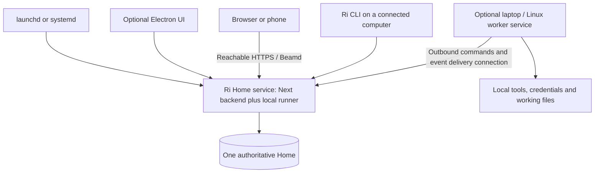

# Ri desktop, headless service, and multi-device delivery plan

Updated: 30 September 2026. This is the single desktop reference: what is built, how to run it, the research and audit evidence, the target architecture, and the remaining build and acceptance work. It consolidates and replaces the earlier desktop recommendation, demo guide, integration checklist, readiness review, final audit, and Home/worker addendum. The separate [One Ri specification](homes-spec.md) remains authoritative for Home, worker, and team semantics. This document supplies its desktop and service integration requirements.

Quick navigation: [Status](#status-and-landing-boundary), [Implementation review](#post-implementation-review), [Run the demo](#what-is-built-and-how-to-run-it), [Home and team architecture](#home-worker-service-and-team-architecture), [Updates and SQLite migrations](#application-updates-and-sqlite-migrations), [Open findings](#open-findings-and-implementation-requirements), [Audit coverage](#audit-verification-and-product-coverage), [Delivery plan](#delivery-sequence-and-effort), [Build checklist](#build-checklist-after-the-multi-deviceteams-work), [Acceptance](#combined-release-acceptance), [Landing checks](#landing-verification).

## Status and landing boundary

**The standalone desktop and personal Homes implementation are on main. The P5.4 companion integration is built and exercised on macOS arm64.** Electron can select a Home or connected-device role before database startup, pair a viewer, opt into a supervised worker, and keep local controls outside the remote Home page. This is an unsigned local beta candidate, not a published or qualified production release. No production Home, OS login service, live tunnel, provider account or public release was changed by implementation tests.

The original audit and phase snapshots later in this document are dated evidence. This status, the P5.4 checklist and the current implementation matrix supersede their statements about features still missing. Homes' personal device design is now adopted. Teams P6/P7 remain separate.

Source and packaged launches default to isolated desktop roots. Sharing an existing CLI root requires explicit selection and stopping any older foreground launcher first. CLI and Electron attach to the same per-root background service. Quitting Electron leaves that service running, while native notifications and global Quick Capture require the GUI process to remain in the menu bar. Connected roots own credentials and worker journals, never a second authoritative tasks/notes database. Existing Home adoption still requires its verified migration/recovery process.

### Remaining work and ownership, 30 September 2026

| Workstream | Current state and remaining work |
| --- | --- |
| Standalone desktop features | Implemented: Electron UI, bundled CLI/headless runtime, shared background service, local updates and SQLite recovery, OAuth routing, notifications, menu bar/activity, managed speech and recoverable capture. Recorded package evidence is unsigned macOS arm64. |
| Home/worker companion | Implemented and exercised: role selection, pairing, separate execution consent, supervised worker, remote viewer, local controls and reconnect. The automated candidate passed. Signed distribution, trusted remote HTTPS and physical-device qualification remain below. |
| Cross-machine updates | Build identities, protocol/capability negotiation, worker journal formats, per-device status, local update guards and browser API/draft handling are implemented. Actual signed N/N−1 package and installer transitions remain release qualification. Compatible machines do not require matching version numbers. |
| Existing-data adoption and provider setup | Existing CLI export/import and refusal/recovery protections remain. A fully guided Home relocation journey and pre-baseline conversion without a checkout still require product implementation and acceptance. This integration can attach a compatible existing root but does not move or merge its data. Providers requiring confidential hosted OAuth exchange still need it. A callback relay alone is not that exchange. |
| Public distribution and qualification | Configure publisher/feed and required OAuth registrations, produce signed/notarized installers, exercise installer updates, and complete Linux/Intel, login/reboot/sleep, permissions, phone/tunnel and live-provider checks. Speech distribution retains its separate recorded review gate. |
| Teams | Authorization, conflict handling and team connection/cache separation belong to P6/P7. They do not block personal Home/worker integration. |

The desktop owner retains Electron/service integration and release qualification. Homes owns role, placement and journal semantics, with shared interfaces reviewed together. macOS supervision starts with the user's login, not before login or encrypted-disk unlock. A sleeping or disconnected Home is unavailable to the phone. Keep the Home awake or use an always-on host.

Older D/U checklists combine implementation and external qualification. Their unchecked entries must be read alongside the current evidence, not as a fresh estimate of unimplemented source work.

### Personal companion integration, P5.4

Implementation started 30 September 2026 from main `6b1416e`. Electron is the companion. `homes-spec.md` owns Home/device semantics, this document owns desktop/service/update requirements, and `homes-build.md` records Homes implementation evidence. No Teams work or production migration is implied by this integration.

- [x] C1: Select Home, connected worker, or viewer before database startup. Preserve existing identity and refuse silent adoption of retired or conflicting roots.
- [x] C2: Pair and enroll through the installed app with explicit local-execution consent, scoped credentials and one device identity. No pasted terminal commands or separate CLI installation.
- [x] C3: Supervise the worker through the shared CLI/desktop service. Preserve journals, reconnect after sleep/network interruption, keep working when Electron quits, and persist deliberate Stop local execution across restarts.
- [x] C4: Open the selected remote Home with save/draft guards and authenticated device association. Keep remote pages outside direct privileged native filesystem, service, update and native OAuth capabilities.
- [x] C5: Expose local role, worker activity, connection/compatibility, stop/resume and login controls through trusted desktop surfaces. Home controls and local-worker controls name their scope.
- [x] C6: Integrate authenticated build/protocol/capability and journal-format compatibility with local update policy. Keep the signed release envelope compatible with existing updaters and preserve unresolved work across offline/busy/incompatible peers.
- [x] C7: Validate SQLite migration ownership at Home only and worker journal/config transitions locally, including failed activation, backup/recovery and retained drafts.
- [ ] C8: Exercise the packaged Home and connected-app journeys, CLI coexistence, OAuth, notifications, capture, restart/wake and mixed-version behavior against disposable installations. Record unsupported platform/external-account checks rather than claiming them complete.
- [x] C9: Prepare P5.5's unfamiliar-person script and evidence checklist. Actual human performance, signing credentials and real platform qualification remain separately recorded acceptance gates.

The desktop implementation owns C1-C9 and coordinates changes to Homes enrollment, protocol and execution contracts. A source implementation checkbox requires its focused tests to pass. Completing this list's automated work does not claim that an unfamiliar person passed P5.5 or that a signed public release shipped.

#### Implemented boundaries

- `desktop/connection-setup.ts` verifies the Home and device sign-in before persisting a connection. Pairing requires normally trusted HTTPS. Explicit source development may use loopback HTTP. Credentials cross a bounded ordinary-Node stdin/private-IPC boundary, never command arguments, logs or the local setup page. Copied Home-host or worker credentials cannot sign in as a companion.
- The shared service supervises a separate worker child under its existing exclusive worker lock. Intentional Stop persists for that enrollment. GUI quit, network interruption and a protocol mismatch do not erase journals or create another Home. Revocation stops execution. Shutdown verifies child-process identity before cleaning up descendants, without signalling unrelated processes.
- A connected Home renderer receives platform metadata, guarded save/capture controls and validated external-browser opening. It cannot operate the local service, updater, native OAuth, filesystem recovery or preferences. Ri on This Device is a separate local sandboxed window with an exact sender/frame/URL check. It owns enrollment, stop/resume, login, notification consent, global capture preferences and update actions. Existing authenticated Home APIs still route folder setup, file views, terminals and known-editor opening through the owning worker. Pairing binds the renderer to its verified device. The local companion does not add an unrestricted folder or command bridge.
- Native alerts use the shared notification outbox. Remote claims require the authenticated device's sign-in key and a channel derived from that device. The local installation must also grant OS presentation. A Home channel preference alone cannot enable native alerts on a computer. Electron denies Chromium notification requests to prevent a second presentation path, and its remaining permission grants require the actual main frame and expected origin. Remote connector OAuth follows the Home's web callback path. The private native callback capability remains local-Home-only.
- A renewed sign-in to the same Home preserves device identity, enrollment, folders and journals. A changed address requires an explicitly stopped worker and verifies the same Home identity. A declined save/reconnect handshake leaves the existing viewer and its drafts open for retry.
- Release envelope 1 and minimum-updater 1 remain parseable by existing updaters. `server/ri-compatibility.json` is included in the existing signed runtime inventory/hash. Current supported contracts are worker protocol 4, API/native bridge 1, and config/command/event journal format 1. This bridge does not promise protocol 3 support.
- Package identities come from the verified runtime manifest. Source identities are explicitly marked. Authenticated worker reports are retained per enrollment, so a missing or corrupt report never proves an offline worker idle for an incompatible update. Compatible patch releases can proceed without forcing all machines to match versions.
- The Home alone checkpoints and migrates authoritative SQLite. Connected-worker checkpoints preserve device-local state, including configuration and journals. The worker child has no SQLite dependency. Controller ownership/update sidecars are separate from authoritative Home data.db. Current journal/config formats remain 1, and unknown formats or any changed write format are refused pending a qualified converter. Unknown journal formats fail before rewriting or repairing them. Browser API version mismatches fail before route handlers. Reload waits for acknowledged or durably retained document, capture and chat drafts, and persistence failure keeps the view open.

#### Verification record

The application regression suite passed 4,595 tests with 25 existing skips across 468 passing files. The final desktop suite passed all 320 tests across 35 files. After the filesystem-only shell helper extraction, 40 focused service/install/role tests also passed. TypeScript and the new shared-code lint checks passed. Existing view lint findings were not rewritten as part of this integration. These are implementation checks, not evidence of signed installer transitions, physical sleep/wake or P5.5.

The source companion driver passed explicit Home selection, setup with an already-running empty controller, rejection of untrusted remote TLS, authenticated viewing without a local task database or native control bridge, separate same-device worker enrollment, transport reconnect, GUI-independent worker lifetime, and deliberate Stop surviving a controller restart while the Home stayed up. The compiled-controller fixture separately passed role/no-DB checks, offline/protocol retry, revocation, crash/orphan cleanup and recovery admission.

Review found and corrected ordering across worker heartbeat and durable signal replay, native permission bypasses, rejected reconnects leaving a frozen renderer, and failed saves replacing visible pending edits. Current-session document patches now remain visible in note/task pages and slideouts and areas while the normal query cache still rolls back. Old persisted drafts still require explicit Restore. Ordinary reloads retain their unload guard, including a synchronous chat-draft persistence check. Explicit version reloads may proceed after proven draft retention without starting a second conflicting native save handshake. Unsupported connection-file versions are refused before normalization or writes, while versionless legacy records remain readable.

Packaged testing also caught a native-module import leaking from a login-status helper into Electron. The helper and notification permission writer now use filesystem-only modules. Packaging parses every shell bundle and rejects external application/native dependencies, computed loaders and unsafe bundle links. The corrected app passed first-run and all following checks.

The final unsigned candidate is `release/desktop/mac-arm64/Ri.app`, with the same standalone payload at `release/ri-runtime-0.1.0-darwin-arm64` and its `.tar.gz`. Runtime identity: `77cfc89a586b16eecfba8fd2a9c2e60fa3cb2d42d29f7c4c9dae63f9eee23299`. Shell ASAR SHA-256: `12bbfc2a2e0653f1988476d70810883cef91b12af770bb8744eced19d94ba747`.

Reports, screenshot evidence, hashes and limits are preserved locally under `release/qualification/personal-companion-77cfc89a/verification.json`. Generated artifacts are intentionally not committed. Every reported fixture cleaned up its own apps and services.

| Final candidate check | Result |
| --- | --- |
| Companion, 10 checks | Explicit Home choice before task database creation, shared authenticated Home data, separate same-device worker consent, reconnect, GUI-independent service lifetime and deliberate Stop persistence. Remote native alerts use the real per-device outbox/claim/ack path, and Home settings cannot override local refusal. The remote shell limitation below applies. |
| API/draft transition, 3 checks | Rejected writes retain document/chat/capture drafts. Storage failure and ordinary unsafe reload keep the view open. Explicit saved-draft reload succeeds and recovers all three kinds. |
| Interaction, 6 checks | Search, note editing and save-before-navigation, native reload retention, chat focus, Back/rail/capture/close shortcuts, and exact attachment download contents. |
| OAuth, 4 checks | Native loopback/DCR/PKCE, native deep-link reconnect and replay refusal, remote browser-origin return, and relative fallback. Providers and OS deep-link dispatch are controlled fixtures. |
| Native notifications, 7 checks | Local capability boundary, opt-in/preferences, real durable delivery/claim/ack, history, click navigation with pending edits, no duplicates after reload, and visible OS rejection. OS presentation is mocked. |
| Capture, 12 checks | Text and image intake, limits, explicit recovery after reload/GUI quit/renderer crash, durable discard, real text submission, uncertain-result retention, and quota-failure protection. No image extraction or live speech provider was started. |
| Final headless lifecycle, 7 checks | One shared CLI/controller owner, pinned authenticated HTTPS, explicit stop persistence, preserved origin/data, backend/controller crash cleanup and no surviving fixture children. No OS supervisor was installed. |

The signed runtime-update rehearsal passed on the immediately preceding runtime `982429bde21f5a80a3f0e43742667c517416a3e0941b8e6edcdf4e5efeb76a69`: HTTPS/Ed25519 publisher verification with a test key, an appended SQLite migration, verified checkpoint, replacement controller, stable origin, preserved note/unpublished file/prior runtime, and accepted post-update writes. Its report is `headless-update.json` in the evidence directory. The subsequent change extracted filesystem-only shell helpers and added the packaging guard. Worker, runtime-job, handoff, Next assets and migrations were unchanged, and lifecycle was rerun on the final bytes. This is not a public publisher or signed shell-installer qualification.

C8, the aggregate P5.4 checkbox and U4 remain open for their full release matrices. Physical sleep/wake, login/logout/reboot, Linux/Intel, trusted remote HTTPS, live providers/phone/tunnel, signed N/N-1 artifacts and unfamiliar-person P5.5 were not qualified here. Teams are separate. The remaining guided Home relocation and fleet-wide shell/update reporting are implementation work, not claims satisfied by these tests.

Repeatable checks, all with disposable test roots:

```sh
pnpm exec vitest run --maxWorkers=4
pnpm desktop:test
pnpm desktop:build
RI_SERVICE_TEST_COMPILED=1 pnpm exec vitest run src/service/worker-lifecycle.test.ts --maxWorkers=1
# After building a package, set RI_DESKTOP_PACKAGE to that .app or linux-unpacked folder.
pnpm desktop:companion-smoke
pnpm desktop:version-smoke
pnpm desktop:interaction-smoke
pnpm desktop:oauth-smoke
pnpm desktop:notifications-smoke
pnpm desktop:capture-smoke
# Set RI_RUNTIME_PACKAGE to the generated headless runtime directory.
pnpm exec tsx desktop/service-lifecycle-smoke.ts "$RI_RUNTIME_PACKAGE"
pnpm exec tsx desktop/update-smoke.ts "$RI_RUNTIME_PACKAGE"
```

The companion driver uses a packaged Home plus an explicitly development-mode source viewer over a loopback HTTP proxy that validates only the fixture Home's certificate. It separately verifies normal remote TLS rejection. It never disables certificate validation in a packaged app or changes OS certificate trust. Real remote trusted-HTTPS deployment remains a qualification gate. CI runs the companion and draft-upgrade drivers in the existing native macOS/Linux matrix and retains their reports/screenshots.

#### P5.5 unfamiliar-person acceptance script

Run this after the automated companion checks pass, on supported signed installation artifacts. Give an unfamiliar participant the installer and a normal pairing invitation, without terminal commands or an explanation of the Home/worker architecture. An observer records what happened and may stop a dangerous action, but any other coaching means that step needs another attempt after the product is improved. Never use the person's only copy of existing work for a rehearsal.

1. Install Ri on a fresh computer, choose it as Home, complete the existing setup, and create a note.
2. From the app, pair a phone. Find and edit that same note on the phone.
3. Install Ri on a second computer and connect from its pairing link. Choose whether this device runs agents. Verify the device appears once in Settings, Devices.
4. Set up an existing project on the connected device using the normal app controls. Start work there and find its output from the Home and phone.
5. Close the desktop window, then quit the desktop app. Verify the Home and the connected worker continue independently. Reopen Ri and find the same work.
6. Enable start at login from Ri on This Device. Log out/in and verify the chosen service starts once. Record actual macOS/Linux behavior and any OS approval steps. A Mac login service does not promise service before login or encrypted-disk unlock.
7. Disconnect the connected computer from the network, keep a draft, and reconnect. Verify the draft survives and pending output arrives once. Repeat after sleep/wake.
8. Choose Stop local execution. Verify only that device stops, and it stays stopped after restarting the app/controller. Resume deliberately.
9. Enable native notifications in the local companion, receive a real event through the shared notification pipeline, and click it. Disable locally and verify changing Home's channel alone cannot re-enable OS presentation.
10. Exercise the supported mixed-version update pair, including a busy worker and a laptop asleep during the Home update. The app must name waiting/update-required states, retain journals and drafts, and never stop a turn solely to align versions.
11. Renew an expired or revoked sign-in to the same Home. Existing device identity, folders, work and worker enrollment survive. A changed Home address requires a stopped local worker and verifies the same Home identity.
12. Additional adoption gate: rehearse laptop-as-Home to always-on-Home relocation and recovery on verified copies. The stopped CLI flow exists, but a guided no-terminal product flow still needs implementation and acceptance. This step is not passed by the companion integration.

Record participant, artifact build IDs, OS/architecture, date, each result, any coaching, retained-data checks, and recovery observations. Automated tests and a developer demonstrating the flow do not pass P5.5. The human run has not been performed by this implementation session. Teams P6/P7 and actual production cutover remain separate work.

### Main integration and Homes handoff, 28 September 2026

The upstream OAuth return changes are main commits `13933e8` and `1d5f335`. They were already on local main and `origin/main` when this integration began. GitHub had no separate OAuth PR in either configured repository. The eight standalone desktop commits through `6f4ddd2` had not yet landed. Five textual conflicts were resolved in connector connect/callback, MCP callback/reconnect, and common MCP authorization.

The combined behavior preserves both designs. A browser or phone records its trusted initiating origin and in-app path against OAuth state, so a callback handled internally as localhost returns to the page that started it. Missing origin metadata uses a relative Location. Native desktop initiation still requires the private capability, uses its loopback or hosted/deep-link callback, and binds state to the desktop channel. Public web callbacks cannot exchange native state. Denial consumes valid web state and returns a coarse result, with replay rejected. Electron still accepts only the verified local service origin and pinned certificate. A non-localhost browser return does not grant that remote page native capabilities or select a remote Home.

MCP authorization now persists an optional `callbackChannel` in its existing sealed JSON state. New flows use explicit web/desktop binding, allowing a web flow to finish with its original registered callback even if the configured public URL changes during consent. Legacy untagged flows retain the prior redirect-URI check. The native return-path helper also rejects paths that normalize to a protocol-relative destination, including encoded dot segments. Main's connector account-set restrictions remain intact. These changes require no SQLite migration.

The separate Homes branch was reviewed at `15149a7`, without modifying it or rerunning its acceptance suite. Its recorded P2/P3/P4 work is complete, while P5 adoption/companion and P6/P7 Teams remain unchecked. It does not block landing standalone desktop. The next implementation step is for that branch to incorporate the updated main, then integrate these boundaries:

1. Resolve Home versus connected-device role before Electron starts a local service or opens a database. Preserve both Homes' `assertMayOpenDatabase` and desktop maintenance/database-access locking.
2. Keep maintenance admission, draining and safe idle-harness closing when adopting the split runner. Remote worker compatibility must join coordinated updates.
3. Keep local filesystem, service, native notification and OAuth capabilities isolated from remote Home/team pages.
4. Preserve deferred notification delivery. Homes' new `deliverRow` currently marks delivery sent unconditionally after the adapter returns. Carry desktop's `if (result.deferred) return` into that path so queued native/browser presentation is acknowledged by the client, not prematurely by the dispatcher.
5. Preserve main's connector account allowlists and owner/session authorization through the Home and harness routing changes.

The desktop-only changes since `e7a4520` overlap Homes in 18 files: `instrumentation.ts`, `next.config.ts`, `package.json`, `pnpm-lock.yaml`, `src/app/layout.tsx`, `src/cli/commands/start.ts`, `src/cli/index.ts`, `src/components/dashboard/dashboard.tsx`, `src/components/executions/execution-composer.tsx`, `src/components/settings/sections/general-section.tsx`, `src/components/workspaces/bucket-config.tsx`, `src/contexts/dashboard-context.tsx`, `src/hooks/use-voice-input.ts`, `src/lib/db/index.ts`, `src/lib/db/queries.ts`, `src/lib/executor/adapter.ts`, `src/lib/notifications/notify.ts` and `src/proxy.ts`. This supersedes the earlier ten-file snapshot below. Use a normal three-way merge and verify behavior at these boundaries, even where Git merges cleanly.

#### Integration verification

The final merged application suite passed 2,744 tests with 25 existing skips, the desktop suite passed all 247 tests, and the connector engine passed all 320 tests. Root and connector typechecks and changed-source lint passed. The editor retains two existing unused-variable lint warnings. One application test initially exceeded its five-second timeout while three suites and the build were running together. Its isolated rerun passed, followed by complete application-suite runs with four workers, including the final focus correction. No assertion or timeout was relaxed.

The new `pnpm desktop:oauth-smoke` runs the packaged viewer and background service in disposable homes with local mock providers. It passed native discovery, client registration and PKCE through loopback, public-callback rejection of native state, reconnect through Electron's `open-url` event, replay rejection, independent owner-client web authorization returning to its recorded remote origin, and relative return without origin metadata. The client verifies the fixture CA and never receives the native capability. Remote-origin metadata is synthetic and redirects are not followed. Real consent, provider registrations, phone/tunnel access and OS deep-link dispatch remain release qualification. CI includes this driver and watches the connector implementation paths.

The packaged interaction run exposed delayed chat autofocus stealing focus from Quick Capture after Back navigation. A traced rerun passed its input assertion but still recorded the unwanted focus transfer, so passing the rerun alone was not treated as a fix. Automatic editor focus, including saved-draft hydration, now checks the current input, dialog, visibility and mount state in the final animation frame before synchronously focusing ProseMirror. Intentional focus shortcuts and user-requested draft restoration retain their existing behavior. Twenty new deterministic regressions cover these guards, including a search dialog whose role wrapper has no layout box. The packaged driver also rejects a background editor taking focus after the capture textarea, even when the text assertion succeeds.

The final unsigned macOS arm64 candidate was rebuilt after the focus correction. Production Next, CLI, service and shell builds passed, with the same 42 dependency-tracing warnings. Packaging verified native SQLite, vector, PTY and bundled CLI operation. Its app and headless manifests are identical at `55ea416bd4d6a08f714fa65c39374d880f513c759261d092e2a559e147e3040d`, covering 81,621 files. The shell ASAR SHA-256 is `cd7bbf5f1b4df41dda0f3a1ae73477ee4c53b36ee79cd5d8c7b48ed951a52294`. This candidate was not signed, published or installed over a production home.

All six packaged interaction checks passed on this final candidate: note creation/editor/full-page save, native reload, focus-chat and Back navigation, rail/capture/Escape/reopen, persisted search/slideout closing, and authenticated upload/native download. The focus trace shows capture retaining focus through its first input with no background editor transfer. Report and screenshot: `/private/var/folders/0f/kt2pkmp53f5g33pyjw3wzvc40000gp/T/ri-interaction-smoke-bbq7Nj/`. The disposable service stopped cleanly.

All four packaged OAuth checks also passed on this exact final candidate. Report and screenshot: `/private/var/folders/0f/kt2pkmp53f5g33pyjw3wzvc40000gp/T/ri-oauth-smoke-XIDlMN/`. The disposable service stopped cleanly. The earlier pre-focus candidate also passed the OAuth driver, but the final run is the acceptance evidence for this landing. Neither local run qualifies the unexecuted Linux/Intel matrix or live provider/phone behavior.

### Standalone implementation checklist

Implementation began from main `e7a4520` and is now reconciled with `b369b20`. Keep changes to shared startup, authentication and DB initialization narrow, and review the Homes branch before changing these boundaries. A service owns process lifetime, not execution placement. No production data adoption, service installation or public release is performed as a side effect of development tests.

- [x] S1: Harden untrusted attachment delivery, bounded request ingestion, cookie mutation origins, atomic configuration writes and schema-history validation, with regression tests.
- [x] S2: Add one local service lifecycle shared by CLI and Electron, verified root/process ownership, stable endpoint, race-safe start/attach, authenticated control, and explicit status/stop behavior.
- [x] S3: Add launchd/systemd installation adapters, stable versioned runtime staging outside the app bundle, isolated headless packaging and service environment discovery. GUI quit leaves the service running.
- [x] S4: Preserve pending edits and drafts on navigation, window close, quit, renderer failure and update. Validate storage identity across reconnects.
- [x] S5: Separate local desktop OAuth initiation from browser/phone initiation, preserve tool reconnect flows, and harden tunnel destination ownership and local native capabilities.
- [x] S6: Implement the local update coordinator, release verification, maintenance admission, complete checkpoint, exclusive migration/bootstrap, validation, crash recovery and in-app/CLI controls. Preserve new writes across failed updates.
- [x] S7: Complete release configuration, desktop diagnostics/permissions/window behavior, optional voice configuration, and documented operator setup. Actual publisher signing, provider registrations and public hosting require their real external configuration.
- [x] S8: Reconcile this checklist with the full document, run application/desktop/connector checks and isolated package/service/update smoke tests, and record platform or live-provider checks that require external hardware/accounts.

Managed speech is now implemented as an optional packaged helper with explicit model installation, described below. Remote worker and Teams integration (D13 and the corresponding parts of D1/D9/D14 and U4) is conditional on adopting the experimental design. Standalone implementation must remain useful without that branch.

### Independent completion checklist

The S1-S8 delivery was the service and desktop foundation, not completion of every original requirement. The following independent product gaps extend that foundation. An unchecked item remains unfinished until its focused verification passes. Production signing and live-device qualification remain separate gates.

- [x] S9: Expose maintenance windows and safe automatic-download/metered preferences in Settings, with owner-only APIs and persisted state.
- [x] S10: Provide a local Electron recovery screen independent of Next, with verified service diagnostics, controlled recovery/retry, and log access.
- [x] S11: Explicitly select and verify an existing local installation, preserve advanced paths and per-installation profiles, and refuse unsafe implicit migration/adoption.
- [x] S12: Add phone installation metadata/icons/instructions and an honest offline experience without caching private pages or APIs.
- [x] S13: Package an optional managed Parakeet helper and pinned verified models, with installation, readiness, cancellation, repair/removal, bounded ownership and format tests.
- [x] S14: Integrate the independent changes, run focused and whole-app validation plus packaged lifecycle checks, reconcile the original requirements, and commit verified work on the desktop branch.

The reviewed desktop source began at `dc318c5` on `ai-task-manager/session-ca52f4`. The related multi-machine implementation was reviewed at `183391a` on `ai-task-manager/session-e4aa22`. Landing preparation also adopts its `@agentex/workspace` 0.0.5 dependency fix and repairs a pre-existing connector-test typecheck error. Its results are identified separately from tests run here. These are dated snapshots, not claims about the future state of either branch.

The other execution worktree was rechecked at `29205f0` (P4.1/P4.4, with additional uncommitted owner Git work). Main remained `e7a4520`. Its changes since the common ancestor overlap this implementation in `instrumentation.ts`, `package.json`, `pnpm-lock.yaml`, `src/app/layout.tsx`, `src/cli/commands/start.ts`, `src/cli/index.ts`, `src/hooks/use-voice-input.ts`, `src/lib/db/index.ts`, `src/lib/executor/adapter.ts` and `src/proxy.ts`. Its branch predates the desktop foundation, so a direct tip-to-tip diff misleadingly shows desktop files as absent. Use a normal three-way merge, not that diff as a patch.

The desktop implementation does not modify the experimental schemas or transfer semantics. The maintenance wrapper and idle-session closer in `adapter.ts` are a deliberate shared integration point. Role selection must run before local service/DB startup if Homes is adopted. Review those ten files for both behavior and textual conflicts. There is no dependency on that branch landing first, and no promise of a conflict-free merge.

The S15-S19 pass rechecked the separate Homes worktree at clean commit `cbbd90c`. Its spec now marks P2.1-P2.9, P3 and P4 complete, including their review notes. P5 existing-data adoption and companion release, plus P6/P7 Teams, remain unchecked. That is the other branch's recorded status, not a rerun of its acceptance suite. Main still points to `e7a4520`. The earlier phase table below is a historical snapshot.

### Current implementation and remaining qualification

| Requirement | Implemented boundary and evidence | Remaining qualification or conditional work |
| --- | --- | --- |
| S1, F01/F11/F12, D5 | Attachment documents are sandboxed, ingestion is bounded before parsing, cookie mutations require the exact origin, production dev APIs are gated, configuration writes merge under an interprocess lock, and migration history is checked before writes. | Public-edge resource limits still belong to the deployed proxy. |
| S2/S3, F03, D2/D3/D4 | `src/service/main.ts` owns one root under an OS-released SQLite lock. CLI and Electron attach through a private per-user Unix socket and verify the canonical root/config/work/DB identity. GUI exit does not stop it. Runtime and launcher are staged outside the movable app. launchd and systemd user adapters are implemented. | Real login/logout/reboot and Linux host qualification. Start at login is opt-in and is not unattended encrypted boot. Personal Home/worker roles are integrated. Teams remain separate. |
| S4, F02/F06, D6 | Serial document saves retain drafts synchronously before debouncing. Native close/navigation/update waits for writes. Chat drafts persist synchronously. Failed saves remain recoverable with conflict choice. Stable endpoint and per-root Electron profile prevent ordinary restart/port fallback draft loss. Recording blocks automatic renderer reload. | Real IME/accessibility/mobile crash cases. Changing a data root or its saved port deliberately is an origin/profile migration, not automatic draft transfer. Team revision conflicts must be integrated if adopted. |
| S5, F04/F05/F07, D7/D8 | Native capability is delivered over the private socket and injected only by the trusted Electron main frame. Web/phone callbacks remain web callbacks, state is bound to its channel, and tool reauth uses common initiation. Tunnel operations are serialized and refuse a conflicting destination. TLS renews with session pin refresh. | Real provider registrations/consent, Beamd edge streaming/reconnect, phone devices and certificate-expiry soak. |
| S6, F08/F13, U1/U2 | Service-owned coordinator verifies Ed25519 metadata, platform/protocol/config compatibility, monotonic sequence, expiry/withdrawal, artifact size/hash, archive paths and the complete runtime inventory. It drains admitted work, stops Next, excludes DB openers, verifies a full checkpoint, boots migrations without effects, then commits and hands off to the new controller. | Linux and actual power-loss qualification. No released-history squash is accepted as an unattended upgrade. |
| S6/S7, U3/U4 | Settings and CLI expose check/download/apply/when-idle/later/status. Approval and maintenance windows persist. Shell updates use the platform updater with artifact metadata checked against the signed publisher envelope. Runtime and GUI can update independently. | Publisher key/feed, Apple identity/notarization, signed clean install and actual shell installer round trip. Personal worker compatibility is integrated. Signed mixed-release qualification and Teams remain separate. |
| S7, F09/F14, D9/D11 | Private persistent executable paths, speech URL and encrypted API keys, common tool discovery, service menu controls, diagnostics, window restoration, renderer crash recovery, camera/microphone descriptions, native save handshakes and opt-in durable native notification routing. | Each real harness from Finder/SSH, real OS permissions/notification presentation, remaining shortcuts, multiple displays and accessibility. |
| Optional F10/D10 | Existing private Parakeet service or Groq can be configured without a source checkout. Browser recording chooses supported WebM, MP4 or Ogg formats. | Managed installation, format decoding and local benchmarks are implemented in S13. Native Linux/Intel builds, real phone recordings, broader accuracy testing and signed distribution remain qualification gates. |
| D1/D13 and multi-machine portions of D9/D14/U4 | Personal Home/worker companion roles, enrollment, supervised lifecycle, remote trust separation and update compatibility are integrated in P5.4. | Complete the recorded package/OS and unfamiliar-person acceptance. Teams P6/P7 remain separate. |

### Release preparation follow-through

This pass extends the independent desktop implementation without adopting the experimental Home/worker schemas. Native alerts use the existing notification outbox and an explicit desktop opt-in. Quitting Electron leaves the backend running but stops native alert delivery. OS presentation and its database acknowledgement cannot be atomic, so an interrupted presentation is recorded as uncertain and is not automatically shown twice.

- [x] S15: Native desktop notification setup, existing event routing, bounded durable delivery, safe click navigation, duplicate protection and visible OS failures, with route/controller and packaged integration tests.
- [x] S16: Complete native speech notices/provenance, verified source and build-material bundling, cross-platform binary inventory and fail-closed release checks.
- [x] S17: Add isolated packaged shortcut/editor/download/reconnect checks and bounded endurance/fault tests with explicit cleanup and measured limits.
- [x] S18: Extend the supported-platform CI matrix and isolated service-supervision lifecycle qualification. Distinguish implemented checks from runs requiring other hosts or release credentials.
- [x] S19: Integrate, build, verify and document the final artifact and any remaining external release gates, then commit on the desktop branch.

The new tests use temporary installations and retain small reports/screenshots while removing their staged runtime copies after verified service cleanup. Native interaction tests exercise the packaged app, its real save guard and background service. Automation uses renderer links and native reload rather than CDP navigation commands that can race Electron's navigation interception. Forced renderer failure is checked independently of Playwright's page handle, which becomes unusable after a crash. Fault tests inject disk-space, copy and durability failures without filling the host's disk.

**Native notifications:** Settings > Notifications offers a desktop opt-in and uses the existing event matrix and trigger/digest destination bindings. This adds no schema migration. The existing `in_app` channel holds a deterministic destination for the selected installation, and the existing delivery outbox remains authoritative. Main-process polling continues while the window is minimized or unfocused. Full GUI quit stops polling, even when the service remains running. Recent pending alerts are considered on reopening, and alerts older than 24 hours expire. Phone browser push and connector delivery remain separate choices. Enabling native alerts removes only this Electron profile's previous web-push subscription, avoiding duplicate alerts without unsubscribing other devices.

The local notification API requires both the installation owner credential and the private desktop capability. Ordinary authenticated browser/phone clients cannot claim the queue. The preload exposes only status, enable, disable and test. It accepts no arbitrary notification text, filesystem path or native action. Notification clicks restore/focus the window and pass same-origin application navigation through the existing save handshake. API/static paths, external destinations, encoded path escapes and pairing fragments are rejected or removed. A copied installation's old destination remains visible and removable, but its controls cannot operate the new local destination accidentally.

A database claim is committed before requesting OS presentation. An acknowledged `show` event marks it sent, native failure marks it failed, and an interrupted or unconfirmed attempt remains explicitly uncertain. Claims are not replayed after lost acknowledgment, crash or overlapping viewer polls. This is at-most-once presentation attempt, not guaranteed delivery or proof the user read the alert. Polls claim at most five alerts and retain at most 50 native click handles. Transport failures recover automatically, while OS refusal pauses the current consumer until an explicit retry or desktop reconnection/restart. Tests report a queued test honestly. macOS history can restore safe click handlers for recent known notifications without showing them again.

Native presentation still requires real OS permission and a supported notification service. Electron's macOS notification implementation requires a signed app. The unsigned package acceptance test verifies the actual IPC/API/outbox/click/save flow with only the OS presentation boundary mocked. It does not certify a real signed notification banner or permission prompt. [Electron notification API](https://www.electronjs.org/docs/latest/api/notification), [platform notification requirements](https://www.electronjs.org/docs/latest/tutorial/notifications).

**Platform and lifecycle qualification:** CI declares four native targets: macOS arm64 and x64, Linux arm64 and x64. Each builds on its matching CPU, packages native dependencies, and has lifecycle qualification. A normal local `service-lifecycle-smoke.ts` run uses temporary roots and direct processes without installing login jobs. Its opt-in OS-supervision mode additionally requires an explicitly disposable GitHub-hosted account. That mode checks launchd/systemd installation, crash restart and uninstall. It refuses local or self-hosted use. Physical logout, reboot, disk unlock, sleep/wake, power loss and real user permission prompts remain hardware checks. Configuration of a CI target is not evidence that it passed.

The local direct lifecycle rehearsal also exposed and fixed installer ordering: an unrelated login definition must be rejected before requesting a handoff from an existing service. The installer retains a second collision check after draining to catch changes during that interval.

Archive review also exposed a symlink escape hidden by lexical path normalization. Runtime intake now rejects ambiguous parent traversal after a named path component, and inventory containment uses the operating system's native path resolution. Regression fixtures distinguish the actual file opened by the kernel from JavaScript's normalized path. Publisher inspection additionally resolves chained links component by component, bounds expansion and rejects entries beneath symlinks. These checks preserve the portable links in the packaged dependency graph.

**Speech release materials:** `desktop/speech/source-catalog.json` pins 22 verified archives: 20 codec/vendor recipe inputs and the complete vendor/PyAV source and recipe archives, totaling 81,901,939 downloaded bytes. The notice index records 154 exact upstream files and extracted header notices, including Linux-only dependencies. The deterministic source bundle includes these archives, their recipes and patches, Ri's helper/build/verification tools, the dependency lock and checked notices. Hash, size, archive-path and inventory checks fail closed. This is the codec/vendor source-material bundle, not a claim that it contains every Python, NumPy, ONNX Runtime or PyInstaller source tree or satisfies every distribution obligation.

`native_inventory.py` scans actual Mach-O/ELF files, resolves declared dependencies against bundled libraries or the restricted OS-library allowance, probes all seven FFmpeg library configurations, and verifies copied notices. Unknown dependencies fail inspection. Linux may reveal additional native dependencies requiring reviewed source/notices before its build can qualify. Changes after inspection invalidate the inventory. The publisher review separately covers source/relinking, combined license compatibility, notices, patent/commercial terms and other Python/runtime dependencies. [Speech release instructions](../desktop/speech/RELEASE.md) explain the exact sequence. No publisher approval is manufactured by these tools.

After building the helper with `pnpm speech:build` (retain `RI_SPEECH_BUILD_PYTHON` if you supplied a custom build environment):

```sh
pnpm speech:sources fetch
pnpm speech:sources bundle --output release/ri-speech-sources.tar.gz
pnpm speech:sources verify-bundle release/ri-speech-sources.tar.gz
```

The bundle command refuses to replace an existing output. Select a new filename when the reviewed inputs change. CI uploads source and inspection reports, not speech-bearing executable artifacts. Signed release metadata additionally requires the final artifact-bound publisher review described under release configuration.

Additional packaged acceptance commands operate on an already-built package and always use disposable homes:

```sh
RI_DESKTOP_PACKAGE=release/desktop/mac-arm64/Ri.app pnpm desktop:interaction-smoke
RI_DESKTOP_PACKAGE=release/desktop/mac-arm64/Ri.app pnpm desktop:notifications-smoke
RI_DESKTOP_PACKAGE=release/desktop/mac-arm64/Ri.app pnpm desktop:endurance-smoke
pnpm runtime:lifecycle-smoke --report release/qualification/service-direct.json
```

The endurance script defaults to three bounded cycles and accepts `RI_DESKTOP_ENDURANCE_CYCLES=1..10`. It measures concurrent streams/requests and Electron memory, exercises renderer disconnection/crash and viewer reattachment, and cleans its owned service/runtime. It is not an overnight soak or measurement of the detached service's memory. Disk exhaustion and failed checkpoint durability use deterministic fault injection, never filling the host disk. User data and the previous runtime must remain unchanged when checkpoint creation fails.

### Release preparation verification, 26 September 2026

These checks cover S15-S19 on `ai-task-manager/session-ca52f4`. Hardware evidence is from the local Apple Silicon Mac. Other CI targets are configured, not certified by these local runs.

| Check | Result |
| --- | --- |
| Application suite | 2,504 passed, 25 existing skips across 272 passing files and two skipped files. Includes notification ownership/outbox tests, checkpoint space/copy/fsync faults, installer ordering and runtime symlink escape regressions. |
| Desktop suite | 139 passed across 22 files, including the native notification controller, trusted request headers, platform safeguards, speech packaging and artifact/signing verification. |
| Connector suite | 301 passed across 49 files. |
| TypeScript and lint | Root and connector typechecks passed. Changed-source ESLint reports no errors and one existing unused-function warning in `queries.ts`. The historical whole-repository lint limitations below remain separate. |
| Production package | Frontend, CLI, controller and shell builds passed. Matching app/headless manifest `c305737df6a5e81925eea55305cac316b959d659e61d41a86fb92d5ca14a0ba7`, 81,580 entries and 3,943 portable links. Runtime archive: 469,150,374 bytes. Native SQLite/vector/PTY and bundled CLI probes passed. |
| Actual artifact correspondence | The final runtime tar and Electron Builder ZIP passed complete content, mode, link and archive validation. Runtime tar SHA-256: `ab3537d13c2912f47b52aa23593b2f2e9786ffb3b5942e944538731594fe1f19`. Builder ZIP: 635,259,296 bytes, including ZIP64 and CRC/header checks. These are unsigned candidate checks, not a signed installer round trip. |
| Packaged interaction | Six checks passed on the final package: search/create/editor/full-page saves, native reload, focus-chat and Back, rail/capture/Escape, persisted search/slideout closing, and authenticated upload/native download with exact contents. Electron's DownloadItem reported all 41 bytes completed. Screenshots inspected. Voice and execution/terminal shortcuts remain separate provider/workbench qualification. |
| Packaged notifications | Six checks passed on the final package: owner/capability boundary, settings opt-in/event routing, real notify/outbox/claim/ack flow, minimized-window click with pending edit saved, reload/disable/re-enable without duplicates, and durable OS failure visible in Settings. Screenshots inspected. Only OS presentation/history/support were mocked, so this does not qualify signed native banners. |
| Packaged endurance and crash recovery | All three cycles passed with eight live streams, 30 reads in batches of six, ten title edits, offline/reconnect, and viewer quit/reopen with the same daemon and origin. Electron working-set samples were 622-656 MiB, maximum read latency 36-66 ms. First launch, including installation/staging, took 62.1 seconds, later viewer launches 609-807 ms. These are local observations, not performance guarantees. Forced renderer failure reloaded the same window with a new renderer PID, ready UI and successful health request. The draft was not silently replayed and explicit Restore persisted it. Playwright reattached through a viewer relaunch after native recovery had already been verified. |
| Packaged GUI update and SQLite migration | Passed on the final package using an isolated HTTPS feed and test Ed25519 publisher key. Download/metered preferences and maintenance-window approval survived reload, and cancellation worked. The verified candidate appended a SQLite migration, replaced the controller, kept the same origin and open note, retained its pending title/body and prior runtime, verified the checkpoint, and accepted new writes. Native notification status authenticated after replacement on the first attempt in 15 ms. The test allows a 15-second retry window because the native helper refreshes its private capability independently of renderer reload. Cleanup verified service shutdown and removed generated runtime copies. This tests the runtime update while the GUI stays open, not a signed shell installer round trip. |
| Speech tooling | 24 Python tests passed. Rebuilt and relocated helper verified 85 native files with no unresolved dependencies. WAV, WebM, MP4 and Ogg transcription, authentication, playlist rejection, duration bounds, cancellation and parent cleanup passed. |
| Direct service lifecycle | Seven checks passed on the earlier candidate in this pass: shared CLI attachment, pinned authenticated endpoint, no OS job installation, restart persistence, backend crash recovery, controller/watchdog cleanup and owned-process shutdown. The subsequent archive hardening has separate regressions and final-package staging/update checks. |
| Source-material bundle | `release/ri-speech-sources-final-v2.tar.gz`: 81,868,945 bytes, 192 entries, SHA-256 `8266c3f1d86b29677a15531b5cefd0a199fa2cf4f4841e70c4482bed45414aba`. Contains verified codec/vendor/PyAV source and build materials, with the scope limitations above. |
| Cross-platform qualification | Four native CI targets and disposable-account launchd/systemd checks are implemented. Those remote jobs, real login/reboot/sleep, Linux/Intel hardware, signed OS alerts, phone devices and live OAuth/tunnel providers were not run here. |

Publication still requires the actual publisher key/feed, platform signing and notarization, review of the exact speech distribution, and signed installer qualification. Experimental Home/worker/Teams integration remains a separate product decision and implementation. None of those gates is represented as complete by unit tests or by an unsigned local package.

### Browser notification recovery and delivery history

This follow-up builds on the shared notifier without changing its dispatcher or adding a retry worker. The Homes branch at `cbbd90c` already separates transaction-time queueing from delivery and adds a drain for stranded pending notifications. Its eventual integration must preserve the desktop adapter's deferred result, so native alerts stay pending until Electron claims and acknowledges them.

- [x] S20: Reconcile this browser's permission, local push subscription and server registration. Provide explicit setup, repair and removal with actionable failure states. Preserve global channel enablement, routing and other devices.
- [x] S21: Show the latest 100 delivery records in Notifications settings, with channel/event, timestamp, attempts and accurate queued, sent, failed, uncertain, expired or skipped states. Bound and sanitize the API response and explain channel-delete retention.
- [x] S22: Verify browser setup failures and recovery, user scoping, preference preservation and history presentation. Run integration/type/lint checks, update this record, and commit on the desktop branch.

The recent-history view uses existing records and existing channel deletion behavior. Removing a channel also removes its history. It is not a permanent inbox or an immutable audit log. No schema migration, read/unread state or replay action is introduced. Browser push still records success once at least one subscription accepts a message, and native success confirms the OS presentation event. Neither is proof that the user read it.

Browser setup checks both the local subscription and the server's matching endpoint/keys. A local permission grant alone is not displayed as a working registration. Enable/repair and removal are explicit actions, and repairing a browser preserves the shared channel's disabled state and event choices. The read-only status route never subscribes a device or changes routing. History returns bounded display data and fixed failure categories, without private push endpoints, provider receipts, event bodies or raw upstream errors.

Reproduce the browser integration check against an already-built package:

```sh
RI_DESKTOP_PACKAGE=release/desktop/mac-arm64/Ri.app pnpm desktop:browser-notifications-smoke
```

An optional `RI_BROWSER_EXECUTABLE_PATH` selects an existing Chromium executable. The fixture uses a fresh browser profile and isolated Ri installation. It mocks browser permission/push-provider operations and injects one failed registration request while keeping the UI, service worker, API and SQLite real. It does not qualify actual browser push delivery or mobile OS behavior.

The S20–S22 verification candidate is a new unsigned macOS arm64 package, distinct from the S15–S19 candidate above. Its app and headless runtime manifests match at `e3b74c9be3bf4e7d59126a15a6ab2990b79c19c4574d292c617224b76356e6c1`, with 81,602 entries and 3,943 portable links. The runtime archive is 469,201,335 bytes. The shell ASAR SHA-256 is `7f89f2c8cd500541b7ab99b927f3436c963bffbe8216207c63499813659bcc22`. Native SQLite, vector, PTY and bundled CLI probes passed.

Application tests passed with 2,563 tests and 25 existing skips. All 139 desktop unit tests passed. Type checking, changed-source lint and the production build passed. Lint retains one existing `isCreateSubtask` warning, and the build retains the same 42 dynamic-tracing warnings as the preceding candidate.

The packaged native-notification check passed all seven scenarios against this candidate. It verifies the real notifier/outbox/claim/ack flow, history's OS-confirmation wording and private-receipt omission, visible failed presentation, save-before-navigation, no duplicates on reload, durable disable and preference preservation. OS display and clicks are mocked at Electron's boundary. Report and screenshots: `/private/var/folders/0f/kt2pkmp53f5g33pyjw3wzvc40000gp/T/ri-notifications-smoke-68cseI/`. The temporary service stopped cleanly.

The packaged browser check passed all nine scenarios in a fresh Chromium profile paired through the real device-pairing UI. It verifies anonymous rejection, no automatic opt-in, failed registration and retained-subscription repair, channel deletion by another client, repair without resetting disabled/routing preferences, failed local removal with explicit retry, preservation of another browser, safe history projection, and status/channel filters. Desktop and 390-pixel-wide screenshots were inspected without horizontal overflow. Report and screenshots: `/private/var/folders/0f/kt2pkmp53f5g33pyjw3wzvc40000gp/T/ri-browser-notifications-smoke-ySyUQN/`. The temporary service stopped cleanly. The run used the existing Playwright Chromium 1223 executable through `RI_BROWSER_EXECUTABLE_PATH` because the default browser revision was absent.

Qualification fixes were confined to the smoke drivers: ordinary browser pairing was required in addition to server authentication, and the native failure assertion was scoped to the delivery list rather than also matching the status-filter option. Production code stayed unchanged after the candidate build. Signed native delivery and real push-provider/mobile checks remain the platform qualification boundary.

### Background desktop and menu bar

- [x] S23: Closing the main window keeps the desktop notification consumer and renderer alive. Reopening through the menu bar, Dock, second launch, or a notification restores the existing window. Explicit Quit keeps its save handshake and leaves the independent service running.
- [x] S24: Add a macOS menu bar icon using the Ri mark, with Show Ri, notification settings, desktop updates, service status and explicit Quit. Keep a recoverable background window on Linux even when its desktop environment does not display a tray icon.
- [x] S25: Verify hidden-window saves and notification delivery, reopen routes, explicit Quit and backend survival. Add regression coverage, packaged checks, documentation and a local commit.

Closing hides the existing window instead of unloading its renderer. Pending edits retain their normal saves and durable drafts, with an additional save attempt when the document becomes hidden. Explicit Quit, navigation and update retain their existing save guards. This work does not install a GUI login job or change the independent service's start-at-login preference.

On macOS, the red close button and Command-W send the main window to the background. The native menu bar dropdown provides Show Ri, Close Window, Notifications, Check for Desktop Update, Service Status, Local Installation and Recovery, and Quit Ri. Its 18-point monochrome template mark has 1x/2x representations for light/dark system menus and Retina displays. The Dock icon remains available. A Linux tray uses a contrasting 24-point icon, and closing minimizes to the taskbar because a constructed tray object does not prove the desktop environment displays it. Missing tray assets also fall back to minimization. [Electron tray behavior and template-image guidance](https://www.electronjs.org/docs/latest/api/tray).

Show Ri, Dock activation, a second launch, notification clicks and completed OAuth flows restore the same window. A pending hide is cancelled by a newer restore request. Close checks the trusted renderer's voice-input state before hiding, so recording/transcription retains visible controls. It never runs the destructive save handshake or leaves the renderer inert. The application-menu close command respects the focused window, including the separate Recovery window. Save-failure dialogs restore the main window before asking what to do. Quit Ri and Command-Q exit Electron, stop desktop alert delivery, and leave the separately owned service running. A desktop-update handoff destroys the tray and bypasses close-to-background behavior after the existing save checks.

Run the packaged background check with `RI_DESKTOP_PACKAGE=release/desktop/mac-arm64/Ri.app pnpm desktop:background-smoke`. CI is configured to run the same driver on its four Mac/Linux targets and retain its small reports/screenshots. Those remote jobs have not been run for this candidate. OS notification presentation and voice capture are mocked at their native boundaries. Physical tray appearance, Dock interaction, and Linux desktop integration still require the corresponding host check. Computer Use denied access to Ri during the local visual check, so native menu appearance remains unverified.

The 27 September candidate's app/headless manifests match at `e8cf361d111725a161bd8b0c47e37a9d2b63eacc3759db3f9839dfbf9c748e1c` with 81,609 entries and 3,943 portable links. Runtime archive size is 469,187,407 bytes and shell ASAR SHA-256 is `5d8f3c785e7fe9bffe48355ebee8c82c5f95a41f97f8d09a6e27142378c4e7cc`. All 2,563 application tests and 161 desktop unit tests passed, with the same 25 application skips. Type checking, changed-source lint, CLI/shell/Next builds and the native dependency probes passed. The production build retains its existing 42 dynamic-tracing warnings. The build remains unsigned and unpublished.

The packaged background check passed all eight scenarios against this candidate: dirty-note and repeated close, shared menu hide/show, activation and a real second process, notification settings and hidden polling, save-before-notification navigation, active voice protection and cancelled Quit, focused Recovery-window close, and explicit Quit with service survival. No renderer errors occurred and fixture cleanup stopped the temporary service. Report and screenshots: `/private/var/folders/0f/kt2pkmp53f5g33pyjw3wzvc40000gp/T/ri-background-smoke-yb9jjB/`. Two earlier attempts exposed smoke-driver readiness mistakes around Quick Capture and a hidden editor copy. Only the driver changed between attempts, with production code and package hashes unchanged.

### Desktop capture, activity and availability

- [x] S26: Configurable opt-in system shortcut and menu command open the existing Quick Capture from any app or Ri page, without replacing the open document. Show registration conflicts and retain one capture surface.
- [x] S27: Live menu bar status uses the existing session classifications, distinguishes disconnected from idle, and opens attention items through the save guard.
- [x] S28: Separate opt-in GUI login startup opens quietly in the menu bar. Report actual OS registration and recover visibly if the tray is unavailable. Keep backend login supervision independent.
- [x] S29: Persist an opt-in service-owned keep-awake policy while on external power, expose owner settings and CLI parity, release on disable/battery/shutdown, and report unavailable OS support honestly.
- [x] S30: Review the combined implementation, verify trust boundaries and process cleanup, exercise the packaged flows in an isolated home, update this record and commit.

These features extend the standalone desktop without importing Home/team schemas. Capture reuses the existing modal rather than introducing a second window or data store. Global shortcuts, GUI login startup and keep-awake are opt-in. Keep-awake belongs to the independent service, so closing or quitting the GUI cannot silently remove that policy. Real OS login, shortcut permissions and physical power transitions remain host qualification checks.

**Capture from anywhere:** Settings > General > Desktop enables a configurable global shortcut, initially `CommandOrControl+Shift+K`, derived from the app's existing command definition. Quick Capture also appears in the native menus. The single shared capture modal stays mounted across dashboard/full-page routes, so opening it restores the current window without navigation or replacing editor input. Repeated native requests open idempotently. A narrow main-frame IPC readiness handshake queues a request during startup. Invalid or conflicting replacements retain the previous working shortcut, failed persistence releases a newly claimed binding, and explicit Quit unregisters it. On Linux Wayland, enabling or restoring an opted-in shortcut ensures an installed desktop identity for the permission portal. Matching package-manager entries are preserved. A downloaded AppImage can create a private hidden entry pointing to its durable path, without adding an autostart job. Foreign entries and another live copy are left unchanged with an actionable error. Actual key delivery and portal consent need the corresponding desktop-session check. [Electron global shortcuts](https://www.electronjs.org/docs/latest/api/global-shortcut).

Unsubmitted capture text and staged images are now retained on the current device, as described under Recoverable capture and image intake. Hiding or closing the capture surface retains the mounted draft. Navigation, Quit and reload wait for pending local writes, and unsafe input still blocks leaving. Cancelling a guard restores interaction. Explicitly choosing Continue without saving authorizes only that one departure and can lose content that failed to save.

**Activity at a glance:** A read-only owner-and-desktop-capability endpoint projects the existing rail classification into running, needs-input and unread counts, with at most five safe session links. Background provider processes do not count as running turns. The Electron main process polls every five seconds, including while hidden, and clears stale targets/counts on disconnection. The menu bar and Dock attention count combines pending input and unread sessions. Clicking a session uses the existing save-before-navigation guard. Native menus rebuild only when displayed activity changes because Electron's submenu property is read-only. No session transcript or arbitrary navigation action crosses this endpoint.

**Quiet login startup:** Settings > General > Desktop separately controls opening the GUI in the menu bar at login. The existing Tools service login actions retain their independent meaning. macOS reads the native login-item state, including approval and registration failures, and genuine OS login launches select the saved installation. Linux owns a private XDG autostart entry with escaped executable arguments and supports a persistent AppImage path. It refuses foreign entries or another live application copy, and permits explicit repair after a move. Development launches cannot install GUI login items. `--ri-background` changes visibility while preserving an explicitly selected test/data root. Missing trays remain recoverable and Linux uses its minimized taskbar fallback. Signed/notarized Mac installation and real login remain qualification gates. [Electron login items](https://www.electronjs.org/docs/latest/api/app#appsetloginitemsettingssettings), [XDG autostart](https://specifications.freedesktop.org/autostart/latest/).

**Host availability:** Settings > Devices exposes the installation owner's keep-awake preference and actual controller state. CLI parity is `ri service awake on`, `off`, or `status`. The default is off. Policy lives in a private `service-awake-<service-id>.json` under the resolved configuration directory, keeping separate installation identities independent even with a shared configuration folder. No SQLite migration is needed. The controller detects external power before acquiring a bounded assertion and reports battery, unknown power, missing permission or unsupported systems honestly. Turning it off, stopping the service, or switching to battery releases it. macOS requests and verifies both idle and system sleep assertions while watching the controller PID. Linux uses a noninteractive systemd sleep inhibitor around a private pipe-owned helper. The display may sleep. Power checks run every ten seconds with a five-second read deadline and bounded teardown time, and each helper lease expires after sixty seconds if the controller stalls. A hung OS read occupies one slot, so later polls do not accumulate blocked reads. A late result cannot reacquire an assertion after disable or shutdown. Parent death also releases the helper. This does not override laptop-lid behavior, wake a powered-off machine, or guarantee network reachability. The choice applies to the server host, including when changed through a browser. [Apple idle-sleep assertion](https://developer.apple.com/documentation/iokit/kiopmassertiontypepreventuseridlesystemsleep), [systemd-inhibit](https://www.freedesktop.org/software/systemd/man/latest/systemd-inhibit.html).

Reproduce the isolated combined check with `RI_DESKTOP_PACKAGE=release/desktop/mac-arm64/Ri.app pnpm desktop:native-features-smoke`. Native shortcut registration and Mac login APIs are controlled boundaries, Linux autostart writes stay inside the fixture XDG directory, and keep-awake remains off throughout the packaged run. Unit tests exercise policy changes, battery transitions, exact-PID assertion verification, pipe EOF, lease expiry and shutdown races without changing real sleep settings. CI runs this driver alongside the background-window check, using a window manager for Linux minimization.

**Verification, 27 September 2026:** the final application suite passed 2,610 tests with 25 existing skips. All 239 desktop tests passed, TypeScript passed, and scoped lint passed across changed source files. The three modified shared UI files retain nine pre-existing lint errors, confirmed against parent commit `01f50b7`. The production build passed with its existing 42 dynamic-tracing warnings. Review additionally corrected Electron's read-only submenu handling, invalid unsaved shortcut text preventing disable, unsent capture loss during native navigation, automatic reload retries while capture is pending, the service-ready/Quit race, Wayland portal identity, and unbounded power-status reads.

The final unsigned Mac arm64 package and matching headless archive have runtime ID `d1dc4b10b4e1b880fd29957d5be63905fbba6c7a08c4fc04660e5e513672959b`, with 81,622 verified manifest entries. Desktop ASAR SHA-256 is `6e05a4016273a3f5dfc74bddcb132c33aa710eea03ceb727bc1502314fec9ac1`. Native SQLite/vector/PTY and CLI packaging probes passed. The combined packaged driver passed all eleven scenarios with no renderer errors and confirmed cleanup stopped its temporary service. Reports and screenshots are in `/private/var/folders/0f/kt2pkmp53f5g33pyjw3wzvc40000gp/T/ri-native-features-smoke-idJhx1/`. An earlier run also passed before the final power-read deadline fix, and the final run repeated the checks against the rebuilt artifact. The background-window driver also passed all eight scenarios against this runtime, with no renderer errors and successful service cleanup. Its report is in `/private/var/folders/0f/kt2pkmp53f5g33pyjw3wzvc40000gp/T/ri-background-smoke-ULlvo7/`. The interaction driver passed all six existing hotkey, editor-save, Quick Capture and attachment scenarios against the same artifact, with successful service cleanup. Report: `/private/var/folders/0f/kt2pkmp53f5g33pyjw3wzvc40000gp/T/ri-interaction-smoke-TAaJS5/`. These 25 packaged scenarios supplement the unit tests. OS key delivery/portal consent, genuine signed login, physical sleep transitions and the other platform builds remain release qualification work. No production home or OS preferences changed.

### Recoverable capture and image intake

- [x] S31: Persist bounded device-local Quick Capture text and staged images, recover after renderer/app restart with explicit Restore/Discard, keep closing distinct from discard, and show storage failures without losing live input. Isolate simultaneous windows and prevent late saves from resurrecting submitted/discarded content.
- [x] S32: Route file-picker, screenshot paste and image drag/drop through shared validation and limits. Preserve ordinary text paste, reject unsupported files, prevent file navigation, and manage preview lifetimes correctly.
- [x] S33: Integrate durable saves with desktop navigation/reload/quit guards, retain uncertain submissions without automatically replaying them, verify unit and packaged crash/recovery/input flows, document limits and commit.

Closing capture keeps the draft on this device. **Discard capture** explicitly clears it. After reload, Quit/relaunch or a renderer crash, **Saved captures on this device** offers Restore or Discard for each abandoned draft. Restoring never submits automatically. Successful capture uses the existing Stream or image-capture API and clears the local copy only after acknowledgement. A submission interrupted before acknowledgement is marked uncertain, with an instruction to check the Stream before retrying. A failure to persist that marker prevents the request entirely. If the server acknowledges but local cleanup fails, resubmission stays disabled and the user can discard the local copy.

The picker, screenshot paste and image drag/drop share one validator: at most 10 supported images and 20 MiB combined per capture, with 100,000 characters of text. Ordinary text paste remains native. Clipboard HTML, remote image URLs and directories are not fetched. Invalid additions leave existing text and images intact. Dropping files outside the composer while the modal is open cannot navigate away. Preview URLs belong to individual file occurrences and are released when removed or unmounted.

Draft text and metadata have a synchronous localStorage journal. Image blobs use IndexedDB transactions, and the UI shows **Draft saved on this device** only after persistence completes. Exclusive browser locks keep simultaneous windows from claiming the same draft. Up to 10 draft slots are retained without evicting older captures. Explicit deletion writes a tombstone before asynchronous blob cleanup, preventing late image writes from resurrecting a submitted or discarded draft. Missing blobs are named during recovery and require acknowledgement before the recovered content can be submitted. Storage failures retain live input, expose Retry, and keep the unload guard active. Text edits reuse already stored image blobs.

Desktop navigation and Quit flush pending capture writes before leaving. Safely retained captures allow departure and explicit recovery next time. Recording, transcription, active uploads, unadded transcripts and failed local writes retain their guards. Completed voice transcripts append to the durable text. If a transcript would exceed the text limit, it stays visible for copying or explicit discard, and submission is blocked until it fits or is discarded.

These are device-local recovery drafts, scoped to the browser origin/profile or selected Electron profile. They are not a synchronized outbox, a server backup, or an offline submission queue. Clearing site data or the desktop profile removes them. Browser storage may be unavailable or evicted, and an abrupt crash before the saved indicator can leave missing images, which recovery reports. Raw microphone buffers are not persisted. This feature adds no SQLite tables or migrations and needs no Home/team schema changes.

Run the isolated packaged check with `RI_DESKTOP_PACKAGE=release/desktop/mac-arm64/Ri.app pnpm desktop:capture-smoke`. It exercises native reload, Quit/relaunch, forced renderer crash, explicit discard, text submission, interrupted requests and injected local-storage failure. Clipboard/drop events use synthetic fixture Files, never the OS clipboard. Images are decoded for preview/recovery but are not sent to an extraction provider. Text uses the real Stream pipeline with automatic triage disabled. CI runs the driver on its Mac/Linux targets alongside the existing native-feature and background-window checks.

**Verification, 27 September 2026:** the application suite passed 2,660 tests, with the existing 25 skips, and all 239 desktop unit tests passed. The 50 new focused tests cover storage ownership, limits, write ordering, interrupted blobs, tombstones, retry, preview intake and unload coordination. TypeScript, scoped lint and the production build passed. The existing 42 dynamic-tracing warnings remain. The final UI correction distinguishes a locally blocked submission from an uncertain network request. Its packaged regression verifies zero POSTs, retained input and no false submission warning after storage failure.

The final unsigned Mac arm64 package and headless archive share runtime `17bbc83be885e57371d42663d72a9a0ca2414c9ed342466f01667afce07ba6a3`, with 81,624 verified entries. Desktop ASAR SHA-256 is `a08e5cf25d8a6db3799358270605da14b9adc8ad8f57857c97e0c5415b3d9514`. Native dependency and CLI packaging probes passed. All 37 packaged scenarios passed against this exact artifact: 12 capture, 11 native-feature, eight background-window and six interaction checks. The capture screenshots were visually reviewed, including restored images and the storage-failure state. Every fixture confirmed service shutdown during cleanup.

Reports and screenshots under `/private/var/folders/0f/kt2pkmp53f5g33pyjw3wzvc40000gp/T/`:

- `ri-capture-smoke-q7l3gh/`
- `ri-native-features-smoke-tPzjLc/`
- `ri-background-smoke-Z38VgJ/`
- `ri-interaction-smoke-O45XGF/`

Linux and other architecture CI runs, physical clipboard/drag sources and genuine microphone input were not exercised locally. The build is unsigned and unpublished. No production home, main branch, real OS login setting or sleep policy changed.

### Independent desktop features

**Updates:** Settings > Updates exposes automatic-download preference, explicit metered mode, and a maintenance window with start hour, duration and timezone. Metered mode pauses automatic downloads, not owner-requested downloads. This is an explicit preference, not OS network detection. Approval applies only to the selected update. A sleeping or busy computer waits for the next eligible safe point. The selected timezone stays fixed when the user travels. Renderer settings cannot change the publisher URL, key or release channel. Headless parity is `ri update preferences --automatic-download on|off --metered on|off`.

**Recovery and association:** Tools > Local Installation and Recovery opens a separate, sandboxed local window with no app credentials or network access. It works when Next cannot start, reads verified service status, copies credential-free diagnostics, reveals local logs, and runs the controller's existing recovery flow. It also offers an explicit existing-installation picker with read-only migration preflight. Advanced paths and per-installation profiles stay associated together. No background service is stopped merely because another installation is selected. A failed selection leaves the original renderer usable. A missing/unwritable selected profile opens recovery instead of silently starting another data home.

Cold startup recognizes a strictly validated, installation-bound interrupted update before comparing the transitional SQLite schema. Only the existing selected controller performs recovery and full content verification. A precommit interruption restores its verified checkpoint, while a committed version retains the new database. Unexpectedly missing databases, unrelated or malformed recovery records, and stopped unmanaged CLI installations are refused. Connecting a viewer never stages replacement binaries for an existing owner. Login supervision handoff also excludes new update commands and already-queued activation ticks until shutdown.

Fresh packaged installations receive a private first-initialization record bound to their identity and selected runtime. Configuration/TLS failures before database bootstrap can retry that runtime. The controller consumes the record durably before any database import/open, preventing later database deletion from being treated as a new install. A crash between consumption and the first database creation stops for manual recovery rather than guessing whether data was lost.

`RI_DESKTOP_STATE_DIR=/absolute/path` optionally isolates the saved installation choice, recovery profile and default desktop home from the OS-wide desktop state. `RI_DESKTOP_ROOT` still selects a specific data home. This also lets native integration tests exercise the real picker and saved selection without touching personal desktop preferences.

**Phone installation:** the app supplies a standalone manifest, regular/maskable icons, and Settings > Devices instructions for Safari and browsers offering installation. The single existing notification worker caches only a public `/offline.html` explanation. It never caches authenticated pages, API responses, attachments or mutations, and does not queue offline writes. Opening Ri on a phone still requires an awake, reachable server. The offline page explains this and offers retry. Native Electron windows do not install the web worker. Real iOS/Android installation, push, pairing storage and recordings remain device checks.

**Managed local speech:** builds made with `--with-speech` contain a frozen Python 3.12.12, ONNX ASR 0.12.0/ONNX Runtime 1.30, and PyAV 18.1 helper. Users do not install Python, FFmpeg or Docker. The helper ships with the immutable runtime and is included in its signing/inventory boundary. The 670,619,803-byte Parakeet v3 INT8 model downloads only after choosing Install local speech in Voice settings or `ri voice managed install`. The pinned revision is `8f23f0c03c8761650bdb5b40aaf3e40d2c15f1ce`. Each file has an app-controlled size/hash. Downloads support pause/resume, retry, verification/repair and removal. Removing the model leaves the packaged helper and authored data intact.

The model cache lives under the selected work directory's `speech/` folder, outside the app. It is regenerable and excluded from migration checkpoints. The enabled/fallback preferences remain in the configuration checkpoint. A cross-process lock prevents competing model managers. The helper starts on demand, binds only to loopback, requires a random credential sent over private stdin, and exits when its parent disappears. It unloads after five idle minutes, limits recordings to ten minutes and admits one local transcription at a time. Decode formats are constrained so uploaded playlists cannot read local files or networks. Installation and transcription participate in the maintenance admission guard. Browser cancellation aborts uploads and discards stale results.

Automatic cloud fallback is off unless explicitly enabled. Explicit local model selection never switches to Groq or browser recognition. Headless commands use the same backend owner and pinned TLS, with no second helper manager:

```sh
ri voice managed status
ri voice managed install
ri voice managed pause
ri voice managed enable
ri voice managed disable
ri voice managed allow-cloud
ri voice managed local-only
ri voice managed remove
```

Build the helper on each matching target, then include it in the desktop or headless artifact:

```sh
pnpm speech:build
pnpm desktop:package --with-speech
pnpm runtime:package --with-speech
```

CI pins `uv`, and the helper build enforces its Python/package versions and hash-checked dependency lock. It preserves PyInstaller relative links, records component notices, and verifies its native executable. No model is bundled or downloaded by packaging. A build without the flag continues supporting an external Parakeet service and explicitly reports the managed helper unavailable.

The first end-to-end packaged transcription took 16-17 seconds during concurrent validation, including model verification and process startup. Warm helper inference timings below are a separate measurement and do not describe that first-request delay.

On this Apple Silicon development Mac, the relocated frozen helper transcribed the same 6.52-second synthetic sample correctly in WAV, WebM/Opus, MP4/AAC and Ogg/Opus. Warm calls took 151-161 ms. A 91.32-second repeated synthetic sample took 2.78 seconds with about 2.08 GiB resident memory. Model load was about 0.84 seconds. This is functional evidence, not a multilingual accuracy or platform-performance certification. Auth rejection, the 600-second duration limit, cancellation and parent-stdin cleanup also passed. Actual helper signing/notarization, Linux/Intel qualification and exact redistribution obligations for native dependencies remain release gates. The audited PyAV wheel links x264/x265, while its vendor patches FFmpeg’s dependency license classification. Do not describe the complete binary as LGPL-only based on the reported runtime string. Exact upstream license texts and source provenance are in `desktop/speech/licenses/` and `desktop/speech/NOTICES.md`. The source-material preparation and native inventory are now implemented as described below. Exact compatibility, corresponding-source/relinking obligations, patent or commercial terms, and publication remain explicit publisher decisions. CI exports source and inspection evidence, never speech-bearing binaries based on a Boolean approval flag.

The service's private control socket is local to the OS account. HTTP update/configuration actions require the installation's original owner credential, not a paired-device, harness or future team token. No renderer-controlled artifact URL, shell command or signing key is accepted. Diagnostic clipboard output contains status and paths, not logs or credentials. Logs redact known service credentials, bearer headers and OAuth URL parameters, rotate locally, and are never uploaded automatically. Logs may still contain user content from dependencies, so inspect them before sharing.

The service checkpoint includes SQLite plus the selected root/config/work files, attachments, encryption keys and unpublished working files. Links are saved as links rather than following external folders. Recovery storage must be outside these roots. The live Electron profile (`.config/electron-demo`) is excluded from this service checkpoint because Chromium keeps its databases open. It remains in place, including durable drafts, and is never rolled back. Quit all desktop windows before making a separate cold profile backup. External reference folders are also not rolled back. Before commit, only the candidate SQLite changes are restored automatically. At or after the durable commit, the new database is retained even if startup fails. The private recovery surface stays available, avoiding an automatic rollback or restart loop.

### Shared desktop and headless operation

Packaged Electron stages its runtime and starts or attaches to the local service. **Tools > Start at Login** installs supervision. **Quit Desktop** closes the GUI and connection helper. **Stop Background Service** is a separate explicit action and disconnects phone/browser clients too. An unsupervised detached service survives GUI closure but needs a subsequent launch after a machine restart. A launchd user agent starts at login, not before FileVault unlock. A systemd user service needs user-manager availability or deliberately enabled linger for boot/logout operation.

Reopening a viewer checks the private service identity and active runtime selection first. It attaches directly when both match an already running service. Full runtime inventory verification and staging happen when starting an installation, rather than rescanning the whole bundle on every window reopen. First installation still includes substantial file verification and is not a measured cold-start performance guarantee.

The matching terminal command follows the stable launcher. To share data intentionally, select the same `RI_DESKTOP_ROOT` for Electron and `RI_ROOT` for the CLI. Stop an older `ri start` launcher before first handoff. Tools > Local Installation and Recovery verifies an existing installation before selecting it, including separate database/configuration/work paths. Selection persists across launches and matching terminal commands preserve those paths. Ambient CLI overrides are still ignored unless an installation was explicitly associated. A stopped installation must already have an explicitly staged managed runtime with compatible migration history. Otherwise start its existing CLI service first. Connecting a viewer never stages or selects bundled code for that CLI installation, including after a controller reconnect. Pending or incompatible migrations are refused without changing the database. Use the existing service’s verified update flow first. Running services are attached through the existing identity/protocol handshake. No data is moved or merged.

From a trusted matching headless runtime archive on macOS or Linux:

```sh
# Run these from the extracted runtime directory. No global Node/pnpm is needed.
export RI_ROOT="$HOME/ri-headless"
./node/bin/node server/dist/cli/index.mjs service stage "$PWD"
./node/bin/node server/dist/cli/index.mjs service start --home
./node/bin/node server/dist/cli/index.mjs service install --dry-run
./node/bin/node server/dist/cli/index.mjs service install
./node/bin/node server/dist/cli/index.mjs service status
```

The archive contains the CLI and service but no Electron GUI. Its contents must be obtained from the trusted publisher and checked against that publisher's authenticated release metadata before executing bundled code. Linux requires the normal native runtime dependencies plus `lsof`, `ps`, `tar`, and the chosen harness/tool executables. Installation is per user, never an implicit root service. `service uninstall` removes only the matching owned job and retains data, staged versions and recovery material. Removing the GUI alone does not uninstall an independently staged backend.

Use `service configure --file /absolute/path/settings.json` for headless setup, or Settings > Updates > Runtime setup. Supported values are absolute `CLAUDE_COMMAND`, `CODEX_COMMAND`, `CURSOR_COMMAND`, `OPENCODE_COMMAND`, optional PATH directories (`paths`), `LOCAL_SPEECH_TO_TEXT_URL`, `GROQ_API_KEY`, and the embeddings-only `OPENAI_API_KEY`. Secrets are encrypted with a private machine configuration key. Settings and that key are included in the checkpoint. Restart the service after changing environment settings. Harness subscription authentication remains on the execution host under the same OS user. SSH Claude sign-in can use the vendor's copied URL/returned-code flow. Connector consent runs in the phone/browser with a reachable registered callback to the host.

Phone availability requires a running service, an awake/reachable host, and a public HTTPS tunnel or an equivalent reachable endpoint. Local Electron h2 certificate pinning is separate from the phone's normal HTTPS trust. Use the existing Remote Access/pairing settings. The service validates tunnel destinations rather than taking over another instance's named tunnel. Host availability can opt into sleep inhibition while on external power. High availability, unattended encrypted reboot and offline database replication are not provided.

### Update operation and publishing

```sh
ri update check
ri update download
ri update when-idle
# Or allow the already approved update in a local 03:00-05:00 window:
ri update when-idle --hour 3 --hours 2 --timezone America/Denver
ri update status
ri update later
# After fixing the reported issue in a stopped recovery state:
ri update recover
ri service start
```

`apply` also waits for a safe point and never forces active work to stop. The idle check includes executions, background tasks, pending permissions, owned child processes and admitted HTTP/CLI work. Cached idle harness sessions are closed only after admission closes. Downloads may happen automatically with a configured policy, but do not approve activation. Metered mode disables automatic downloads. Polling is bounded to hours with jitter rather than an offline retry loop. A permanently busy host can remain on its current release indefinitely with a visible reason. If final eligibility verification fails, approval is cancelled and the owner must check and approve again. Hashing, unpacking, staging and checkpoint work run in an ordinary Node helper so the controller remains responsive.

Renderer reload follows the changed backend only after local edits and recording/transcription finish. A reconnect banner keeps the interruption visible. A service update restarts the controller under the selected runtime's own Node, rather than retaining the old controller/native ABI. The GUI process remains separate. A shell-only update saves the current renderer before permitting the native installer to restart it.

Native quit keeps the window alive through the save acknowledgement and connection-helper shutdown, then destroys it. A real macOS quit probe caught and fixed a hang when that last window was destroyed before waiting for the helper's exit.

Release builds use `pnpm desktop:release` (macOS DMG/ZIP or Linux AppImage). `pnpm runtime:package` builds the display-free archive. The build pins ordinary Node 26.5.0, Electron 44.4.5, electron-builder 26.17.0 and electron-updater 6.8.9 through package/lock configuration. The desktop workflow builds and tests native macOS/Linux jobs without public publication.

Publisher configuration consists of `RI_RELEASE_FEED` (HTTPS), `RI_RELEASE_PUBLIC_KEY_FILE` (Ed25519 PUBLIC PEM), and optional `RI_RELEASE_CHANNEL=stable|beta`. macOS releases additionally require the actual Developer ID identity in `CSC_NAME` and the notarization credentials supported by electron-builder. Native Node/addon bytes are signed before the immutable manifest is computed, excluded from subsequent re-signing, and verified after outer-app signing. No signing private key belongs in the application or runtime archive.

After building, sign exact artifact metadata offline:

```sh
node desktop/sign-release.mjs \
  --resources /path/to/extracted-runtime \
  --runtime /path/to/runtime.tar.gz \
  --runtime-url https://YOUR-RELEASE-HOST/runtime.tar.gz \
  --shell /path/to/Ri.zip \
  --shell-url https://YOUR-RELEASE-HOST/Ri.zip \
  --sequence 1 --private-key /private/path/publisher.pem \
  --out /path/to/release.json
```

If the runtime bundles speech, this command also requires `--speech-sources /path/to/ri-speech-sources.tar.gz --speech-review /private/path/publisher-review.json`. The review must match the final helper inventory and source bundle hashes. Signing the app changes native bytes, so release packaging re-inspects the signed helper before computing its immutable runtime manifest. Review that candidate before signing its release envelope. The source review's planned publication URL must accompany the release. `desktop/speech/publisher-review.example.json` is a pending template, not approval. Neither building a candidate nor passing automated integrity checks grants redistribution rights.

The release signer checks the actual runtime archive and the runtime embedded in the shell artifact against the reviewed resources before signing their hashes. A valid resources folder cannot authorize a substituted archive. Runtime tar and macOS ZIP validation streams file contents, modes and links with entry, byte and time limits. ZIP validation also checks every entry's CRC. Linux AppImage inspection reads the embedded SquashFS through a locally installed, trusted `sqfs2tar` from squashfs-tools-ng. It never executes the candidate AppImage, and refuses to continue when that inspection tool is unavailable. The speech review and migration journal are bound to the captured artifact inventory, including the helper's complete file map. Files changed during inspection are rejected.

Use the ZIP/AppImage produced by `pnpm desktop:release` and its matching electron-builder metadata. The configured builder preserves symbolic links and produces ZIP64 when needed. A local manual `ditto` probe wrapped its 16-bit entry count for this large app and produced an invalid archive. The verifier rejects that file. Valid bounded macOS AppleDouble provenance sidecars are checked against their corresponding app members, with no resource/data-fork payloads or unknown attributes permitted.

Version numbers and publisher sequence must advance. Publish immutable artifacts and platform metadata first, then the short-lived signed envelope. The signing script never uploads. The package command uses `publish: never`. Keep expired/withdrawn releases unavailable for new activation, subject to the [native Squirrel staging boundary](#post-implementation-review). A changed publisher key requires an explicit trusted policy/bridge update, not accepting an arbitrary key from the feed. Ordinary unsigned local builds have no configured feed and clearly report that updates are unavailable.

Do not run `db:push`, a baseline rebuild or an older legacy binary against an updating installation. Cooperative CLI DB connections hold a shared access lease, and migration waits for all of them. `lsof` blocks activation when an older uncooperative process still has the database open. These are operational fences, not protection from an administrator manually replacing files.


### Foundation verification, 26 September 2026

These results describe the S1-S8 foundation at `c4c62a0`. The independent feature verification below records the subsequent S9-S14 work.

| Check | Result |
| --- | --- |
| Application suite | 2,284 passed and 25 existing skips across 249 files, including withdrawal, fast-download progress and live-profile checkpoint regressions. |
| Desktop suite | 28 passed across 9 files. |
| Connector engine suite | 301 passed across 49 files, including web/desktop channel binding and replay/denial checks. |
| Root and connector TypeScript | Passed. |
| Production frontend, CLI, controller and shell builds | Passed. |
| Runtime packaging | Native SQLite/vector/PTY and bundled CLI probes pass. Complete runtime manifests and 3,924 portable dependency links verified. |
| Packaged native lifecycle | Real immediate-edit quit and reopen passed after correcting macOS shutdown order. Reattachment took 385 ms in the final local fixture. The same controller/run ID and origin remain, and the final title/body persist. h2, eight open SSE streams with a 3 ms API request, wrong-certificate rejection, mock OAuth/PKCE, replay rejection, uploaded-SVG prevention and bundled CLI also pass. These timings are local observations, not performance guarantees. |
| Signed runtime update rehearsal | Passed headlessly and with the packaged GUI open: real HTTPS feed and Ed25519 envelope, a downloaded 410 MB runtime archive, appended SQLite migration, full verified checkpoint, new controller PID/run ID, stable origin, retained prior version, preserved note/unpublished file and successful post-update writes. The final GUI run exercised Settings Check/Download, automatic page reload and return to the same edited note. No OS CA installation. |
| Fault/security regressions | Changed/ahead migration histories, unauthorized installation credentials, untrusted attachment execution, bounded reads, wrong-origin mutations, concurrent configuration writers, busy/racing admission, corrupt/oversized archives/downloads, withdrawn metadata and recovery before/after commit are covered. |
| Lint | New modules introduce no lint errors. Changed-file lint still reports six existing `react-hooks/set-state-in-effect` errors in four editor/slideout files and eight warnings. All six errors were reproduced from main `e7a4520` using the same ESLint configuration. Broad baseline lint is not a clean release gate. |
| Isolation | No production data migrated, login job installed, real provider consent granted, live Beamd destination changed or public release published. The experimental worktree and main were not edited. |

Reproduce using disposable homes:

```sh
pnpm test
pnpm desktop:test
pnpm --filter @connectors/engine test
pnpm ts
pnpm --filter @connectors/engine typecheck
pnpm desktop:package
RI_DESKTOP_PACKAGE=release/desktop/mac-arm64/Ri.app pnpm desktop:smoke
pnpm exec tsx desktop/update-smoke.ts
# macOS: keep the actual desktop open through that same update
RI_UPDATE_SMOKE_GUI=release/desktop/mac-arm64/Ri.app pnpm exec tsx desktop/update-smoke.ts
```

The updater rehearsal creates its own publisher key and process-local CA trust, never production keys or OS trust. Its fixtures deliberately use a real appended SQL migration. Generated artifacts and homes are ignored by Git. The older audit probe is retained as historical evidence, not used as a passing release gate.

**Remaining release gates:** actual Apple signing/notarization and shell installer update, a real publisher feed/key, Linux/Intel/clean-machine service qualification, login/logout/reboot/sleep behavior, live provider and Beamd flows, phone recording/push, accessibility and long-running resource budgets. Automated crash-phase recovery tests are not a physical power-loss certification. Managed speech is optional and implemented below. Homes/Teams remains conditional. No automatic force-update or silent rollback after new writes is enabled.

### Independent feature verification, 26 September 2026

These pre-review checks cover the S9-S14 additions through `1484636`. The subsequent implementation review and its fresh verification follow below. All service and browser fixtures use disposable installations. They never install an OS login job, alter the production data home, grant provider consent, change a live tunnel, or publish an artifact.

| Check | Result |
| --- | --- |
| Application suite | 2,428 passed, 25 existing skips, across 264 passing files and two skipped files. |
| Desktop suite | 64 passed across 14 files, including real SQLite interrupted-update rollback/forward recovery, first-initialization retry boundaries, and refusal of malformed or unrelated records. |
| Connector engine suite | 301 passed across 49 files. |
| Python decoder boundaries | Three passed, including playlist rejection and supported audio container decoding. |
| TypeScript and builds | Root and connector checks, production Next, CLI, controller and desktop builds pass. |
| Changed-source lint | No errors. Two existing unused-import warnings remain in command input and quick capture. The earlier whole-project lint limits above still apply. |
| Packaged recovery and association | A deliberately failed first setup recovers before its first DB open. The real native picker verifies advanced paths, saves its selection, closes safely and reopens using that saved identity. The attached source/CLI owner retains its runtime, no extra database is created, and GUI quit preserves both services. The recovery screenshot was inspected. |
| Phone browser smoke | Real Chromium validates manifest/icons, the public-only offline cache, offline API failure, reconnect and gateway fallback. Worker/cache-denial and bounded notification-activation regressions pass. No physical-phone claim. |
| Managed speech | Relocated frozen helper, four actual audio containers, bounded duration, auth rejection, cancellation and parent cleanup pass. The packaged Voice UI and bundled headless CLI use one helper and retain the backend after GUI quit. Benchmarks and distribution limits are recorded above. |
| Runtime update | Real HTTPS/Ed25519 feed, archive verification, appended SQLite migration, complete checkpoint, controller replacement, stable origin, retained prior runtime, preserved edit and successful new writes pass headlessly and with a packaged GUI. The GUI also persists download preferences and a maintenance window across reload, preserves draft window fields while polling, and cancels approval with Later. |

Additional reproduction commands, after a production desktop build:

```sh
pnpm speech:build
pnpm desktop:package --with-speech
RI_DESKTOP_PACKAGE=release/desktop/mac-arm64/Ri.app pnpm exec tsx desktop/recovery-smoke.ts
pnpm exec tsx scripts/smoke-phone-web-app.ts
# Reuse a verified local model/audio fixture without another large download.
RI_DESKTOP_PACKAGE=release/desktop/mac-arm64/Ri.app \
RI_SPEECH_MODEL_FIXTURE=/absolute/path/to/verified/model \
RI_SPEECH_AUDIO_FIXTURE=/absolute/path/to/sample.wav \
pnpm exec tsx desktop/voice-smoke.ts
```

The pre-review local desktop/headless runtime manifest was `aa8ff6938b790d05fbd31d449f904ef5fd731bba41923ca34e3b75b1c80e10f2`. Packaging verified 3,943 portable dependency links, the complete runtime inventory and native CLI/SQLite/vector/PTY probes. The optional helper and all 11 checked-in native notice/provenance files were present, with their bytes checked against source. The subsequent implementation review below supersedes this artifact.

One pre-review parallel GUI update rehearsal timed out on a private control request while several large fixtures were active. The headless rehearsal and subsequent isolated GUI rehearsal passed. Controller responsiveness under sustained storage pressure remains part of release soak qualification. First-setup recovery and persisted installation switching also passed against that pre-review artifact.

The CI workflow now builds native helpers and runs the appropriate Mac/Linux checks, but that remote workflow has not been executed from this local session. Speech-bearing artifact upload remains gated on the documented distribution review. This is an unsigned local beta implementation, not a claim that the combined D1-D14 release matrix has passed. Conditional Homes/Teams integration and external qualification remain open.

### Post-implementation review

**Historical review before S15-S19.** Artifact hashes and test counts in this section describe earlier candidates and are superseded by the release preparation verification above.

The review covers the complete `e7a4520..1484636` implementation, including the service foundation and independent features, with separate reviews of shell/distribution, saves/authentication, and speech/phone behavior. It checks failures and interactions against the original requirements, rather than treating earlier suite results as proof of completeness.

| Priority | Finding and correction | Regression evidence |
| --- | --- | --- |
| P1 | Unauthenticated malformed request targets could throw before Next authentication and crash the backend. The service returns HTTP 400 and continues serving. | Three request-boundary cases reproduce the old exception. The packaged update rehearsal also sends raw unauthenticated targets through the real TLS gateway. |
| P1 | Native updater artifact selection could differ from Ri's case-sensitive check, allowing another feed artifact to be selected. Eligibility now matches native extension handling, and the updater receives exactly one fresh artifact record from the signed envelope. A feed reporting no eligible update cannot reuse an older cached record. | Tests use the pinned updater's actual resolver, including a lowercase AppImage with architecture preference, extra artifacts and stale metadata. |
| P1 | Shell eligibility was checked only before user approval/download. The publisher is now checked again immediately before native staging and explicit installation, rejecting expired, withdrawn or replaced artifacts. | Eight regressions cover delayed download, replaced version/hash/URL/size, post-staging withdrawal and Linux preinstall expiry. |
| P1 | Shell installation resumed editing before asynchronous Squirrel staging/quit finished, and early lifecycle teardown broke retry after an error. Staging and final save verification now precede installation. Viewer teardown occurs only on the native quit-for-update event. | Staging, delayed quit, error and timeout regressions verify that editing does not resume during installation and ordinary quit behavior survives failure. Actual signed OS installation remains a release gate. |
| P1 | `ri service start --dev` selected production data unless a root was supplied. It now selects the development home before runtime lookup, while preserving explicit root precedence. | Commander-level tests cover default development, explicit environment/flag roots and normal production selection. |
| P1 | Recovery did not hold the coordinator's busy fence during asynchronous restore. Failed rollback/activation could also leave the backend stopped while status remained “updating”, blocking the recovery action. Recovery is serialized, stopped failures report a failed service, and validation is stopped before forward recovery. | Concurrent recovery/check rejection, failed restore, failed prior-runtime restart and postcommit activation failure regressions. |
| P1 | A runtime helper could outlive controller shutdown while replacing the database. Graceful shutdown now reaps helpers. Each helper holds an OS lease and checks its initiating parent/nonce, and a replacement waits for that lease before recovery. | Real-process tests cover an unresponsive helper, controller SIGKILL during synchronous mutation, and a late helper from an earlier controller. |
| P1 | Retained drafts could silently replay after a later edit returned server fields to their old values. Field equality was insufficient evidence that a draft was current. Non-matching retained drafts now require Restore draft or Discard draft after reload. | A prior-session acknowledged save with denied storage cleanup cannot automatically overwrite a later server edit. Live autosave remains automatic. |
| P2 | Area edits undone before debounce could save the intermediate value. The latest valid input always replaces the queued patch. | A mounted-component A-to-B-to-A regression covers both name and description. |
| P2 | Browser storage failure after an acknowledged save could leave a phantom pending write or prevent newer queued writes from reaching the server. Acknowledged writes now clear the memory queue and storage cleanup is best effort. | Denied storage reads/removal, serial writes, retained drafts and explicit discard failure are covered. |
| P2 | Explicitly cleared credentials could remain inherited by CLI commands, and Settings still reported them as enabled. Current-process environment application now removes disabled variables, and status reflects the saved override. | Inherited credentials, explicit null/empty overrides and unrelated-variable retention tests. |
| P2 | A fast runtime download could lose its completion progress message at the helper's throttle, leaving Settings near zero while the complete archive was being verified. The helper now always forwards the signed final byte count. | The packaged GUI rehearsal reproduced the stalled display. A helper-boundary regression verifies progress reaches the controller before download validation returns. The final headless package also reports all 468,822,339 bytes while verification is still in progress. |
| P2 | A failed local speech helper could leave provider probes unavailable even after re-enabling it. Voice settings now offers Retry local speech, and `ri voice managed enable` allows another deliberate on-demand attempt while preserving the restart limit. | Startup-failure retry and repeated real child-process crash/cooldown tests. |
| P3 | PyAV resampler flush samples bypassed the ten-minute decoding limit. Every decoded output frame now uses the same sample bound. | Real decoding test at the exact flush boundary, plus a relocated frozen-helper test with 600 seconds and one extra sample. |
| P2 | A direct Darwin/arm64 SQLite vector dependency blocked other-platform installation. Linux recovery CI also exercised source Electron instead of the packaged executable. The direct dependency was removed in favor of the upstream optional platform packages, package paths were unified, and Linux CI selects its unpacked artifact. | Frozen offline lockfile validation and Mac/Linux package-layout tests. Linux execution still requires its CI/host run. |
| P2 | A preload resume listener passed Electron's IPC event into page callbacks. The bridge now invokes the callback without the event or sender. | A preload regression verifies the renderer receives no arguments and cleanup removes the exact wrapper. |
| P2 | ONNX Runtime's independent telemetry initialization was still enabled and could create a session sidecar during native imports. Telemetry is now disabled before import, as well as through the runtime API before inference. Build probes use an isolated working directory. | Reproduced the native sidecar in a disposable directory. Five Python tests and the relocated frozen helper verify that a conflicting ambient setting is overridden and no telemetry files are created. This is separate from Hugging Face's preference. |

The scope also included service admission and locks, database history validation/checkpoints, attachment sandboxing, bounded bodies, cookie origins, OAuth channel binding/replay, connector reconnects, Beamd destination ownership, renderer IPC/trust, optional model download/auth/cancellation, public-only offline caching, notification activation, and the conditional Homes/Teams boundary. No production home, login job, real provider consent, live tunnel, or public publisher was changed during this review.

On macOS, native Squirrel staging is an activation boundary: it can arm installation on the next launch. A withdrawal after that handoff cannot reliably revoke an already staged update through supported APIs. Ri checks eligibility immediately before handoff and refuses an explicit installation after a later withdrawal, but does not promise to undo the OS updater's staged state.

Fresh review verification:

| Check | Result |
| --- | --- |
| Application suite | 2,453 passed and 25 existing skips across 270 passing files and two skipped files, including the final helper progress regression. |
| Desktop suite | 88 passed across 18 files, including native resolver behavior, publisher freshness, asynchronous installation and preload isolation. |
| Connector engine suite | 301 passed across 49 files. Total JavaScript/TypeScript tests: 2,842 passed and 25 existing skips. |
| TypeScript and builds | Root and connector typechecks, production Next, CLI, controller and Electron builds pass. The frozen offline lockfile check passes. |
| Python and frozen speech helper | Five Python tests pass. The rebuilt, relocated native helper transcribes WAV, WebM, MP4 and Ogg and rejects unauthorized requests, playlists and 600 seconds plus one sample. Parent-exit cleanup, telemetry suppression and all 11 source notice/provenance files pass. Helper executable SHA-256: `7163e135914c3b9456691d029966cc4f356076b1fcd1fac069857159ba455872`. |
| Phone browser smoke | Chromium parses the actual manifest and service worker, caches only `/offline.html`, refuses offline private API access, reconnects and displays the gateway fallback. This uses a local fixture, not a physical phone. |
| Packaged recovery and association | Failed first setup recovers. The native picker verifies custom root/database/config/work paths, persists the selection and reopens it. Both services survive GUI quit. The recovery screenshot was visually checked. |
| Packaged GUI runtime update | A real local HTTPS feed and Ed25519 envelope deliver a 468,822,408-byte archive. The appended SQLite migration, verified full checkpoint, new controller, stable origin, retained prior runtime, preserved immediate note edit and new post-update writes all pass. Settings preferences, maintenance scheduling/reload/Later and malformed unauthenticated request rejection pass. |
| Lint and teardown | No new lint diagnostics. The changed-file scan still reports two pre-existing effect errors and two warnings in `area-slideout.tsx`. The unrelated stream test fixture was isolated from asynchronous mirror exports and now tears down cleanly. Broad baseline lint remains a separate limitation. |

The recovery and GUI update checks above used runtime `8ba6ff7879d2b94f773f4799eddf12585f9459c1b8acf9b674e2b490fe2112be`. The only subsequent application code change forwards completed download progress from the helper before archive validation returns. Its regression reproduces the old behavior and passes, and the complete application suite was rerun afterward.

The final desktop and headless artifacts share verified runtime manifest `db05b01acbf79732ff542ac7c10f29d8e1e6c62629c3700bf721eb590ddb3abc`. Packaging verifies 3,943 portable dependency links and native CLI/SQLite/vector/PTY probes. The final package checks below use that exact artifact.

- Headless update: passed with its own HTTPS/Ed25519 feed, signed download, real appended SQLite migration, full checkpoint verification, controller replacement, stable origin, retained prior runtime and accepted new writes. Raw malformed unauthenticated request targets are rejected without restarting the backend. The final byte count reaches the controller before archive verification finishes.
- Packaged speech: the real Voice settings and bundled CLI share exactly one lazy local helper. Local transcription, preference changes, explicit-model rejection and private status filtering pass. GUI quit preserves the service and helper, and service stop reaps the helper. The first end-to-end request took 16.26 seconds with the existing verified synthetic fixture. This is a local observation, not a cold-start performance guarantee. The settings screenshot was visually checked.

All four native rehearsal processes exited successfully, and their disposable services were stopped. The final local beta outputs are `release/desktop/mac-arm64/Ri.app` and `release/ri-runtime-0.1.0-darwin-arm64.tar.gz`. No artifact was signed or published, and main and the experimental Homes worktree remain unchanged by this review.

The existing release gates remain: signing/notarization and a real publisher, exact speech redistribution obligations, Linux/Intel qualification, actual phone/provider/tunnel checks, logout/reboot/sleep, accessibility and sustained resource/pressure testing. Multi-machine/team semantics remain conditional. Passing local tests does not certify those external cases.

## Framework decision and delivered assets

Keep **Electron**. The existing application depends on Next request-time routes, ordinary Node, SQLite/vector native modules, PTYs, harness subprocesses, and streaming. Electron gives it a consistent Chromium UI and a TypeScript shell. Next.js alone does not require Electron.

Tauri's strongest benefit would be avoiding bundled Chromium and using the OS webview, potentially reducing shell size and resource use. It would still need this Node backend as a sidecar, or a substantial backend rewrite. It introduces WebKit/WebView differences across systems. A static Next export would remove required server functionality. There is no measured whole-app memory or performance win here, and switching shells would not fix the audit findings. [Tauri Node sidecars](https://v2.tauri.app/learn/sidecar-nodejs/), [Next integration](https://v2.tauri.app/start/frontend/nextjs/), [WebView versions](https://v2.tauri.app/reference/webview-versions/), [Electron process model](https://www.electronjs.org/docs/latest/tutorial/process-model).

The implementation keeps one React/Next application and its query layer. Electron owns the window, menus and narrow native bridge. The ordinary Node service owns backend lifetime independently of the GUI. A separately bundled ordinary Node runs the backend, so SQLite/vector/PTY modules use that Node ABI rather than Electron's ABI. The current packager stages production dependencies and Next output explicitly. It does not depend on a static export or require a Rust backend.

Branding is already on main. [The asset guide](../assets/brand/README.md) and [preview](../assets/brand/preview.png) cover the supplied logo's path-based SVG trace, tightly cropped mark with no square image padding, color variants, browser/touch assets, and desktop icon sizes including ICNS/ICO. Runtime assets live in `public/brand`, and source/packaging assets live in `assets/brand`. The mark is used sparingly in onboarding and desktop startup. No website-style branding expansion is required.

## What is built and how to run it

### Run from this checkout

Release builds require pnpm and pinned Node 26.5.0 so native modules match the bundled runtime. The dependency build allowlist includes Electron's runtime download. End users of the packaged app need neither Node nor pnpm.

```sh
pnpm desktop:demo                       # Build the shell and production Next, then open
node desktop/launch.mjs --skip-build     # Reopen the current build
pnpm desktop:dev                        # Development server with hot reload
```

On macOS, source launches cache an ad hoc signed `Ri Demo.app` under `.electron-demo/development-shell`. Its bundle metadata gives the menu bar and Dock the Ri name and icon. The copy retains Electron source mode, development data paths and Next hot reload, and never changes the shared Electron dependency. Packaged releases remain `Ri`. Electron's [`app.setName`](https://www.electronjs.org/docs/latest/api/app#appsetnamename) alone only changes its internal name, not the operating system name.

`pnpm desktop:dev-smoke` builds the CLI and exercises a real Next development Home with disposable data. It checks certificate-verified HTTP/2 health, authenticated API compilation, the first-run redirect and the welcome page, then stops its test service. This complements packaged tests and remote viewer tests, which do not boot a local Next development server. It uses `.next-desktop-dev`, so stop a source desktop development service before running the check. Web development uses a separate build directory.

If startup reports an HTTP 500 from `/api/health`, the application failed after HTTPS and HTTP/2 connected. Do not install a certificate or delete the database to address that message. The local recovery screen now includes up to three recent redacted Next error summaries. **Open log folder** reveals `service.log` with the full startup context. For the default source Home, the log is `.electron-demo/home/.work/service.log`. Detailed local errors are omitted from service status responses to paired devices.

On 30 September 2026, a fresh source development Home passed the new acceptance check on macOS arm64 with Node 26.5.0, and a native macOS process identity probe reported `Ri Demo` with `isPackaged=false`. The reported failure on another Mac was not reproduced by that run. Its service log is still needed to establish the underlying cause, rather than interpreting the generic HTTP 500 as a TLS problem.

These commands must run in the worktree containing `desktop/`. Source runs default to `.electron-demo/home`. An explicit `RI_DESKTOP_ROOT` chooses another desktop home. Other database/config/work path overrides are cleared, so the normal CLI home is not silently inherited.

A source-only installation has no staged release. If its service was explicitly stopped, start it using that installation's matching checkout before reopening the viewer. For the default source demo home:

```sh
RI_DESKTOP=1 NEXT_DIST_DIR=.next-desktop RI_DB_PATH= RI_CONFIG_DIR= RI_WORK_DIR= \
node dist/cli/index.mjs service --root "$PWD/.electron-demo/home" start
node desktop/launch.mjs --skip-build
```

Use the actual selected root and advanced paths for another installation. A packaged, previously staged installation restarts its own selected runtime directly. This distinction prevents a new viewer from implicitly choosing replacement code for an existing source/CLI home.

The first service start prefers `https://localhost:42242` and records an available public and private port. Later starts reuse those ports and report collisions instead of silently changing the origin. It uses `.next-desktop` or `.next-desktop-dev`, separate from ordinary web development. The existing authentication cookie is established before the page loads. The renderer has no Node access and receives a narrow platform/browser and save-handshake bridge through preload.

### Standalone macOS app

```sh
pnpm desktop:package
# macOS output: release/desktop/mac-arm64/Ri.app
# Headless output: release/ri-runtime-0.1.0-darwin-arm64.tar.gz
```

Packaging supports matching macOS/Linux x64/arm64 build hosts. macOS arm64 is the locally exercised target. Linux builds and OS service adapters need their CI/host qualification. The app carries Electron, an official portable Node 26.5.0 distribution, production dependencies, Next output, matching Ri CLI, migrations, icons, and shipped skills. Node downloads are checked against the official SHA-256 checksum. All packaged dependency links are rebased and checked to resolve inside the bundle before the temporary build folder is removed. SQLite, sqlite-vec, node-pty, and the CLI are checked during packaging. pnpm deploy creates a self-contained dependency tree without copying local `.env` files or data homes. File-tracing reports and build caches are excluded.

The app stages its Node/server runtime outside the bundle under a per-root installation directory. Moving or replacing the app does not move a running backend or break its stable launcher. A source checkout, pnpm, and a system Node installation are not needed to run the package. Harness executables and their account logins remain user-provided, as in the CLI app. Docker STT is still optional and is not included. The package keeps the production dependency tree. The earlier audited bundle was approximately 2.1 GiB before speech models. The standalone runtime also needs installation and checkpoint disk space.

The packaged app defaults to `~/Library/Application Support/Ri/home`. `RI_DESKTOP_ROOT` can select an existing desktop demo home when launching the app executable from a terminal. The CLI's normal home and any separately running CLI instance remain separate. Closing the last window or choosing Quit leaves the shared background service running. Stop Service is a separate explicit action.

This is a local unsigned build. Public distribution still needs developer signing, notarization, configured publisher credentials/feed, and validation on the additional operating systems/architectures you intend to support.

### Matching CLI and agent setup

The app includes its matching `dist/cli/index.mjs` and Node executable. App-generated harness instructions name those exact paths and the desktop data root. Database migrations resolve from the bundled server even when an agent invokes the CLI from another folder.

Use **Tools > Install Terminal Command…** to install an optional command. The suggested name is `ri-desktop` in `~/.local/bin`. You can choose another location or name, including `ri`, if it is free. An existing file or symlink is never overwritten. Add the chosen directory to PATH if needed. **Tools > Remove Terminal Command…** removes only the exact command this app installed. The installed command follows the stable runtime launcher across app moves and service updates. The command uses this desktop home's data, so ordinary `ri` continues to target its existing installation.

Desktop onboarding installs shipped skills only inside the desktop home. The global skill setting is disabled in the desktop UI, and that API cannot install/remove global skills or clean other project links in desktop mode. Existing global harness logins and executables are still shared system resources.

### Connector sign-in

From Connectors, sign-in opens the system browser. Native clients supporting PKCE receive a temporary `http://127.0.0.1:<port>/oauth/callback` listener. This is the standard native OAuth loopback pattern and needs no certificate or OS trust change. State and PKCE are checked, states are single-use, and waiting listeners expire after ten minutes. A new attempt replaces the previous waiting attempt for that provider. Cancel is available in the connector screen.

The callback exchanges the code server-side and saves credentials through the existing encrypted store. An authenticated event stream informs Electron, which restores/focuses the window and returns to the connector screen. The system browser does not need the app's cookie. OAuth-protected MCP servers use the same return mechanism, dynamic client registration, and their own persisted single-use state.

OAuth clients still need to be registered with each provider. No provider client IDs or secrets are invented or bundled by this change. For native clients, use a desktop/native registration that supports loopback redirects with dynamic ports. The Advanced setup panel explains the required callback for each provider. A return relay is implemented for fixed HTTPS redirects, as described below. This is not proof that every provider permits that client/deployment configuration. An OAuth process interrupted by quitting the app must be started again.

### Hosted HTTPS callback relay

`desktop/relay/server.mjs` is a dependency-free, stateless callback landing page. `desktop/relay/Dockerfile` can deploy it behind an HTTPS-capable container host. It receives an authorization code and state and renders an **Open Ri** link using the registered `ri://oauth/callback` protocol. It never accepts an arbitrary destination, stores credentials, or exchanges provider tokens. The desktop app validates the state before exchange. Replayed, expired, foreign-instance, or malformed callbacks are rejected.

```sh
pnpm desktop:relay
# Local health check: http://127.0.0.1:8080/health
# Build a deployment image:
docker build -t ri-oauth-relay desktop/relay
```

Deploy the container with HTTPS termination and register `https://YOUR-DOMAIN/oauth/callback` with the provider's OAuth app. Disable query-string logging at the hosting/CDN layer because callbacks carry short-lived authorization codes. There is no database or provider client secret to configure on the relay.

Bake the public address into a desktop build, or set these variables when launching its executable:

```sh
RI_DESKTOP_OAUTH_RELAY_URL=https://YOUR-DOMAIN/oauth/callback pnpm desktop:package
```

The demo routes providers without PKCE through the hosted return page. Production still needs provider-specific client registration and policy validation. A relay alone does not make a desktop app a confidential client. Some providers require a hosted token exchange, while others permit a user-owned client configuration. To force selected PKCE providers through the relay, set `RI_DESKTOP_OAUTH_RELAY_PROVIDERS=google,microsoft` (use `mcp` for all OAuth MCP servers). Register matching callback URLs with those clients. Client secrets belong in the app's encrypted BYO configuration, never in a distributed desktop binary or relay.

The source demo deliberately does not claim the `ri://` system handler. Test relay returns with the packaged app, whose Info.plist declares the scheme. Use one installed Ri app per OS protocol registration.

The service and deployment files are ready, but no public relay has been published. A domain and hosting target must be supplied first.

### Webhooks and HTTP/2

OAuth callbacks and webhooks have different reachability requirements. OAuth returns through a browser on your machine. Remote webhook senders cannot reach a loopback address. Use the existing Remote Access/tunnel settings for incoming webhooks. The existing optional auto-tunnel boot behavior is retained. The callback relay does not proxy webhooks or expose the local app.

Electron trusts only the generated localhost leaf certificate inside its dedicated session. Other hosts retain Chromium's standard verification. The app does not install an OS certificate or disable TLS verification. Permission grants and main-window navigation also require the exact app origin, including the port.

The connection is `Electron → HTTPS/HTTP2 gateway → HTTP/1.1 Next server`. HTTP/2 lets concurrent streams share a connection with ordinary requests. It does not remove React work, database latency, or harness latency. An ordinary browser still applies its own trust rules to the local HTTPS URL.

### Window and shortcuts

On macOS, `hiddenInset` removes the separate title strip while preserving the native close/minimize/zoom controls. The top HUD provides the drag region and leaves room for those controls. Interactive controls opt out of dragging. Onboarding and other full pages get a small fallback drag region. Web-only rendering keeps its normal layout.

Existing application hotkeys and the standard Electron editing/window menus remain in place. External HTTP/HTTPS links open in the system browser. There is no new global OS hotkey registration.

### Code footprint and isolation

Most new implementation is in `desktop/`, `src/service/` and `src/lib/service/`: shell, lifecycle, release verification, staging, checkpoint/recovery, packaging and probes. Shared changes add connector/MCP initiation and state validation, desktop-only authenticated API endpoints, skill/onboarding isolation, drag regions, and packaged migration-resource lookup. The task/note domain model and database schema remain unchanged.

The initial audit counted 22 modified shared `src/` files, 226 added and 94 removed lines, excluding new files and build configuration. This is a historical size reference, not the total final diff. The standalone implementation also changes shared attachment/auth boundaries, editor save lifecycle, OAuth initiation, voice configuration and remote-client behavior. It cannot all be implemented inside a window wrapper.

Desktop endpoint handlers remain gated to desktop-capable backends. Native callback initiation additionally requires the verified per-client capability. The renderer remains sandboxed with Node integration off, context isolation on, and no webview tag. The native opener verifies the sender, main frame, app origin and allowed HTTP(S) scheme. Electron's embedded Chromium does not replace the separately discovered agent automation browser.

## Home, worker, service and team architecture

**The related work is identifiable.** Ri's recent activity reports “Implement Homes Spec Clarifications,” session `01a0d523-f451-7690-828a-e4aa221862b3`, on `ai-task-manager/session-e4aa22`. Its worktree is `../ai-task-manager-e4aa22` relative to this worktree. At inspection it was clean at `183391a`, tracking its origin branch. The latest session message reports the P2 review fixes pushed at that commit. Ri has no associated PR number recorded, and searches of the two configured GitHub repositories did not find a matching PR.

The main-branch contract is [docs/homes-spec.md at 200fb36](https://github.com/treyhuffine/ai-task-manager/blob/200fb36/docs/homes-spec.md). The local main checkout was `c42e77d` at that review. The implementation's [build notes](https://github.com/treyhuffine/ai-task-manager/blob/183391abead0ef42469ec5a199f1c39042b16691/docs/homes-build.md) and [updated checklist](https://github.com/treyhuffine/ai-task-manager/blob/183391abead0ef42469ec5a199f1c39042b16691/docs/homes-spec.md) give the phase status.

| Work in the Homes branch | Observed state |
| --- | --- |
| P0 and P1 | Marked complete: isolated development, recovery tools, stable Home/computer identity, connected installations, CLI routing and machine-local setup files |
| P2.1-P2.6 | Implemented: runner separation, enrollment, outbound connection, durable commands/events, placement routing, input attachments and actor/permission checks, plus review fixes |
| P2.7-P2.9 | Still unchecked: remaining environment/persona/remote session integration, complete outage/crash acceptance and selected terminal history import |
| P3/P4 | Still unchecked: complete location/delivery UI and explicit Git-based continuation |
| P5.4 | Still unchecked: packaged companion, start at login, reconnect/update and local stop controls |
| Reported verification | Build notes report 2,536 tests passing on the branch, real MacBook/iPhone gate-A checks, and later real-harness tests using a stand-in worker on the Mini. I did not rerun or independently certify those results. |

One phase caveat matters: P2.5 has working input-attachment materialization, but its notes explicitly defer a retained-output artifact producer/upload until a producer is integrated. A checked phase should not be read as evidence that every future artifact flow already exists.

**Your proposed model matches the specification.** A Home is a role, not necessarily another physical computer or a cloud account. One Mac can be the Home, run executions and show the desktop UI. Later, a Mac Mini or Linux server can be the Home while a laptop is a connected viewer and optional worker.

| Responsibility | Where it belongs |
| --- | --- |
| Canonical tasks, notes, agent identities, Ri conversations, execution records, schedules, deck and personal orchestration | Home |
| Harness process, working files, native session history, tools and local credentials | Computer owning that execution |
| Windows, navigation, focus and unsent UI drafts | Viewing surface |
| Restarting background processes after failure or login/boot | Operating-system service manager |

New executions should normally use the Home when it has the required setup, while respecting an explicitly saved agent default or one-off selection. Scheduled new executions stay on the Home in the current contract. Existing replies and controls always follow their execution's owner. Opening an execution on the laptop does not move it. A remote worker receives defined operations over an outbound authenticated SSE/HTTP connection and does not need an inbound network listener.


```mermaid
flowchart TD
  OS[launchd or systemd] --> Home[Ri Home service: Next backend plus local runner]
  Desktop[Optional Electron UI] --> Home
  Browser[Browser or phone] -->|Reachable HTTPS / Beamd| Home
  CLI[Ri CLI on a connected computer] --> Home
  Home --> Data[(One authoritative Home)]
  Worker[Optional laptop / Linux worker service] -->|Outbound commands and event delivery connection| Home
  Worker --> Local[Local tools, credentials and working files]
```

**Yes, the server can run with no GUI open.** The implemented desktop attaches to a separately owned service, and quitting Electron leaves that service running. Opt-in launchd/systemd supervision handles later login or service restart. A hidden window alone is not independent supervision. The computer must remain awake and reachable for phone access.

Use the same installed runtime from both UI and CLI. The CLI is a way to install, inspect, start, stop and diagnose the service, not another authority or daemon alongside it. On a Home machine, one supervised service owns the backend and its child processes. On an enrolled remote execution machine, one supervised worker owns its local harnesses and journals. A viewing-only installation needs neither a local database nor a worker.

At the reviewed experimental-branch snapshot, `ri worker run` was long-running and connected `ri start` checked/opened the saved Home address without starting a supervised worker. This desktop branch now implements launchd/systemd adapters for the standalone service. Role-aware Home/worker supervision remains conditional integration work.

The management commands `ri service install`, `status`, `start`, `stop`, `logs` and `uninstall` share the role-aware service. On a fresh headless host, `ri service start --home` explicitly chooses to create a Home. Plain `service start` leaves a fresh installation waiting for a role, without opening a Home database. Connected devices use `ri service worker stop` and `ri service worker resume` for scoped execution control. The GUI should invoke the same lifecycle layer. Ordinary window close and Quit Desktop must not silently mean Stop Home. Stopping local execution on a worker must not stop the Home or executions on other computers.

**Mac and Linux need different service adapters, with the same Node runtime and protocol.**

| Target | Recommended service arrangement | Availability boundary |
| --- | --- | --- |
| Mac laptop or logged-in Mini | Per-user launchd agent, installed/managed through the supported macOS service-management mechanism | Survives GUI closure and screen lock while the machine is awake. Starts at login and ends at logout. |
| Mac required to serve before GUI login | A separately designed system launchd daemon, running under an appropriate non-root service identity | Must validate data access, credentials and every headless dependency. It cannot assume the logged-in user's GUI or unlocked login keychain. Disk-unlock requirements still apply. |
| Linux desktop worker | systemd user service | Normally tied to the user's service-manager lifetime. Enable lingering when operation after logout and at boot is intentional. |
| Linux always-on Home | systemd system unit with an unprivileged `User=`, or a dedicated user service with lingering | Can start at boot independently of the desktop session, provided storage, network and credentials are available. |

Apple documents the distinction between login-session agents and boot-time daemons. systemd documents lingering as starting the user manager at boot and retaining it after logout. Configure bounded crash restarts and graceful termination, rather than assuming that merely backgrounding a process provides recovery. [Apple launchd lifecycle](https://developer.apple.com/library/archive/documentation/MacOSX/Conceptual/BPSystemStartup/Chapters/CreatingLaunchdJobs.html), [SMAppService](https://developer.apple.com/documentation/servicemanagement/smappservice), [systemd lingering](https://www.freedesktop.org/software/systemd/man/252/loginctl.html), [systemd service behavior](https://manpages.debian.org/trixie/systemd/systemd.service.5.en.html).

Prefer the logged-in Mini for your near-term setup because it already has your Mac tools and accounts. Locking the screen is compatible with this model. If unattended availability immediately after reboot and without a GUI login is a firm requirement, a Linux Home is the simpler target to qualify. Some GUI automation and account integrations may still need a logged-in Mac worker. This is a deployment recommendation, not a claim that the Linux build has passed acceptance.

**“Always accessible” requires more than a daemon.**

| Event | Intended result |
| --- | --- |
| Close/quit desktop UI | Home continues, phone and workers remain connected |
| Desktop renderer crash | Backend unaffected, drafts recoverable |
| Home service crash | OS restarts it, journals reconcile, no automatic duplicate turn |
| Laptop worker disconnects | Home and Home-owned executions remain available. Laptop work is unavailable, not reassigned. |
| Home temporarily disconnects | An already-dispatched remote turn may finish under its existing permissions and journal output. No new turns or approvals until authority is revalidated. |
| Home sleeps, loses power, storage or its network | Phone and new Home operations are unavailable, regardless of GUI or service configuration |
| Home restarts | Verify one owner, data/migrations, credentials, stable address/tunnel, then resume service according to the existing recovery contract |

Keep the chosen Home powered and prevent system sleep when hosting, while allowing its display to sleep. Maintain a reachable HTTPS address, tunnel reconnection, verified destination ownership, health checks and visible failure reporting. Test reboot and encrypted-disk recovery. FileVault prevents automatic login, so do not equate “start at login” with “available after every reboot without intervention.” There is no need to disable disk encryption to close the app window. [Apple sleep settings](https://support.apple.com/en-bw/guide/mac-help/mchle41a6ccd/mac), [automatic login constraints](https://support.apple.com/en-au/102316).

For outages where power/internet availability matters, a UPS and a stable host/network can improve uptime. They do not turn a single Home into high availability. The spec deliberately excludes replicated personal databases and automatic authority election. Adding a Mini as a worker does not make a laptop-hosted Home available while the laptop sleeps. Deliberately relocate the Home to the always-on computer instead. Any future failover design would need data replication, authority fencing and recovery beyond this scope.

**The main desktop integration changes are now clearer.**

1. **Resolve the installation role before booting anything.** The standalone viewer now attaches to a verified local service and can initialize an explicitly selected fresh local installation. If Homes is adopted, apply its connected-installation guard before any local service or database initialization, and present Start using Ri or Connect to existing Ri on first run. It must not silently create a second personal Home when the remote one is unreachable.
2. **Extend verified service attachment with Home identity.** The standalone implementation already verifies local root/config/work/database identity, process ownership and version before attachment, and GUI close preserves the service. Add the adopted Home identity and role contract to that handshake. An occupied port or responding health endpoint alone is insufficient.
3. **Separate local UI capability from backend role.** The same Home can serve Electron, phone, browsers and worker API calls simultaneously. `RI_DESKTOP` cannot decide every OAuth callback or authorize machine-local opening. Reuse the Homes branch's explicit local association and scoped credentials. Do not infer “This Mac” from localhost or a claimed header.
4. **Keep remote Home trust distinct from the local gateway pin.** Remote clients and workers use the existing reachable HTTPS address and normal HTTPS trust. Keep the existing Electron-local certificate mechanism confined to that local connection. Do not introduce a new cross-machine certificate-pinning enrollment system, which the Homes spec explicitly excludes for this build.
5. **Keep local actions local and execution actions owner-routed.** Opening an editor on the laptop belongs to its authenticated companion. Files/diffs and execution controls follow placement. A worker's localhost preview URL is not usable on a phone. Reuse the planned P3 owner routing and existing preview providers.
6. **Preserve independent service builds.** The standalone packager already produces a headless runtime with ordinary Node, migrations/assets, native SQLite/vector/PTY modules and matching CLI resources. It supports matching Mac/Linux x64/arm64 build hosts, with macOS arm64 locally exercised. Add the adopted Home/worker roles without requiring Electron. Qualify Linux x64 first and arm64 where required, with explicit distro/runtime support. Verify clean installs without a source checkout, pnpm, shell profile or graphical display. Electron's own headless testing needs display infrastructure, which the core server should not require. [Electron headless documentation](https://www.electronjs.org/docs/latest/tutorial/testing-on-headless-ci).
7. **Coordinate versions, ownership and shutdown.** Preserve the existing worker protocol checks, journals, placement generations and uncertain-delivery rules. A service restart must not create duplicate workers or replay an ambiguous send. Drain/stop only owned processes on update. Supply a real release version directly: the current worker version helper falls back to `dev` when a service is not launched with `npm_package_version`.
8. **Place voice and credentials deliberately.** For the first release, put managed speech on the Home, so desktop and phone use the same transcription route. Workers retain their own harness credentials and toolchains. Account for service PATH, home directory and headless key access on both OSes. Do not copy user login credentials as part of execution continuation.

**Some previous audit work is already covered by this branch and should not be rebuilt.** The Homes branch uses `@agentex/workspace` 0.0.5, which fixes the relative Git metadata bug behind the eight tests that failed in the desktop worktree. It also adds a checksummed full-Home backup/verify/restore implementation covering attachments and portable configuration. Reuse that for desktop updates and migration, while retaining its explicit inventory of excluded machine-local material and unpublished work.

The branch adds stable identities, stronger role/credential boundaries, stopped recovery behavior, routing and worker crash handling. Those reduce the desktop work remaining. They do not fix the reproduced SVG-document execution, last-edit-on-quit loss, renderer origin changes, desktop OAuth selection, or package signing and update integration. The service and companion work belongs with the already planned P5.4, not a competing desktop architecture.

Merge integration must preserve both branches' changes to startup, database initialization, onboarding, proxy authentication, Next/package configuration and shared assets. The earlier desktop estimate cannot simply be added to the whole Homes estimate, because substantial recovery, identity and routing work overlaps. Finish and qualify the existing P2/P3 contracts, integrate the service/desktop layer once, then run the combined acceptance matrix.

**The critical combined acceptance tests are:** close the GUI with Home and worker executions running, reopen without creating another process or database, crash/restart each component independently, reconnect a sleeping worker without reassignment, preserve drafts through Home unavailability, verify remote callbacks from a phone, and test login/logout/reboot behavior on a real Mac and a real Linux host. Repeat cross-OS in both directions where supported. Upgrade mismatched versions deliberately and rehearse recovery from a backup without booting two copies of the Home identity.

### One runtime, two installation paths

The Electron download should contain the same pinned Node runtime, server and optional CLI as the headless distribution. A Mini owner can choose “Use this computer as my Home” in onboarding, install the background service, and never download a separate CLI. Installing a terminal shortcut is optional. CLI and GUI management call the same lifecycle layer and verify the same Home/root/service/version. They must not start duplicate backends or synchronize two local databases.

An existing CLI-owned Home must be discovered and adopted deliberately, preserving its identity, files and recovery policy. A fresh connected desktop must not create an empty Home on first launch or during a remote outage. A Home also runs its own execution runner in-process. Other computers enroll an optional worker only when they should execute work locally. A viewer alone needs neither a worker nor a local personal database.

On a cloud Linux machine, install and configure over SSH with no Electron or graphical display. The headless installer supplies the ordinary Node runtime and native dependencies, then configures the service manager. A browser or connected desktop on another device handles the UI. Some browser automation and platform tools require additional dependencies or a logged-in Mac worker. This is a target distribution, not a Linux package certified by the current macOS demo.

### Teams must preserve separate authority

The desktop follows [Homes spec sections 9 and 10 and phases P6/P7](homes-spec.md). A team space is its own authority and data root with member-bound credentials. Never convert a private Home into a team by flipping a flag, and never give a team renderer the personal Home's owner token or native capabilities.

A teammate can use a browser or phone without a personal Home, worker, repository, harness or model subscription. The initial team product offers ordinary tasks, notes, keyword search, attachments, attribution and invitations with AI disabled at execution boundaries, even if an API key is present. Team membership and incoming content cannot authorize personal execution. Team-hosted agents are outside the initial contract.

Electron must maintain clear connection/space identity and credential/cache separation when presenting personal and team surfaces. Enforce authorization on every API, orchestrator action and attachment, not only in navigation. Opening a team on a phone does not navigate the laptop or change execution ownership. Personal planning may project assigned team obligations, with private overlays remaining personal.

Shared-body autosave requires content revisions, ordered writes, retained drafts and explicit conflict resolution. A stale write must stop autosave rather than silently replace focused text or retry against a new revision. A save-on-quit implementation must preserve this contract. Publish only a deliberately selected result and audience, never a full private transcript or automatic task completion merely because an execution ended. Connector administration and credentials remain scoped to the relevant authority, including after membership revocation.

### Authorization across desktop, phone and headless Home

| Initiating surface | Intended browser and return path |
| --- | --- |
| Electron attached to a service on the same computer | System browser with supported native-client PKCE/loopback, or a validated registered HTTPS flow |
| Phone/browser or Electron attached to a remote Home | Browser on the user's device, registered reachable HTTPS callback to the Home, server-side code exchange and storage |
| SSH/terminal setup on a headless Home | A browser link opened on another device, or provider-supported device authorization. No GUI browser on the server is required for these flows |
| Harness execution on a worker | Provider-supported authentication on that execution machine, independently of connector OAuth. Do not replicate Home credentials indiscriminately |

Use one initiation service for settings, reconnect, expired credentials, tool-generated links and incremental consent. Persist the initiating surface, provider/client and validated return target with state, PKCE, expiry and single-use completion. Public/native registrations, provider-specific redirect rules and confidential clients are different cases. A fixed hosted exchange may be required for particular providers. Device authorization exists only where the provider supports it, and human browser consent can still be required. [Native OAuth](https://www.rfc-editor.org/rfc/rfc8252), [device authorization](https://www.rfc-editor.org/rfc/rfc8628), [server-side browser authorization](https://developers.google.com/identity/protocols/oauth2/web-server).

Callback selection is now per initiating client. Native browser-launching Claude login is restricted to the verified local desktop. Remote callers get terminal/SSH instructions and can retry after authenticating the execution host. Claude supports copying the sign-in URL and pasting a returned code when a remote browser cannot reach its loopback callback. This is a vendor CLI workflow, not a new Ri device grant. [Claude authentication](https://code.claude.com/docs/en/authentication). Real provider consent, account switching, refresh, scope escalation, revocation, cancellation, simultaneous flows and restart recovery are release acceptance, not inferred from mock tests.

## Application updates and SQLite migrations

Design review: 26 September 2026. **Download ahead of time, install at an agreed safe point, and migrate the authoritative SQLite database before making the new service available.** The same update coordinator must serve Electron, the CLI and a headless Home. Closing a desktop window is not evidence that the Home is idle. A phone, scheduler, webhook, worker or another CLI can still be using it.

### User experience and default policy

Check for releases periodically with backoff and jitter, and expose Check for updates in Settings. Download and verify eligible updates in the background, subject to metered-network and disk-space settings. Downloads do not change running code or data. Offer **Update when idle**, **Restart and update**, and **Later**, with a short release summary and a visible waiting reason such as “Waiting for 2 executions to finish.” Remember the user's choice across GUI/service restarts.

For the first supported release, background download is automatic, but activating a Home update requires a user-approved pending update or an explicitly enabled maintenance-window policy. A permanently open Mini therefore still updates without the user having to quit Electron. A headless installation uses `ri update check`, `status`, `download`, `apply`, `when-idle`, `later` and `recover`. These commands are implemented. Do not silently add a periodic restart merely because automatic checking was enabled.

An update to a remote Home must name the computer and its impact: “Update Ri on Mini. Phone access will briefly reconnect.” Restarting a laptop's Electron UI must not restart its remote Home. A headless Home may be controlled from an authorized owner UI, but ordinary team membership, a session token, or worker enrollment cannot authorize software installation. A team host gets its own administrator-controlled maintenance policy and member notification.

If work is continuously active, the update remains pending and offers a deliberate pause/stop choice. A critical security release can show a stronger notice or respect an administrator's preconfigured deadline, but must not invent permission to kill work. Maintenance windows account for the host's timezone and sleep/wake, and do not assume “night” means idle.

### Cross-machine release compatibility

**Decision, 29 September 2026:** keep Electron and reuse the shared service and update controller for the companion. Integrate Home and worker roles into that implementation. Do not create a separate Swift or Tauri companion as a prerequisite. The protocol-4/API-1 bridge, local coordinators and compatibility safeguards are implemented below. This section distinguishes the target release contract from the remaining signed-artifact and physical-device qualification.

**Aim for compatible machines that converge on the current release. Exact version equality must not be required for routine use.** A sleeping laptop must not force the Mini to remain on an old patch indefinitely. Conversely, a new Home must not send commands an older worker cannot understand.

1. **Separate the version contracts.** Publish a human-readable release version and immutable build identity, supported Home/API and worker protocol versions, native bridge capabilities, and readable/writable local journal/config formats. Keep database migration history separate. Authenticate the peer before accepting its compatibility report, negotiate a supported protocol and capabilities on connect/reconnect, and gate dispatch on that negotiated contract. An application version string or matching major version alone is not proof of compatibility. Installed builds must report their actual bundled identity, never an environment-dependent `dev` fallback.
2. **Make compatible rolling updates the normal case.** Routine releases must interoperate with the preceding supported stable release in both Home/worker directions, with explicit tested pairs recorded in release metadata. Extend the overlap when a bridge upgrade needs it. Prefer additive optional fields and capability-gated commands. Do not reinterpret an existing field or command silently. Unknown required behavior blocks that operation with a clear compatibility result.
3. **Use one trusted release channel and a coordinator on each computer.** The target Updates view should show each computer’s shell/runtime versions, role, last seen time, compatibility, available update and waiting reason. Currently Devices shows Home/worker runtime/build, contact, compatibility and pending work. Available/download/waiting/install state is shown locally in the companion or CLI. Fleet-wide shell identity and update-availability/install reporting remain additional UI/reporting work. Distinguish Compatible, Update available, Update required, Offline and Waiting for execution. Download signed eligible artifacts ahead of time. Activation follows the local owner's saved approval/maintenance policy, preserves active work and uses the same controller whether initiated by Electron or CLI. Home membership or worker enrollment does not grant remote software-installation authority. Avoid repeated permission prompts once the owner has enabled a policy.
4. **Stage a breaking change.** First ship a Home/worker bridge that speaks both old and new protocols. Upgrade either side while they share the old contract, then enable new operations only on capable peers. Retire the old protocol in a later tested release after resolving affected active work and pending journals. An offline idle worker may return to Update required, preserving enrollment and local work. An unreachable worker with unresolved execution or undelivered events blocks an incompatible unattended Home upgrade unless a tested compatibility/recovery path exists. Do not revoke, reassign, erase journals, replay uncertain actions or terminate a running turn just to align versions. Error messages identify which side needs updating, including when the Home is older.
5. **Keep web UI and native installation updates distinct.** The target is to serve the selected Home's UI to browser and desktop viewers, while the installed shell/worker has its own compatibility handshake. Remote pages must remain outside the privileged local desktop capability boundary. An already-open browser can still contain old JavaScript. Detect server/build changes and refresh through the existing save/draft guard, with API compatibility checked before accepting stale mutations. Next's deployment ID protection can trigger a full navigation, so it must be qualified with durable drafts rather than treated as the entire solution. [Next deployment identity and version skew](https://nextjs.org/docs/app/api-reference/config/next-config-js/deploymentId).
6. **Migrate data at its owner.** The Home coordinator alone migrates authoritative tasks/notes SQLite, using the checkpoint, exclusive migration and recovery contract below. Worker format validation and checkpoints apply only to local state, preserving receipts and pending payloads until acknowledged. This bridge keeps format 1 and refuses unknown or changed write formats. A future format change requires its own qualified converter. There is no second task database on a connected device to keep in schema lockstep. Shell and service runtime replacement stay independent, so replacing an app bundle cannot remove a running worker's binaries. Team servers have independent administrators and negotiated client/API compatibility, not authority to update personal computers.

Example: the Mini updates while the MacBook is asleep. If their protocol remains supported, the MacBook reconnects normally and updates its installed components when idle under its local policy. If its protocol is no longer supported, Ri names the computer needing an update and preserves its work. It does not create another Home, pretend the worker is merely offline, or dispatch unsupported commands.

**Current implementation boundary, 30 September 2026:** the signed envelope remains at version 1. An inventory-covered compatibility file adds worker/API/native-bridge capabilities and journal/config formats without making existing updaters parse new envelope fields. Protocol 4 peers negotiate additively, including legacy protocol-4 peers. This new worker retries visibly on unsupported protocols while preserving harness sessions and journals. Older binaries retain their own failure behavior. Protocol 3 is unsupported, and legacy protocol-4 peers are credited only with baseline capabilities. Home and worker update admission use authenticated retained-work evidence, with worker-only format validation separated from Home SQLite migration. The implementation and source tests are complete. The signed packaged transition and physical-device gates below remain necessary before claiming the full rolling-update contract qualified.

Add these gates to U4/P5.4 before claiming multi-machine updates complete:

- [x] Versioned authenticated handshakes, accurate build identities, negotiated capabilities, directional incompatibility messages and per-computer runtime/compatibility/pending-work status in Devices. Update availability and install state remain local.
- [ ] Old updater to bridge release to current release, with no trust-key bypass or incompatible manifest parsing.
- [ ] Home N with worker N-1 and the reverse, plus an unsupported older and newer peer. Use packaged releases, not only mocked version strings.
- [ ] Sleep through an update, reconnect with queued events, preserve/deduplicate acknowledgements, migrate an old journal and recover without duplicate execution.
- [ ] Update a busy Home/worker, lose connectivity during drain, and fail activation without killing unrelated work or erasing newer writes.
- [x] Implement stale browser/Electron detection, reject unsupported mutations, and retain drafts through update-required states. Source tests pass. Real signed installer and physical-device refresh qualification is still part of the release matrix.

### Separate installed components from the Home

| Component | Update ownership and disruption |
| --- | --- |
| Electron shell | Local installation manager. Flush that viewer's drafts and restart its windows. A compatible shell-only update can leave the Home running |
| Home runtime: Node, Next, CLI resources, native modules and migrations | One local coordinator per Home, independent of Electron. Drain the Home, back up, migrate, validate, then resume |
| Connected worker runtime | That computer's local coordinator. Preserve enrollment, journals and native history, and wait for its executions to finish before changing runtime |
| Browser or phone UI | Served by the Home. Detect build/API changes and reload only after pending edits are acknowledged or durably retained |
| Speech helper and models | Explicit compatible versions. Reuse unchanged models, stage verified replacements, and wait for transcription to finish |

The compatible component set is described by signed envelope 1 plus the inventory-authenticated compatibility file. Envelope fields cover the platform, artifact digest/size, publisher trust, release/channel, minimum updater and migration history. Compatibility metadata covers API/native bridge, worker protocols/capabilities and local formats. SQLite admission checks the verified migration prefix. Explicit source/target schema-range fields are not part of the current envelope. App version alone is insufficient. Prefer rolling compatibility for routine updates. A protocol-breaking release needs a tested staged order or a bridge release, not an assumption that every computer updates together. Offline workers keep their journals and receive an honest incompatibility state until upgraded. A blocked worker is not revoked and its work is not reassigned.

The service must run from an immutable, versioned runtime directory outside the replaceable `.app` bundle, selected by a stable launcher. Both Electron installation and the headless installer stage that same runtime. Keep the prior compatible runtime until verification succeeds. Resolve installation/cache/data locations through shared path helpers. Do not replace Node, libraries or JavaScript files underneath a running service, and do not make a launchd job depend on a path that the Electron installer removes.

A small local bootstrap/update controller and an atomically written, durable update record must survive Next stopping and schema failure. Record the requested release, prior/target runtime, backup location, phase and recovery decision outside the database being migrated. On boot the controller reconciles that record before starting any backend. Update the controller itself only through a tested installer handoff. Its authenticated control surface accepts eligible release identifiers, not arbitrary URLs, shell commands or migration scripts from a renderer.

### Packaging and delivery choice

Use a pinned, stable **electron-builder/electron-updater** pair for the eventual desktop distribution, replacing the prototype's packager integration when release packaging is implemented. This provides release metadata, progress and platform adapters. Its macOS distribution needs signed artifacts and the update ZIP in addition to the installer. Linux desktop support depends on the chosen target. A headless Linux service still needs its own distribution adapter, not an Electron process. [Stable updater guide](https://www.electron.build/v26/docs/features/auto-update/).

Do not rely on Electron's normal quit hook to make an update safe. Its updater can close windows before emitting the usual quit event, and a staged Mac update can apply on relaunch. Complete Ri's save/drain handshake before invoking native installation, and account for installer behavior on ordinary quit, crash, logout and next launch. Keeping service runtimes separate makes a shell replacement independent of the active backend. [Electron updater lifecycle](https://www.electronjs.org/docs/latest/api/auto-updater).

Pin and test the actual updater API. At this review, the unversioned electron-builder documentation describes an unreleased v27 and its changed automatic-install controls, while v26 is stable. Do not copy a preview API or assume a quit-policy option overrides Squirrel.Mac's behavior. [Versioned API reference](https://www.electron.build/v26/docs/api/electron-updater.class.appupdater/), [preview migration notes](https://www.electron.build/docs/migration/v27-breaking-changes/).

For direct headless installations, publish a signed runtime payload that the local controller stages and activates. For package-manager-managed installations, the package manager owns installed binaries and the update flow coordinates service maintenance with that adapter. Never run two independent updaters against one installation. Do not run package installation as root inside the main app server. OS-level installation may use the platform's narrowly scoped privilege mechanism where required.

Use HTTPS plus authenticated release metadata and artifact verification against a trusted publisher key. A hash fetched beside a binary detects corruption but does not establish publisher authenticity by itself. Verify before activation, retain a usable installed version when offline, support release withdrawal/staged rollout, and reject unintended downgrades. Do not embed a repository-wide GitHub token or signing key in shipped software. Select the public release endpoint and signing identity before distribution.

### What counts as a safe time

The backend's authoritative activity report, not keyboard inactivity, decides. Account for foreground harness turns, background tools/subagents, outstanding permission requests, ambiguous deliveries, schedules, pending saves, attachment transfers, transcription, imports, Git/setup operations and owned terminals/previews. An idle chat transcript may still own a running process. For unattended activation, an unreachable worker with unresolved active work is a blocker, not proof that it stopped.

First acquire an update/maintenance lock and close admission for new work, then wait for admitted work to drain. Continue allowing the completions, saves and acknowledgements needed to reach the safe point. Give connected clients time to flush and durably retain drafts. After a bounded drain, either install or return to a clear waiting state and resume normal admission. Do not starve the user indefinitely behind a half-entered maintenance state.

Before the final backup, stop all writers and background dispatch, including direct local CLI access and all schema-initializing entry points. That requires a shared maintenance/version guard for every DB opener. A non-cooperating legacy process blocks the update. New writes and webhooks during the actual outage receive a retriable response such as 503 with Retry-After, not success without durable storage. Worker events must remain journaled on the worker until genuinely persisted and acknowledged. Do not advance a scheduled slot merely because maintenance rejected dispatch.

The first version uses conservative drain-and-restart semantics. Running a new backend while the old one continues scheduling, or moving an execution to another computer to hide maintenance, would require additional coordination and is outside this update feature. If the owner explicitly stops work to update, preserve its confirmed stop or uncertain outcome and never replay it as though nothing happened.

### Upgrade transaction

The phases below form a crash-recoverable state machine, not one database transaction:

```text
available -> downloading -> verified -> waiting for safe point
          -> draining -> backed up -> migrating -> validating
          -> activated -> serving
```

1. **Stage and preflight.** Verify signatures, OS/CPU/native ABI, supported upgrade path, available space, updater version and component compatibility while the old version continues serving. Keep downloads outside the installation and Home content. Partial downloads are resumable or safely discarded.
2. **Drain and freeze.** Acquire the single coordinator lock, save/acknowledge edits, stop new work and wait for a known safe state. Persist the phase before stopping processes. Keep a small authenticated maintenance/status endpoint available independently of Next so the GUI and phone can explain the outage.
3. **Create and verify the recovery point.** Reuse the Homes full-backup implementation once merged. Its DB snapshot uses SQLite's backup API, not a raw copy of a live WAL database. Freeze other content/config writers while capturing attachments and configuration, because a DB snapshot alone does not make the whole Home consistent. Verify the manifest before proceeding. [SQLite backup API](https://www.sqlite.org/backup.html).
4. **Stop the old runtime and prepare data.** All its DB handles must close. Run the target release's migration/bootstrap helper under the maintenance lock, before ordinary server startup. Never invoke a new `getDb()` as a preflight step before the backup, since it currently migrates automatically. The helper must not start schedules, mirrors, harnesses, tunnels or external account actions.
5. **Migrate and validate.** Apply pending migrations with the existing safe runner and complete all derived-schema/backfill steps. Verify integrity, relationships, expected migration identity and representative reads before enabling background work. A staged migration rehearsal on a consistent copy may catch failures early, but the final data must also be checked after writers have stopped. Budget disk space and measure large-Home duration.
6. **Activate and reopen admission.** Switch the runtime selection atomically, start the new backend in a validation mode with public writes and external effects still disabled, and verify its version, Home identity, database readiness and health. Persist the successful activation before reopening writes and dispatch. Reconnect clients and workers, and reload version-stale screens through the save/draft guard.

Keep schema/data initialization and service readiness explicit. An HTTP process accepting a socket is not enough to mark the update successful. Bound restart attempts so a failed migration cannot produce an endless crash/migrate loop.

### SQLite migration contract

**Already implemented:** [getDb/initDatabase](../src/lib/db/index.ts) applies pending migrations on database initialization using [runMigrations](../src/lib/db/migrate.ts). That runner disables foreign keys before its transaction, applies pending SQL and migration journal entries together, checks for newly introduced foreign-key violations before committing, rolls back on failure, and leaves foreign keys enabled. Ten existing regression tests cover this behavior, including the table-rebuild cascade failure it prevents. They passed again on 26 September 2026 using temporary databases. [SQLite's schema-change procedure](https://www.sqlite.org/lang_altertable.html).

**Required for managed updates:**

- Run migration once per authoritative data root under exclusive lifecycle ownership, using the target runtime and its shipped migration files. A connected viewer/worker must never create or migrate a personal Home DB. A team authority migrates its own DB, under its own administrator's update policy.
- Add a compatibility preflight before any schema-changing boot. Validate the entire applied migration sequence and hashes against the release's expected history. The hardened runner now validates every applied timestamp/hash against the exact target prefix, including unknown/ahead, changed and missing history. Never let an older CLI or service silently write a newer/unknown schema.
- Publish forward, append-only migrations for supported released databases. Do not squash a published baseline into a normal unattended update. The existing `MigrationHistoryError` and rowid-preserving [rebuild script](../scripts/db-rebuild.ts) handle a development history collapse, but their current source-checkout command is not a packaged recovery UX. A necessary legacy conversion needs a shipped, versioned conversion path, backup, verification and an explicit supported source range. Otherwise offer the required intermediate release without touching the DB.
- Use the application's runner, never `drizzle-kit migrate`, `db:push`, or destructive reset commands. Preserve rowids and validate FTS relationships when a table must be rebuilt. Existing policy-default and migration rules still apply.
- Include everything in `initDatabase`, not just the numbered SQL: FTS tables/triggers, vector index conversion, seed rows and entity-link backfills. Derived initialization now runs transactionally after the numbered migrations, and failed initialization closes/discards the candidate connection. The service remains in validation mode with public requests and background effects disabled until the coordinator commits.
- Report pre-existing integrity problems separately. The current runner permits foreign-key violations that predate an upgrade. That avoids mislabeling old damage as a new migration bug, but is not a clean bill of health. Define which preflight problems block unattended updates and preserve the original for repair.
- Check disk space for the download, prior runtime, backup and migration working space. A failed backup, full disk, unreadable key/config file or unsupported history must leave the prior service/data usable or enter a truthful recovery state. Never delete user content to make an update fit.

### Recovery and the point after which rollback is unsafe

Before admitting new application writes or external effects, the controller may recover by restoring the verified pre-upgrade checkpoint and selecting the prior compatible runtime. Preserve the failed candidate and diagnostic evidence. All old/new DB handles must be closed during a swap, and WAL/SHM files must be handled with the stopped SQLite database, not reused from the failed candidate. Reconcile the durable phase after power loss instead of guessing which binary or schema is current.

**Once the new version has accepted writes, acknowledged worker events, or dispatched external work, never silently restore the old backup.** That could erase tasks, forget acknowledgements and repeat an action already performed elsewhere. Prefer a forward repair. Restoring an earlier recovery point then requires an explicit recovery workflow that preserves newer data/journals and explains the consequences. A binary-only downgrade is allowed only if the old binary is explicitly compatible with the current schema, config, journal and browser-profile formats. Do not assume every migration has a safe reverse SQL script.

The Homes portable backup deliberately excludes machine-local identity, worker journals and other local material. Reuse its verified content backup, but add an update-specific inventory and checkpoint for any local state the release changes. Preserve the current machine's identity/enrollment and unpublished work. Do not call portable restore as though updating meant moving to another computer. Browser profiles and speech caches have their own compatibility/retention policies, and recovery must not erase durable drafts or silently reset logins.

### Update acceptance and implementation order

| Test | Required result |
| --- | --- |
| GUI closes while the Home or worker is busy | Service continues on its current version, update waits with a reason |
| New work races the idle check | Admission/ownership lock prevents work from starting between drain and migration |
| Home update with connected phone, CLI and workers | Acknowledged edits survive, pending drafts remain, events retry from journals, exactly one scheduler returns |
| Offline worker or protocol mismatch | No lost journal or reassignment, clear compatibility state, tested staged upgrade order |
| Fresh DB, one-release-old and several-release-old DBs | All supported migrations run without user shell commands, relationships and search/vector indexes validate |
| Older binary or changed/missing migration history | Refused before application writes, with a usable upgrade/recovery action |
| Power loss at every persisted phase | One runtime/authority resumes, or recovery opens with the verified checkpoint preserved |
| Migration, backfill or readiness failure | No normal traffic or external work starts, recovery follows the recorded phase and does not loop |
| Failure after the new version served writes | No silent backup restore or duplicate external dispatch |
| Invalid publisher/signature, corrupt download, disk full or offline feed | Running installation remains usable, error/progress and retry are clear |
| GUI-only update while a compatible service is busy | Shell can restart safely, service binaries and running jobs remain intact |
| User/team/worker credentials attempt an unauthorized update | Only the relevant installation owner/host administrator can activate it |

- [ ] U1: Establish the service owner, stable launcher, versioned runtime layout, maintenance guard, save/draft handshake and activity report with the Home/worker integration.
- [x] U2: Add migration-history compatibility checks, exclusive migration/bootstrap mode, full update checkpoint/verification, and crash-safe recovery. Local regressions and signed-runtime migration rehearsals pass. Physical power-loss and additional-platform qualification remain release gates.
- [ ] U3: Build signed release payloads/metadata and the platform installer adapters, then connect them to the shared durable coordinator. Verify installed-app behavior, not only a development mock.
- [ ] U4: Expose in-app/headless update controls and opt-in maintenance scheduling, implement UI/worker compatibility handling, and pass the fault matrix before unattended activation is enabled.

Planning allowance: approximately 5-9 engineer-days after the service/backup foundation is stable for the coordinator, migration/recovery hardening, UI and Mac/Linux update adapters, including focused failure tests. This overlaps D4/D6/D12 and the existing release estimate, so do not add the full amount again. Signing/account setup and support for additional installer formats can add elapsed time. This was the original planning allowance. The standalone coordinator is now implemented. No migration was run against the user's production home.

## Open findings and implementation requirements

**Historical audit, before the standalone implementation.** The following reproductions and line references describe the original demo. Use the current implementation matrix above for resolution status. Retained acceptance requirements still apply to real providers, hardware and the conditional multi-machine product.

The audit inventoried **252 API route files**, traced the desktop-sensitive subsystems, ran all three JavaScript test suites, checked both TypeScript projects, inspected packaging and upstream documentation, and exercised the real packaged application. This is broad architectural, code, and targeted runtime coverage. It is not a claim that every route, provider account, operating system, accessibility interaction, or failure condition has passed end-to-end certification. The coverage table below identifies those limits.

**The most consequential findings are below.** P1 means resolve before depending on the affected capability or distributing the beta. P2 means required hardening or feature completion, with the stated conditions. “Runtime” means reproduced locally. “Code” means established by the implementation. “External validation” identifies what was not exercised.

| ID | Priority | Finding | Evidence and scope |
| --- | --- | --- | --- |
| F01 | P1 | Uploaded SVG documents can execute authenticated JavaScript | Runtime. Shared web-app defect, also present in Electron. |
| F02 | P1 | Quitting immediately after editing loses the latest text | Runtime. Shared save debounce plus desktop shutdown behavior. |
| F03 | P1 | Closing the last window stops the backend and all services it hosts | Code and existing shutdown smoke. Desktop lifecycle limitation. |
| F04 | P1 | A phone connected to the desktop backend receives desktop OAuth callbacks | Code. Desktop integration regression for remote clients. |
| F05 | P1 | Tool-generated reconnect and extra-consent links bypass desktop OAuth initiation | Code. Connector integration gap. |
| F06 | P1 | Fallback port changes separate drafts and preferences into another browser origin | Runtime. Desktop storage reliability defect. |
| F07 | P1 for phone hosting | Tunnel reuse does not establish ownership of the correct backend port | Code. Actual Beamd collision/rebind behavior still needs a live test. |
| F08 | P1 for distribution | The bundle is unsigned, with no managed release/update/recovery pipeline | Code. Current target is macOS arm64 only. |
| F09 | P1 for a clean-machine beta | Bundling Ri's CLI does not make installed harnesses and prerequisites reliably discoverable | Code. Real Finder-launched harness sessions remain unverified. |
| F10 | P1 before promising local voice | The package cannot install or independently manage its current Parakeet sidecar | Code. Existing external STT may be reused. |
| F11 | P1 before public hosting | A public webhook buffers its body before enforcing its size limit or checking credentials | Code. Shared server defect. |
| F12 | P2 | Cookie authentication lacks an independent cross-origin mutation defense | Runtime under an explicitly trusted HTTPS-preview fixture. The default HTTP-preview probe did not succeed. |
| F13 | P2, required for safe updates | Existing snapshots are not a complete recoverable app-home backup | Code. Attachments, configuration, encryption keys, and in-progress work need a recovery policy. |
| F14 | P2 | Native permissions, notifications, file dialogs, and lifecycle UX need completion | Code plus limited capability probes. Several clean-machine OS interactions remain untested. |
| F15 | P1 release gate, partly resolved during landing | The repository's complete validation is not green | The eight Git tests and connector typecheck are fixed in the landing changes. Broad source lint still has existing errors. See the fresh results below. |

**F01: opening an uploaded SVG grants it the app's web authority.** [The MIME allowlist](../src/lib/attachments/mime.ts) accepts SVG at line 55. [The attachment route](../src/app/api/attachments/[fileName]/route.ts), lines 57-69, serves it inline as `image/svg+xml`, without a document sandbox or restrictive CSP. In the packaged app the probe uploaded a benign SVG, navigated to its attachment URL, and observed its script run. The script then fetched `/api/user-state` successfully with status 200.

An image rendered through an ordinary `` is a different case. The confirmed problem requires loading the SVG as an active document, such as opening its URL. Electron's same-origin navigation policy permits that URL. This is not an Electron sandbox escape and does not require Node integration. The app already exposes powerful authenticated server operations, so same-origin script execution is serious on its own.

Fix the attachment document boundary: sandbox active formats on delivery, use safe download disposition where appropriate, and/or serve untrusted documents from an origin without Ri credentials. Add `nosniff` and a deliberate application CSP as defense in depth. Verify thumbnails, previews, downloads, and SVG-document navigation separately. Keep the current narrow preload and renderer sandbox. [Electron security guidance](https://www.electronjs.org/docs/latest/tutorial/security).

**F02: the last edit can disappear on quit.** [The full-page note editor](../src/app/note/[id]/page.tsx), lines 51-80, delays writes by 500 ms. Comparable task and slideout paths also debounce writes. [Desktop shutdown](../desktop/main.ts), lines 88-103, destroys the window before stopping the backend. It does not await a renderer save handshake.

The final probe first saved and independently read back `Audit persisted control`. It then entered `Audit last keystrokes before quit` and quit. Shutdown completed in roughly 107 ms. On relaunch, the saved title remained `Audit persisted control`. The final edit never produced a PATCH request. This was a real editor interaction, not a simulated timer unit test.

Implement a coordinated close/quit/update path that flushes pending document changes and waits for acknowledged writes. Persist drafts durably enough to survive renderer failure. React unmount cleanup alone is insufficient when the renderer is destroyed. Existing chat drafts do flush on React unmount, but their final pending debounce is still not guaranteed to run on process destruction. Add regression coverage for note/task titles and bodies, chat drafts, navigation, window close, Cmd+Q, and updates.

**F03: the desktop starts the backend, but does not eliminate its lifetime requirement.** [The main process](../desktop/main.ts) quits on `window-all-closed`. [The backend](../desktop/backend.ts) also shuts down when its parent IPC connection disappears. There is no background-service attachment mode, menu bar lifetime, launch-at-login management, automatic backend restart, or coordinated sleep/wake handling yet.

That backend owns more than HTTP pages. [Instrumentation](../instrumentation.ts) starts the markdown mirror, session reconciliation and health sweeps, preview maintenance, calendar integration, tunnel keepalive, and scheduling for deck, heartbeat, and stream work. Stopping it removes phone access and webhook intake and interrupts server-managed work. PTYs are process-local. Preview teardown has explicit shutdown hooks. The separately launched agent browser can outlive Ri, so it needs a distinct ownership policy.

The scheduler already has locking and recovery, but its [documented at-most-once dispatch](../src/lib/scheduler/runner.ts) advances the next slot before dispatch. A crash in that gap loses the slot. Previously running jobs are reaped on startup. Do not promise uninterrupted execution or automatic replay of every missed schedule. Define catch-up, retry, and idempotency policy before adding automatic restarts.

**F04 and F05: callback selection must be per initiating client and common to every authorization path.** [Connector connect](../src/app/api/connectors/connect/route.ts), line 31, and [MCP initiation](../src/lib/connectors/mcp-authorization.ts), line 19, select the desktop flow using the backend-wide `RI_DESKTOP` flag. [The normal connector callback](../src/app/api/connectors/callback/route.ts) returns 404 in that mode. A phone using this backend therefore gets a loopback or custom-scheme return intended for the Mac. The phone's `127.0.0.1` is the phone, not the Mac.

Separately, [the connector engine](../packages/connectors/src/core/runtime.ts) constructs `auth_required` and `needs_consent` URLs internally from stored client configuration. Those paths do not arm the desktop callback manager used by the Settings connect action. Explicit connection smoke coverage does not establish that reconnect or extra scopes work.

Use one authorization initiation service for settings, tools, expired credentials, and incremental consent. Record the initiating surface and validated return destination with the flow. Local desktop clients can use public/native-client PKCE loopback flows. Remote browsers need a registered public HTTPS callback reaching the authoritative backend. Preserve state, expiry, single use, PKCE, issuer/provider validation, and safe return-path handling. Test multiple simultaneous flows, denial, expiry, revocation, app restart, and callback delivery to the wrong app instance.

The included relay is a return bridge, not a confidential token-exchange service. Shipping a common client secret inside a desktop bundle does not keep it confidential. Some providers need a supported native client registration or a hosted confidential exchange. Production and development should also have distinct protocol identities instead of competing for `ri://`. [OAuth for native apps, RFC 8252](https://www.rfc-editor.org/rfc/rfc8252).

**F06: the renderer needs a stable identity independent of an available port.** [Backend startup](../desktop/backend.ts), lines 49-59, tries port 42242 and falls back to a random port. Electron keeps the same disk profile, but browser storage remains scoped to the origin, including the port.

The probe wrote a localStorage marker, quit, reserved that fixture's old port, and relaunched. The origin changed from `https://localhost:50363` to `https://localhost:50419`. The marker was unavailable at the new origin. Database records remained available. This is apparent loss of origin-bound drafts/preferences, not evidence that SQLite was erased. Returning to the old origin could reveal the old storage again.

Persist a stable endpoint per home and handle collisions deliberately, or move durable drafts/settings into home-scoped storage with an explicit migration path. A custom application protocol is another possible design, but requires testing Next routing, streaming, cookies, and secure-context behavior. Do not introduce it merely to hide a port without validating those features.

**F07: app tunnels and preview tunnels need destination ownership checks.** [The app tunnel keepalive](../src/lib/auth/auto-tunnel.ts), line 66 onward, checks name and health without verifying that the tunnel targets this backend. [The preview Beamd provider](../src/lib/preview/providers/beamd.ts) also reuses an existing name without checking its port. CLI and desktop can share a Beamd account and the default production tunnel name while owning different homes. The desktop's private Next port changes on restart.

Give each authoritative home a stable identity and tunnel name, validate target host/port, and record ownership before adopting or closing a tunnel. Test two homes, both launch orders, restart with a new upstream port, stale processes, account changes, and reconnect. This review did not open, rebind, or close the user's live Beamd tunnels.

**F08 and F09: the successful package is not yet a complete installation.** [Packaging](../desktop/package.mjs) bundles Electron, production Next assets, ordinary Node, SQLite/vector/PTY native components, and Ri's CLI. The separate ordinary Node process is a good choice: those native libraries do not need to run under Electron's Node ABI. The package validates these native components, and the earlier relocated-bundle smoke exercised the CLI outside the checkout with a minimal PATH.

However, the external Claude/Codex/Cursor/OpenCode commands, Git/gh, their credentials, and the separately discovered agent browser remain host dependencies. The installed agent SDK's fallback command search omits `/opt/homebrew/bin` and version-manager locations. A JavaScript CLI found by absolute path can still fail if its `/usr/bin/env node` interpreter is absent from the child's PATH. Terminal launches can hide both problems by supplying a richer shell environment. The real packaged Git fixture passed, but that does not certify every harness.

Add a first-run dependency/status check, explicit command configuration, appropriate environment construction, and clean Finder-launched execution tests. Do not silently install or replace users' harnesses. Settings that currently tell users to edit `.env.local` need persistent desktop configuration, especially for Groq STT and OpenAI embeddings. Embeddings currently skip when their key is absent, so keyword search and semantic search should report their actual capabilities separately.

The package target is explicitly macOS arm64. It is unsigned, has no updater integration or release CI, and chooses Node from the build machine's current version. Pin and validate the release runtime, build native artifacts reproducibly, sign/notarize all required nested executables, publish a signed update channel, and coordinate updates with active work and database compatibility. An older binary is not a safe rollback after an incompatible migration unless its matching data is restored. Electron's macOS updater requires a signed application. Code signing is separate from trusting a localhost TLS certificate. [Signing](https://www.electronjs.org/docs/latest/tutorial/code-signing), [updating](https://www.electronjs.org/docs/latest/api/auto-updater).

The optional terminal command installer correctly avoids overwriting existing commands and pins its home. Its recorded absolute application path can become stale if the user moves the app. Install/update/remove behavior needs to follow the installed application location.

**F10: local voice should be optional, managed, and independent of the source checkout.** The current [CLI voice helper](../src/cli/lib/voice.ts) resolves Docker Compose under the current working directory. The package does not include the Parakeet module and desktop startup does not act on the voice-enabled preference. [Transcription](../src/lib/stt/transcribe.ts) can call an existing local service, but that is different from installing, starting, and supervising it.

My recommendation is to bundle a signed, versioned speech executable and download only its model data after opt-in. Downloading the executable too is feasible, but adds independent executable signature, quarantine, and compatibility management. Keep an advanced external-service option and Docker for development.

| Runtime option | Why consider it | Required proof |
| --- | --- | --- |
| Package the existing Python/ONNX/FFmpeg service | Preserves the current transcription API and audio conversion behavior | Reproducible native packaging, writable paths outside the app, readiness, CPU/RAM/latency, process cleanup |
| Benchmark NVIDIA NeMo-Speech.cpp | Native Parakeet support with an Apple Silicon Metal path | Equivalent transcription quality, formats, timestamps, long recordings, cancellation and resource use |

The checked-in service chooses TensorRT/CUDA/CPU, not CoreML. CPU macOS arm64 is a supported ONNX ASR path. The NVIDIA native server is not a drop-in replacement: its documented upload API uses WAV and a loaded model, so browser audio conversion still matters. No engine benchmark was run here. [ONNX ASR](https://github.com/istupakov/onnx-asr), [NeMo-Speech.cpp](https://github.com/NVIDIA/NeMo-Speech.cpp), [native HTTP API](https://github.com/NVIDIA/NeMo-Speech.cpp/blob/main/docs/api.md).

The published ONNX INT8 encoder and decoder total approximately **670 MB**, excluding runtime dependencies and download staging. The full mixed-precision model repository is larger and should not be downloaded indiscriminately. Pin a model revision, verify an app-controlled size/hash manifest, download into staging, and activate atomically. Provide progress, cancel/resume/retry, space checks, repair, and uninstall. Keep the model outside the replaceable `.app`. Ship model attribution and dependency notices. [Model files](https://huggingface.co/istupakov/parakeet-tdt-0.6b-v3-onnx/tree/main), [official Parakeet model card](https://huggingface.co/nvidia/parakeet-tdt-0.6b-v3).

Start on demand, distinguish process startup from model readiness, bound restarts and transcription time, and optionally unload when idle. Bind only to loopback and authenticate requests from Ri. The checked-in Docker mapping publishes `5092:5092`, rather than restricting it to loopback. Do not expose the speech endpoint itself through Beamd. Track whether Ri owns a helper before stopping it. Make cloud fallback explicit: automatic provider selection can choose Groq when local STT is unavailable and a key exists.

The recorder currently assumes WebM/Opus, and server status always labels browser recognition available. Select recording formats using client capability checks and preserve the real MIME type and filename. Safari added WebM/Opus recording in 18.4, so older supported devices need another format. Presence of an API is not proof that its recognition service works in Electron. [WebKit's recording changes](https://webkit.org/blog/16574/webkit-features-in-safari-18-4/).

**F11: enforce request limits while reading, not after buffering.** [The public trigger webhook](../src/app/api/webhooks/triggers/[public_id]/route.ts), line 46, calls `arrayBuffer()` before applying its 256 KiB check and before looking up/authenticating the trigger. That is not a bound on application memory consumption. No destructive load test was performed.

Reuse [the existing limited reader](../src/lib/webhooks/read-limited-body.ts), as the Pebble route already does, and apply edge/server limits consistently. The attachment upload limit is also checked after multipart parsing, while capture/transcription paths need consistent request and processing bounds. Review webhook retry deduplication separately: Pocket has recording-ID deduplication, whereas generic trigger dispatch does not establish delivery-ID replay protection in this route. An authenticated retry should not accidentally launch duplicate expensive work.

**F12: same-origin and same-site are different protections.** [Authentication middleware](../src/proxy.ts) accepts the session cookie for mutations without an Origin/Fetch Metadata/CSRF check. The JSON note handler accepts a `text/plain` JSON body. [Preview frames](../src/components/executions/preview/preview-view.tsx), line 123, retain scripts and their own origin.

The HTTPS preview fixture deliberately reused the disposable app's certificate so Electron would trust it. On a different localhost port it received the session cookie and successfully created a fixture note using a credentialed, cross-origin, no-CORS POST. **This is not proof that an arbitrary HTTPS localhost server can bypass the certificate pin:** without the pinned certificate it is rejected. The ordinary HTTP localhost preview received no cookie and its mutation did not succeed in this packaged test. Those negative results matter.

Nevertheless, the cookie/API design has no independent protection once an untrusted page is in an accepted same-site context. Public app/preview hostnames need checking against actual registrable-domain/public-suffix behavior before asserting that Beamd siblings are isolated. Enforce allowed origins on cookie-authenticated mutations, with deliberate handling for trusted bearer clients and provider callbacks. Keep preview credentials separate and consider an isolated Electron session for untrusted preview content if needed. Changing SameSite to Strict alone does not create a port boundary. [Cookie behavior](https://developer.mozilla.org/en-US/docs/Web/HTTP/Reference/Headers/Set-Cookie), [site versus origin](https://developer.mozilla.org/en-US/docs/Glossary/Site).

**F13: distinguish a database snapshot from restoring the product.** [Online DB backup](../src/lib/backup/index.ts) correctly uses SQLite's backup API. [The existing snapshot](../src/lib/export/snapshot.ts) intentionally excludes attachments and does not provide a complete configuration/key backup. The markdown mirror is useful export, but is not a complete substitute for the canonical database and all runtime state.

A desktop recovery flow should inventory SQLite, attachments, authored home files, connector/configuration keys, and recoverable work. Never copy a live SQLite file alone as the backup strategy. Preserve uncommitted worktrees even though `.work` is broadly described as scratch. Define retention, encryption, restoration verification, pre-migration snapshots, and what uninstall removes. Keep backups outside the application bundle.

Connector secrets are encrypted, but their encryption key is a restricted-permission file in the same configuration tree. That is useful protection against accidental plaintext disclosure, not against an attacker who can read the whole home as the same OS user. Consider OS-backed key protection with explicit export/recovery semantics. Also make shared config writes atomic and serialized: [config-file.ts](../src/lib/auth/config-file.ts), line 124, currently writes JSON in place, and CLI/server writes can overlap. [Electron safeStorage](https://www.electronjs.org/docs/latest/api/safe-storage).

**F14: desktop integration needs a complete user-visible contract.**

| Area | Current assessment | Completion requirement |
| --- | --- | --- |
| Title bar and branding | Hidden inset macOS title bar, traffic-light placement, drag regions and onboarding mark exist. Assets are already in the brand commit. | Check full-screen, dialogs, zoom, multiple displays, reduced motion, high contrast and keyboard focus. No additional website-style branding is needed. |
| Hotkeys | Existing shared hotkeys and terminal keymap remain in use. The wrapper adds standard Electron menus. | Exercise every command in the packaged UI, including editor/terminal focus, input composition and menu accelerator conflicts. Cmd+W/Cmd+Q currently implicate F02/F03. A global summon shortcut is separate and not implemented. |
| Notifications | Web-push subscription/delivery code and a service worker exist. The packaged probe exposed Notification, PushManager and serviceWorker. | Presence is not delivery verification. Test permission, actual subscription, background delivery and click routing, or implement native desktop delivery. Avoid duplicate desktop/phone alerts. |
| Microphone and camera | Mic usage description is packaged and origin-scoped Electron permissions exist. | Verify real recording and denial/retry on a clean signed install. QR scanning also requests camera access, but packaging does not declare a camera usage description. |
| Folder picking and opening editors | File opening uses the server's existing native-spawn API. Folder picking invokes AppleScript on macOS. | Prefer desktop-native dialogs for the local UI. Remote clients must not accidentally open a dialog on the host. Treat “this is the host” UI/header hints as hints, not a security boundary. |
| External pages and downloads | HTTP(S) external navigation uses the system browser. Same-origin new-window links reuse the one app window. | Preserve unsaved work on navigation. Verify attachment downloads, filenames, progress/cancel, clipboard/image paste and drag/drop. Do not broadly enable arbitrary external URL schemes. |
| Agent browser | Uses a separately discovered installed Chromium, not Electron's renderer. It can outlive the backend. | Show dependency and profile status, validate permissions/credentials, and define shutdown/update cleanup. |
| Crashes and diagnostics | Startup failures have a basic error path. No managed renderer/backend recovery or diagnostics UI was found. | Persist redacted logs, expose data home/runtime/tunnel/voice health, recover renderers and supervised backend failures, and test disk full/offline/corrupt configuration. |

Electron documents separate OS permission requirements for camera/microphone and provides native notifications and sleep/wake events. These are tools to integrate, not guarantees supplied by wrapping a website. [Permissions](https://www.electronjs.org/docs/latest/api/system-preferences), [notifications](https://www.electronjs.org/docs/latest/tutorial/notifications), [power events](https://www.electronjs.org/docs/latest/api/power-monitor).

Two smaller runtime issues also deserve attention. Local certificates are generated/renewed at startup, with a 90-day leaf lifetime, but the long-lived gateway and Electron pin have no coordinated live renewal path. An always-on service needs rotation without a trust outage. Also, [child environment sanitization](../src/lib/utils/sanitize-child-env.ts) drops many Ri/Next variables but retains `NEXT_DIST_DIR`; desktop sets it to `.next-desktop`. A child project that honors that variable can inherit the wrong build directory. These are code findings, not reproduced end-user failures.

## Phone networking and HTTP/2

**Beamd can serve the phone without installing the local TLS certificate on it.** The phone uses Beamd's public HTTPS origin. The tunnel can forward to the private HTTP Next port, bypassing the self-signed local gateway. The installed Beamd documentation describes edge TLS termination and an encrypted tunnel, so the edge is part of the trust boundary. Pair and revoke each device with its own credential. In the current single-user design, a paired client has broad owner authority, not a restricted guest role.

Phone microphone recordings can be sent through Ri to the Mac's speech helper. The phone does not need the model. “Local transcription” then means on the Mac, while audio crosses the remote-access path. Phone camera/microphone access requires an appropriate secure context. A web app manifest/home-screen icon set and actual iOS/Android testing remain needed for an installed phone experience. iOS web push requires a Home Screen web app and a user-initiated permission request. This is remote access, not offline synchronization. [Media capture](https://developer.mozilla.org/en-US/docs/Web/API/MediaDevices/getUserMedia), [iOS web push](https://webkit.org/blog/13878/web-push-for-web-apps-on-ios-and-ipados/).

**HTTP/2 is already a useful part of the design, but it is not a universal speed fix.** The existing packaged smoke negotiated h2, held eight SSE streams open while completing an API request, rejected a wrong local certificate, and showed that ordinary Node trust still rejected the private certificate. There is no OS CA installation. Localhost itself is fast. HTTP/2 mainly removes the browser's small HTTP/1.1 per-origin connection pool as a bottleneck for this streaming-heavy app. It does not accelerate model inference, SQLite queries, renderer work or cold starts. Startup, idle memory, sustained CPU and battery use still need measured budgets.

## Audit verification and product coverage

**Original audit results, before landing fixes, are recorded here for provenance.** The final verification section below records the passing application suite and connector typecheck after the targeted fixes.

| Check | Result |
| --- | --- |
| Application `pnpm test` | **2,183 passed, 8 failed, 25 skipped**, across 230 files. Isolated app home. Optional live-browser integration was not enabled. |
| Desktop `pnpm desktop:test` | **19 passed**, across 7 files. |
| Connector engine tests | **299 passed**, across 49 files. |
| Combined automated test count | **2,501 passed, 8 failed, 25 skipped.** These are not 2,501 end-to-end feature checks. |
| Application `pnpm ts` | Passed. |
| Connector engine typecheck | Failed at `packages/connectors/src/__tests__/google-workspace.test.ts:145`, TS2532, possibly undefined. This package is excluded from the root tsconfig. |
| Normal `pnpm lint` (original audit) | Interrupted after scanning generated desktop artifacts. The consolidation change adds exclusions for these directories. See the landing verification below for the subsequent run. |
| Explicit source lint | **132 errors and 106 warnings**. Reported diagnostics were in unchanged source files, not the desktop-modified files. They still prevent a clean release gate. |
| Added audit probe lint | Passed. |
| Packaged audit probe | Completed with the vulnerability/data-loss observations described above. Packaged Git create/tree/file returned 201/200/200 and the correct edited file. |
| Earlier packaged integration smoke | Relocated bundle, bundled CLI, onboarding/title bar, mock MCP PKCE and callback replay rejection, custom-protocol return, h2/SSE, certificate rejection, persistence and process teardown passed. Not a live-provider certification. |

The original eight application failures were concentrated in `list-tree.conflict.test.ts`, `open-folder.test.ts`, and `api/workspaces/[id]/folder.test.ts`. The then-installed `@agentex/workspace` 0.0.4 reads a relative Git metadata path against the process working directory. In this worktree `.git` is a file, causing `ENOTDIR` for `.git/info/agentex.json`. Supplying explicit base information in [openFolderHandle](../src/lib/workspaces/index.ts), line 596, does not prevent the dependency from first reading that metadata.

The audit reproduced the same dependency call failing from this worktree and succeeding from a non-repository working directory. The real packaged Git endpoints also passed. Accordingly, these are confirmed repository/dependency defects and release-gate failures, not evidence that the packaged app's Git feature universally fails. Landing preparation adopts the existing upstream 0.0.5 fix already used by the Homes branch, and the complete application suite now passes from this worktree. No duplicate local dependency patch was introduced.

The reproducible packaged probe is [desktop/audit-probe.ts](../desktop/audit-probe.ts). Run it after producing the current package with `pnpm exec tsx desktop/audit-probe.ts`. It creates its own home under `.electron-demo`, prints booleans/statuses rather than credentials, and leaves `.electron-demo/audit-results.json`. It observes the current defects, so successful completion means the observations completed, not that those defects are fixed. Convert the cases into passing security/save regressions when implementing the fixes.

**Coverage across the product is recorded explicitly.** “Shared suite” refers to the automated application/connector tests above and does not imply that each row has full UI coverage.

| Facet | Evidence reviewed or exercised | Remaining acceptance work |
| --- | --- | --- |
| Tasks, recurring work, notes, areas | Query/mutation architecture, shared suite, packaged note persistence and immediate-quit reproduction | Complete UI editing, recurrence boundaries, attachments and close/navigation durability |
| Rich editor and chat drafts | Debounces, optimistic updates, draft persistence/unmount paths, origin probe | Image paste, drag/drop, IME, undo, draft crash recovery and accessibility |
| Search and embeddings | Native vector packaging, key-gated indexing/search, shared suite | Real embeddings configuration, offline fallback, large-home performance |
| Capture and stream triage | Routes, STT routing, trigger startup and shared tests | Actual iOS Shortcut/media ingest, cancellation, long uploads and duplicate deliveries |
| Deck, calendar and heartbeat | Instrumentation, harness one-shot path, connector tests, scheduler ownership | Live account timezone/DST, sleep/missed-slot behavior and offline recovery |
| Harness chat and execution | Credential/runtime discovery, capability reporting, reconciliation and permission machinery | Each supported harness from Finder, authenticated session, tools, cancel/resume, crash mid-turn |
| Agent folders and Git | Full-suite failures traced, dependency reproduction, real packaged Git endpoints | Worktree create/merge/conflict, credential helpers, repository disappearance and external changes |
| GitHub and pull requests | Host dependency and shared package/API architecture | Real gh login, repository permissions and account switching |
| Terminals | Ordinary-Node native module packaging, PTY lifetime/replay/keymap | Real shell, resize, input, reconnect, child-process cleanup and interruption policy |
| Preview servers | Supervisor, orphan cleanup, providers, frame attributes and local fixtures | Actual framework previews, websocket/HMR, tunnel collision/rebind, remote-site isolation |
| Agent browser | Discovery, CDP/profile process ownership, existing tests | Real installed browser/profile, authentication, update/reconnect and cleanup |
| Files and reference folders | Path/open/picker routing and shared suite | TCC denial, external/removable paths, symlinks, Finder and editor integration |
| Attachments and entity history | Upload/serve/storage paths, SVG reproduction, shared suite | Safe active-document policy, preview/download/export and large-file behavior |
| Connectors and MCP | 299 engine tests, desktop mocks, authorization code paths | Live providers, refresh/revocation, tool-emitted reauth, phone flows and concurrent accounts |
| Orchestrator CLI and both MCP surfaces | Shared registry, caller credentials, remote trust model, bundled CLI smoke | Desktop runtime ownership across concurrent CLI/HTTP calls and restarts |
| Notifications | Adapter/service-worker code, capability probe | Real OS/browser permission, delivery, action clicks, deduplication and phone installation |
| Pairing, devices and authentication | Token/cookie middleware, profile isolation and cross-origin probes | Complete per-device revoke/expiry/re-pair, QR camera and remote recovery |
| Webhooks | Signature/secret checks, existing tests, body-limit and retry review | Public edge limits, replay/idempotency and host downtime behavior |
| Voice | Existing sidecar, settings/recorder/provider code, upstream engine research | Actual model/runtime package, benchmarks, microphone permission and real phone formats |
| SQLite, migrations and mirror | Safe migration/online backup architecture, native packaging, persistence | Upgrade/restore rehearsal with representative data, power loss, disk full and full-home backup |
| Application settings and secrets | Path overrides, environment dependence, encrypted stores/config writes | Persistent desktop setup, concurrent writers, key recovery and clean-machine account isolation |
| Networking and remote access | h2/certificate smoke, runtime endpoints, tunnel ownership code | Live Beamd, corporate proxy/VPN, IPv6/network changes, prolonged uptime and wake |
| Desktop shell and branding | Existing icons/onboarding, title bar smoke, sandbox/preload/navigation review | All hotkeys, menus, native dialogs/downloads, window state and accessibility |
| Distribution and operations | Relocated unsigned bundle, size/native checks, package allowlist, runtime pinning review | Signing/notarization, updater, diagnostics, recovery, uninstall and additional platforms |
| Development-only surfaces | API inventory includes dev/session injection, playground and benchmark routes | Explicit production gating. Auth protects them today, but dev tools remain in the production route graph. |

No real provider consent, production database migration, destructive disk test, live tunnel reconfiguration, full speech-model download, or public deployment was performed for this report. The phone, clean signed installation, Windows/Linux/Intel Mac, VoiceOver and sustained-load results remain unverified.

## Delivery sequence and effort

**Historical planning estimate, before S1-S14 implementation.** These stages included implementation and focused tests for one experienced engineer working with coding assistance. They excluded waiting for Apple credentials, provider approvals or external account/domain setup. They are retained to explain the original scope, not as an estimate of work remaining after this implementation. Current outstanding work is in the implementation matrix and release gates above.

| Stage | Scope and completion criterion | Estimate |
| --- | --- | --- |
| 1. Make the existing local app safe to use | Fix SVG document execution, pending-save loss, unstable draft identity, request bounds and mutation origin checks. Turn the probes into regressions and repair validation gates. | 4-7 engineer-days |
| 2. Make Ri a dependable host | One owner per home, attach/start service, close/quit controls, login supervision, active-job shutdown, wake/reconnect, tunnel destination ownership and diagnostics. | 4-7 engineer-days |
| 3. Complete clean-install and phone flows | Harness/tool discovery and configuration, unified desktop/remote OAuth, reconnect/consent, real phone pairing/voice/notifications and live tunnel verification. | 4-7 engineer-days |
| 4. Ship a maintainable Mac release | Reproducible signed/notarized package, coordinated updater, backup/restore rehearsal, native permissions, install/move/uninstall and bundle trimming. | 4-7 engineer-days |
| Optional local voice product | Runtime comparison, signed helper, model installer, status/lifecycle UI, supported-format conversion, resource/cancellation/failure tests. | 5-9 additional engineer-days |

Budget **roughly 4-6 engineer-weeks for a dependable macOS arm64 beta**, or **5-8 weeks including managed local voice**. These are planning ranges, not measured throughput or a guarantee. A narrow personal-use build can arrive sooner, but the capability gates above still determine what is safe to depend on. Other OS/CPU targets and a hosted confidential OAuth service are additional scope.

These desktop estimates were produced before the multi-machine integration review. Do not add them blindly to the full Homes/teams estimate. Reuse its existing role/identity, worker routing, journals, backup and Git dependency work. Re-estimate if Homes is adopted and qualify the combined system. Linux qualification, additional CPU targets, live account approvals, hosted confidential exchange and team-specific acceptance need their own budget. The local speech functional benchmark is now recorded above. Broader accuracy, hardware and real-phone qualification remain open.

## Build checklist after the multi-device/teams work

This is the original combined Home/team acceptance checklist. It remains unchecked where it includes conditional multi-machine behavior or external qualification. Standalone code completion is tracked by S1-S33 and the implementation matrix above. The Homes spec controls its own phase ownership.

- [ ] D1: Resolve Home/connected/viewer roles before any DB initialization. Adopt an existing installation only through explicit verified ownership and the existing stopped migration/recovery flow. Keep development profiles explicit.
- [ ] D2: Extract one lifecycle API used by GUI and CLI. Install/status/start/stop/logs/uninstall services without requiring a separate CLI download. Package Home/worker runtime independently of Electron for Mac and Linux.
- [ ] D3: Implement a verified root/Home ID/runtime/protocol handshake, owner lock and race-safe attach/start. Version workers explicitly, including service launches outside pnpm. Prevent duplicate schedulers, split authority and concurrent old/new binaries during update.
- [ ] D4: Add launchd/systemd adapters, bounded crash restart, graceful drain, login/logout/reboot tests, wake/reconnect and service diagnostics. Quit Desktop leaves an enabled service running. Stop Home and Stop Local Worker are separate actions with correct scope.
- [x] D5: Fix active-document attachment execution, bounded body reads, cookie mutation-origin defense, atomic configuration writes and safe production gating of development-only surfaces. Preserve bearer and provider-callback paths deliberately.
- [ ] D6: Flush pending saves on navigation/close/quit/update, wait for acknowledged writes, keep durable drafts through crashes, and preserve team content-revision conflict behavior. Stabilize renderer storage identity across ports and Home reconnection.
- [ ] D7: Unify authorization initiation and registered callbacks per initiating client. Complete headless harness login and provider-specific secret handling. Verify settings/tool reconnect, refresh/revocation, simultaneous accounts and phone callbacks with real providers.
- [ ] D8: Bind tunnels and previews to the correct Home/owner/destination, keep the public address stable, verify edge streaming/websocket/upload behavior, and exercise live Beamd restart/collision/reconnect. Rotate local TLS pins and certificates without a long-lived service outage.
- [ ] D9: Complete service environment/tool discovery, persistent configuration, local companion association, local folder/editor actions and remote preview/file routing. Reuse execution placement and permission checks. Do not infer local authority from hostname or a client header.
- [ ] D10: If shipping managed voice, benchmark the engine, package signed helpers and optional verified model downloads, support real recording formats and explicit fallback, and implement install/repair/uninstall/readiness/resource limits. Keep helper endpoints private.
- [ ] D11: Complete native permissions, camera/microphone descriptions, hotkeys, menus, downloads, notifications/clicks, accessibility, window restoration, multiple displays and phone home-screen installation. Do not confuse API presence with successful delivery or recording.
- [ ] D12: Pin release dependencies/runtime, reduce the bundle, sign/notarize and build an update channel. Implement the [update and SQLite migration contract](#application-updates-and-sqlite-migrations), including U1-U4. Reuse full-Home verified backups, preserve unpublished work and machine-local exclusions, rehearse migration/recovery, redact logs and define uninstall retention. Add clean-machine CI/QA for supported Mac/Linux targets.
- [ ] D13: Integrate personal/team connection identity, scoped credentials, no-AI team boundaries, retained conflict drafts, membership revocation and deliberate result publication. A remote/team page never inherits the local personal native bridge.
- [ ] D14: Pass the combined acceptance matrix below and the Homes spec gates, with explicit evidence for every supported OS, provider and deployment mode. Convert the audit's successful vulnerability probes into passing prevention regressions.

## Combined release acceptance

| Scenario | Required outcome |
| --- | --- |
| Install Electron on a fresh Mini | One selected Home, bundled runtime, optional supervised service, no separate CLI download, no source checkout or user Node required |
| Existing CLI install plus Electron | Verified attachment to the same owner and data, no second Home, safe version negotiation and coordinated update |
| Fresh connected desktop, Home unavailable | Connection/draft state preserved, no local authority or personal DB fallback |
| SSH-only Linux install | Core Home/worker runs with no display, boots and recovers under systemd with documented dependencies and credentials |
| Close or crash GUI while work runs | Home/worker ownership remains correct, phone remains usable, acknowledged edits persist and unsent drafts recover |
| Service crash, restart, sleep or network loss | Durable journal reconciliation and explicit uncertain outcomes, no duplicate execution or invented reassignment, no new permissions while Home authority is unavailable |
| Mac logout/reboot and Linux boot/logout | Behavior matches chosen service adapter, storage unlock, key access and network availability. Do not claim start-at-login guarantees unattended encrypted reboot |
| Local, phone and remote-desktop OAuth | Correct registered return path, secret storage on the intended authority, no client-loopback confusion, denial/replay/revocation handled |
| Real execution on each supported harness/OS | Correct folder, environment, credentials, tools/MCP, permission mode, stream, cancellation, reply routing and recovery |
| Phone voice and managed Home STT | Actual iOS/Android format conversion, microphone permission, authenticated upload, private helper, cancellation and resource limits |
| Personal and team open together | No credential/native capability/private-context leakage, no AI for no-AI teams, conflicts preserve drafts and revocation blocks access |
| Upgrade, relocation, rollback and uninstall | Compatible versions and schema, verified full backup, unpublished files preserved, old Home fenced, no two active copies of the same identity |
| Malicious document, preview or oversized request | Untrusted content cannot execute as Ri or mutate via ambient cookies, bounded resource consumption, useful safe previews/downloads still work |
| Signed clean installation with normal usage | Real shortcuts/editor/PTY/notifications/dialogs pass, logs contain no credentials, performance budgets and platform support are measured |

The original packaged smoke demonstrated h2, eight SSE streams, certificate rejection, mock PKCE, relocation, native modules, bundled CLI, persistence and owned-process teardown. It did not certify this complete matrix. Linux and Intel Mac remain separate qualification work. Windows is unsupported by the current packager and service adapters. Full high availability or offline personal DB replication remain outside the current architecture.

## Landing verification

**Historical foundation landing.** This table records the earlier demo landing, not the new standalone implementation. Fresh standalone verification is recorded near the top of this document.

The landing change adds generated desktop directories to ESLint's ignore list, labels the README entry as an experimental isolated demo, adopts the existing upstream `@agentex/workspace` 0.0.5 fix, and corrects a test-only array-index type assertion in the connector suite. Three new real-SDK/mock-provider web callback regressions cover successful state/PKCE completion, foreign state/replay, denial, and expiry. They establish web-mode compatibility of the shared MCP changes, separately from live provider certification.

The current local main (`c42e77d`) was merged into the desktop worktree without conflicts before these checks. The unrelated untracked `docs/execution-ui-proposal.md` in the main checkout is outside this change. No production service, home data, or multi-device worktree was modified.

| Fresh check on the integrated source | Result |
| --- | --- |
| Application suite after the dependency fix | 2,200 passed, 25 skipped, zero failed, across 231 files |
| Desktop suite including web MCP regressions | 22 passed across 8 files |
| Connector engine suite | 299 passed across 49 files |
| Combined tests | 2,521 passed, 25 skipped, zero failed |
| Root TypeScript | Passed |
| Connector TypeScript | Passed after the test-only assertion fix |
| Changed-source ESLint | Passed. Existing broad-lint diagnostics are outside the desktop implementation changes |
| Whole-repository ESLint | Completes with generated output excluded. Still fails with 132 pre-existing errors and 118 warnings |
| CLI and desktop shell build | Passed |
| Production Next build and macOS arm64 package | Passed, including native module/CLI checks and 3,894 portable resource links |
| Relocated packaged-app smoke | Passed with developer Node removed from PATH: real h2, eight concurrent SSE streams, wrong-certificate and ordinary-trust rejection, mock OAuth/PKCE and replay checks, CLI use, onboarding isolation, persistence after relaunch, and owned-process cleanup |
| Document integrity | One canonical desktop document, all 15 audit finding IDs and 14 build checklist entries retained, local file links resolve, `git diff --check` passes |

Reproduce the focused validation from the checkout containing `desktop/`:

```sh
pnpm desktop:test
pnpm test
pnpm --filter @connectors/engine test
pnpm ts
pnpm --filter @connectors/engine typecheck
pnpm desktop:package
RI_DESKTOP_PACKAGE=release/desktop/mac-arm64/Ri.app pnpm desktop:smoke
```

Tests must use disposable app homes. The Vitest setup supplies a temporary root when no explicit root is set. For landing verification, explicit separate temporary roots were used, with advanced database/config/work overrides unset. Build/runtime probes used `.electron-demo` and relocated temporary bundles. A sandbox may need permission to bind local fixture servers, launch Electron, or fetch build assets. The audit probe intentionally demonstrates unresolved defects and is not a passing release-security gate.
