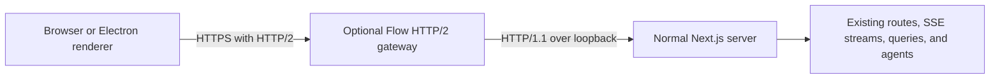

# Optional built-in HTTP/2

Status: Proposed, implementation not started  
Date: 2026-09-10  
Reviewed against: `7797f61`  
Independent proposal alongside [Optional shared WebSocket transport](optional-realtime-transport-spec.md). Neither spec replaces, requires, or authorizes implementation of the other. HTTP/2 controls the browser-facing HTTP connection protocol. The WebSocket proposal separately controls live-event delivery.

Implementation decisions updated on 2026-09-10 following implementer review. HTTP/2 is the selected current work. A tRPC migration and the independent WebSocket proposal are outside this implementation. Future composition requirements apply only when those features exist.

## 1. Objective

Add actual browser-facing HTTP/2 to Flow as an optional, removable server feature. Keep the existing HTTP APIs and SSE streams. Do not replace SSE with WebSockets or redesign how components receive updates.

With HTTP/2 enabled, ordinary requests and long-lived SSE streams can share multiplexed connections instead of competing for the browser's small HTTP/1.1 connection pool. This addresses connection contention. It does not make React rendering or git computation faster.

Flow manages the HTTP/2 listener itself. Users do not install Portless, Caddy, or another proxy. The default remains the current HTTP/1.1 startup path.

## 2. Architecture



Use Node's `http2.createSecureServer` with `allowHTTP1: true` for the gateway. HTTP/2-capable clients negotiate `h2` through TLS ALPN. Other clients can use HTTPS with HTTP/1.1 through the same listener.

Start the normal Next server on a private loopback port. The gateway owns the public app port and relays requests and responses. Next continues using its supported HTTP/1.1 server interfaces. Do not feed HTTP/2 request objects into Next, patch Next internals, or import the executor/database into the gateway.

When disabled, do not start the HTTP/2 gateway or initialize its TLS code. Use the independently selected HTTP deployment, which is direct Next on the public port by default. If the optional realtime gateway is enabled, it remains active over plain local HTTP.

SSE remains SSE over HTTP/2. The browser's native EventSource and existing fetch calls require no transport adapter, new message protocol, or new subscription manager.

### Independence and optional composition

Implement and validate HTTP/2 with the existing SSE consumers and without the WebSocket feature present. No client source factory, realtime capability endpoint, WebSocket relay, or browser transport switch is a prerequisite.

If both features are later present, support their flags independently. The combined path is browser -> HTTP/2 gateway on the public HTTPS port -> realtime gateway on a private loopback HTTP port -> Next on another private loopback port. The launcher creates one backend and the selected gateways, with fixed upstream addresses and one canonical public origin. HTTP/2 alone proxies directly to Next. The realtime gateway alone owns the public HTTP port. Neither gateway imports the other's modules or starts a second backend.

The HTTP/2 gateway provides ordinary HTTP proxying and WebSocket upgrade forwarding to its configured next hop. HTTPS HTTP/2 requests and a separate `wss:` connection may coexist. Implementing WebSockets over HTTP/2 itself is not required. Certificate management stays in this spec. Live-event framing, subscriptions, recovery, and SSE fallback stay in the WebSocket spec.

All four combinations are valid: HTTP/1.1 with SSE, HTTP/1.1 with WebSockets, HTTP/2 with SSE, and HTTP/2 with WebSockets. Either proposal can ship first. Combined-mode validation applies when both exist and does not block standalone implementation.

## 3. On/off controls

The following commands are proposed additions, not existing functionality:

```sh
# Enable built-in HTTPS and HTTP/2.
flow start --http2

# Disable built-in HTTP/2 and HTTPS, preserving the live-transport setting.
flow start --no-http2

# Development uses its normal isolated root and public port.
flow start --dev --http2

# Environment equivalents for a service or launcher.
FLOW_HTTP2=1 flow start
FLOW_HTTP2=0 flow start
```

Precedence: explicit CLI option, then `FLOW_HTTP2`, then disabled. Accept only documented boolean environment values. Keep the setting at runtime, without `NEXT_PUBLIC_*`, a Next rebuild, or a database migration. Existing `pnpm dev` and direct `next start` commands retain their behavior.

The HTTP/2 setting never selects SSE versus WebSockets. Once both features exist, `flow start --http2 --realtime-transport sse` uses native SSE over HTTP/2, while `flow start --no-http2 --realtime-transport websocket` retains the realtime gateway over plain HTTP. Do not alter one setting while toggling the other.

Changing mode requires stopping and restarting the server in V1. The launcher must not start a second backend against the same data root when an instance is already running. It reports the existing mode and the restart requirement.

The requested public port stays the same. For example, the default production URL changes between `http://localhost:4224` and `https://localhost:4224`. Read this port from existing helpers rather than duplicating constants.

There is no browser-only switch that changes the protocol of existing connections. JavaScript does not choose HTTP/1.1 versus HTTP/2 for individual fetches. A settings control, if added later, must say **Requires server restart** and coordinate an actual listener restart. A separate live-transport switch cannot change this protocol, and a backend restart cannot promise uninterrupted agents.

The off command does not uninstall certificates or delete configuration. Certificate cleanup is a separate explicit action. This keeps rollback predictable.

## 4. Browser certificate requirement

Browsers use HTTP/2 over HTTPS. Serving unencrypted HTTP/2 on localhost is not a supported way around certificate setup in ordinary browsers. The gateway removes the Portless dependency, but cannot remove browser trust requirements.

Support two certificate sources:

1. A Flow-generated local CA and localhost certificate, with a separate explicit trust step.
2. A user-supplied certificate/key pair, allowing an existing trusted local certificate setup to be reused.

Proposed explicit controls:

```sh
# Generate the local certificate if necessary and explicitly request OS trust.
flow tls trust

# Use an existing certificate instead of generating one.
flow start --http2 --tls-cert /path/to/cert.pem --tls-key /path/to/key.pem

# Explicitly remove only Flow's own trust entry.
flow tls untrust
```

Trust installation may need an operating-system permission prompt. Explain that it allows the browser to trust this local app's HTTPS certificate. Never silently install a root certificate during ordinary startup, require Portless, or advise bypassing a certificate warning.

Store generated files under `getConfigDir()/tls/`, using the path helpers. Generate a unique key per installation, use restrictive permissions, and track the identity of Flow's own trust entry. Use a suitable X.509 generation library rather than assuming every machine has a compatible OpenSSL executable. Do not bundle a shared private key.

### Certificate generation decision

Use `@peculiar/x509` with Node's built-in WebCrypto implementation and its required `reflect-metadata` dependency, loaded inside the lazy TLS module. Add and pin released versions compatible with the app's supported Node runtime through pnpm. Do not add a separate cryptographic implementation when Node provides the required algorithms. Verify both development imports and the bundled CLI entry point.

Generate a CA key and a separate server key for this Flow config root. Use RSA 2048 with SHA-256, cryptographically random positive certificate serials, a five-year CA, and a 90-day leaf renewed when fewer than 30 days remain. Backdate the validity start slightly for clock skew. Mark the CA with critical CA basic constraints, path length zero, and certificate-signing usage. Mark the leaf as non-CA with TLS server-auth usage and appropriate RSA signing/key-encipherment usage. The leaf must not outlive its CA. Verify the certificate/key match and publish them as an atomic pair, for example through a versioned directory and atomic manifest pointer replacement. Two independent file renames are insufficient. Serialize initialization/renewal for the same config root.

Keep directories owner-only and private keys owner-readable/writable on POSIX systems, with equivalent restricted current-user ACLs on Windows. Never import a private key into a browser trust store. Losing the local CA key must not silently generate and trust a new authority. Report that a new explicit trust operation is needed.

Flow does not require a user-installed certificate generator. Certificates previously created by mkcert remain valid supplied-certificate inputs. The built-in mechanism uses the library and native adapters below, rather than downloading or bundling mkcert platform binaries. The earlier draft did not prohibit mkcert explicitly, but this is the selected dependency boundary.

### Native trust adapters and supported targets

Implement small platform adapters with inspect, install, and remove operations. The explicit `flow tls trust` command authorizes trust setup for the detected supported targets and reports each result. Request native authorization only where the selected store needs it. Do not run the application itself elevated, capture a password, install packages, edit browser policy, or perform trust operations during ordinary startup.

| Target | V1 mechanism |
| --- | --- |
| macOS | Built-in `security` tool, SSL trust in `/Library/Keychains/System.keychain`, with explicit OS/admin authorization |
| Windows | Current user's `Root` store through Windows PowerShell/.NET `X509Store`. Do not silently switch to the machine-wide store |
| Debian/Ubuntu | An owned `.crt` anchor in `/usr/local/share/ca-certificates/`, then `update-ca-certificates` |
| Fedora/RHEL family | An owned PEM anchor in `/etc/pki/ca-trust/source/anchors/`, then `update-ca-trust extract` |
| Linux Chromium/Firefox | Existing current-user NSS databases, through an already installed NSS `certutil` |

These native trust-store paths are platform conventions, not Flow data-root paths. Give Linux anchor files a unique installation identifier. Invoke native tools with fixed argument arrays or a fixed script accepting parameters, never shell-interpolated certificate paths. Restrict elevated operations to the exact public certificate/store changes and native trust-bundle refresh.

For Linux Chromium, detect its active database using the documented legacy-path precedence: existing `~/.pki/nssdb`, otherwise existing `~/.local/share/pki/nssdb`. Read Firefox's current-user profile configuration. Do not create arbitrary profile databases, modify other users' profiles, or assume sandboxed browser packaging uses native-profile paths. Packaged browsers or distributions outside the tested targets get an explicit unsupported-target result and manual public-CA import instructions.

Current Firefox on macOS and Windows can use operating-system third-party roots. Do not assume a separate NSS installation is always necessary there, or change preferences/policies to force acceptance. Verify the actual supported browser configuration. Current-user Windows trust normally avoids a machine-wide install, but OS or enterprise policy can still prompt or deny it.

Return per-target results such as installed, already present, permission denied, missing tool, profile unavailable, or unsupported. If a requested target cannot be completed, return a non-success/partial result listing both completed and outstanding work. Do not claim every browser is trusted just because the system store was updated. Missing NSS tooling is not an HTTP/2 implementation failure: provide the public CA path for manual browser import or the supplied-certificate option, without automatically installing a package manager dependency. Rerunning trust retries incomplete targets safely.

### Trust ownership and removal

Keep a versioned manifest under `getConfigDir()/tls/` containing the installation UUID, CA DER SHA-256 fingerprint, public CA certificate, and each targeted store/profile/native entry identifier. Journal an intended store mutation before executing it and mark completion afterward so an interruption can be reconciled. Record whether an exact entry was already present or was created by this installation.

Before deleting an entry, read/export its actual certificate and compare the full DER fingerprint. macOS removes the matching admin trust and owned keychain certificate. Windows removes the exact matching certificate object. NSS verifies the certificate behind the recorded nickname before removing it. Linux verifies the contents of the owned anchor file before deleting it and refreshing the bundle. Never delete by display name or serial alone, remove unrecorded pre-existing entries, or touch user-supplied certificates. If ownership cannot be established, report the entry for manual cleanup rather than guessing.

Trust and untrust must be idempotent and recover from partial failure. A failed removal remains recorded for retry. Untrust removes owned trust entries, not the CA/leaf files needed to identify them, and never affects ordinary HTTP startup.

### Trust verification strategy

Normal automated tests must not change the developer's real trust stores. Cover certificate generation, constraints/SANs, key matching, expiry, renewal retaining CA identity, TLS handshakes, native argument construction, missing tools, permission denial, partial results, idempotency, and interrupted-manifest recovery with fixtures and injected native-command/store adapters.

Run actual native trust tests only in explicitly configured disposable environments. Machine-wide macOS/Linux store tests require a disposable VM or host, not merely a temporary account on the developer's machine. Disposable accounts/profiles suffice only for genuinely per-user Windows/NSS store operations. For each advertised target, create a fresh CA, observe rejection, install it, verify trusted browser requests negotiate `h2`, remove it, and verify rejection in a fresh browser process. An unrelated sentinel CA must survive installation and removal. Cover macOS, Windows, Ubuntu, and a Fedora/RHEL-family environment, plus the advertised Linux Chromium/Firefox profiles. Use real Safari for Safari trust claims. Playwright WebKit and a Node client given an explicit CA are useful tests but do not prove Safari or OS-store integration.

The implementation report must state the OS/browser versions actually tested and any unsupported combinations. Unit tests alone do not establish cross-platform trust support. No real trust test runs against the user's working machine as a side effect of `pnpm test`, build, or startup.

The generated leaf covers the supported local names/addresses, including localhost and loopback IPs. The gateway binds loopback by default. LAN hostnames, remote devices, and custom domains need certificates valid and trusted for those clients. Do not imply that trusting a certificate on the host makes it trusted on a phone.

Renew the leaf before expiry using the existing local CA where possible. Replacing the CA requires a new explicit trust operation. `flow tls untrust` removes only the matching Flow-generated entry, never a supplied certificate or another application's CA.

Default HTTP/1.1 startup creates no certificates and changes no trust settings. Noninteractive HTTP/2 startup never attempts an invisible trust installation. It reports missing/invalid certificate configuration clearly. Local certificate generation and OS trust are distinct states.

Readiness probes use a dedicated Node client configured with the selected CA or exact local trust material. Do not set `NODE_TLS_REJECT_UNAUTHORIZED=0`, alter global TLS validation, or treat every certificate error as a generic offline server. A successful local probe does not establish that the user's browser trusts the certificate.

## 5. Gateway requirements

### HTTP translation

- Translate HTTP/2 pseudoheaders into ordinary upstream method, path, and Host headers. The upstream is a fixed launcher-owned loopback address, never a client-supplied URL.
- Normalize split request Cookie fields according to HTTP cookie concatenation rules before forwarding, so authentication works identically under both protocols.
- Strip HTTP/1.1 hop-by-hop headers and headers named by Connection in both directions. Existing SSE responses include `Connection: keep-alive`, which must not be forwarded into HTTP/2. Do not copy Transfer-Encoding into HTTP/2 responses.
- Preserve authorization, cookies, status codes, multiple Set-Cookie values, content encoding, cache validators, and response bodies. Do not recompress already encoded content or parse domain payloads.
- Stream uploads and responses with backpressure. Flush SSE promptly without accumulating the complete response. Preserve SSE event text, IDs, ordering, and Last-Event-ID headers.
- Cancel the corresponding upstream request when the client cancels one stream. Do not close unrelated HTTP/2 streams or kill an agent/terminal because one viewer disconnects.
- Retain bounded per-session/per-stream buffering and request limits. Long-lived SSE streams must not exhaust a bounded upstream pool reserved for normal API calls. Use separate pool budgets for streaming endpoints and normal requests.
- Use Node's HTTP/2 flow control and bounded stream pipelines. Do not introduce an application event scheduler or replay journal.

### Public identity and auth

The gateway replaces forwarded host/protocol hints with canonical values derived from its validated authority and TLS connection. For the built-in local gateway, the frontend scheme is HTTPS. Preserve any explicitly supported external proxy mode under an exact configured origin/trust policy rather than blindly trusting arbitrary forwarded headers.

Next's existing middleware continues authenticating API requests and SSE connections. TLS is not authorization. Do not add a new account/token system or make private routes public.

Next may build `NextRequest.url` using its private hostname/port. Rewrite an absolute Location header only if it targets an exact launcher-owned private upstream authority, substituting the validated public HTTPS origin while retaining its path/query/fragment. In a composed deployment, these are the known realtime gateway and Next authorities. Preserve unrelated external OAuth redirects. Test both connector OAuth callback families. Do not rewrite arbitrary response bodies.

Generated absolute URLs, pairing, QR links, and health information must use the public scheme and port. Add a launcher-set public base URL override through the existing URL helpers, or reuse it if another deployment feature has already introduced it. Pass the same canonical origin through each explicitly configured trusted loopback proxy hop. Do not rely on `PORT` alone, since Next overwrites it with its private listening port. Audit direct `process.env.PORT` readers, auto-tunnel targets, harness self-calls, preview port allocation, and `flow stop`.

Use the launcher-set environment variable `FLOW_PUBLIC_BASE_URL` for the current process. Reuse the existing `getLocalBaseUrl()` and public-port helpers as the resolution boundary, rather than adding feature-specific URL reconstruction at call sites.

Persist managed-instance discovery in one versioned `getWorkDir()/server-runtime.json` record, shared with the process ownership required in section 6. Include a unique run ID, launcher process identity, start time, deployment mode, canonical public base URL/port, and owned private listener addresses. The file contains no auth token or TLS private key. Publish it atomically only after readiness through the public listener succeeds. Use the explicit candidate URL for startup probes and the environment override inside Next before that point.

`getLocalBaseUrl()` prefers the current process's launcher override, then a valid managed-instance record, then legacy `getStaticUrl()`/`staticUrl`, then the existing HTTP/port fallback. Ignore or reconcile invalid/stale/dead-instance records so an old HTTPS run cannot force a later direct `pnpm dev` launch to advertise HTTPS. Commands acting on a stored instance must verify ownership/liveness and health before treating the record as a running server or signaling it. A URL record alone is not proof of a live process. Public port helpers must agree with the selected public URL even though Next overwrites its private `PORT`. Every managed launch, including plain HTTP, explicit rollback, and Portless, publishes its actual selected origin after readiness.

Do not use `setStaticUrl()` as the new HTTP/2 state store. Preserve it as a legacy/configured fallback and preserve `tunnelUrl`/`getRemoteBaseUrl()` independently. New launcher-managed Portless starts can publish the same runtime record, replacing the current practice of setting/clearing `staticUrl` before startup has succeeded. This is one generic discovery/lifecycle record, not a second user settings subsystem. A failed start must not replace another live instance's discovery state or clear an existing static/tunnel URL.

Audit `getLanBaseUrl()` and `pair --lan` explicitly. The default loopback-only HTTP/2 listener cannot serve a LAN URL, and its certificate does not cover a LAN IP. Report LAN pairing unavailable in that mode unless an independently configured, supported LAN frontend exists. Do not emit the current plain-HTTP LAN URL or mechanically substitute HTTPS. Preserve valid configured remote tunnel links.

### Development and existing proxies

Development HTTP/2 is in V1 scope. Serve ordinary requests and SSE over HTTP/2 and forward HMR using a separate HTTPS HTTP/1.1 WebSocket Upgrade connection. Keep `allowHTTP1: true` and `settings.enableConnectProtocol: false`. RFC 8441 extended CONNECT is not advertised or implemented in V1. Its use requires server opt-in, so HMR does not inherently require that bridge merely because the page uses HTTP/2.

Support ordinary HTTPS HTTP/1.1 Upgrade forwarding to the fixed configured next hop, covering development HMR and any independently installed realtime socket endpoint. The HTTP/2 gateway does not implement realtime subscriptions or grant access to that endpoint. Its owner authenticates the forwarded Upgrade. Preserve the public Origin/Host semantics, upgrade headers, and any already-read upgrade bytes without sending them through ordinary response buffering.

Make actual Chrome and Safari HMR a first integration check, before completing trust-store adapters: negotiate `h2` for page/API traffic, open the HMR socket over HTTP/1.1, edit a component, verify Fast Refresh and preserved client state, then test reconnect and a reload. Use an isolated fixture/dev data root and an explicitly configured test certificate. Report actual browser versions and handshake protocol. Generic WebSocket echo tests alone do not prove Next HMR works. Fix proxy/HMR routing errors within this scope. A verified browser incompatibility is a concrete finding to resolve in the design, not permission to silently disable dev mode or add an unbounded RFC 8441 project. Do not declare dev support complete without this test.

Portless and existing HTTPS tunnels remain independent deployment options. Do not automatically stack TLS gateways. In V1, reject an ambiguous combination such as `flow start --http2 --portless` with a clear explanation to choose one frontend. Existing proxy users can retain the normal Next upstream and obtain HTTP/2 from their proxy.

Do not repoint an HTTP-only tunnel client at the new TLS listener. Preserve its existing backend target when supported, or report that the built-in HTTP/2 mode and that tunnel configuration cannot be combined yet. Local mode must not silently break existing remote links. Validate the supported combinations before shipping.

## 6. Startup and shutdown

The launcher allocates a public port and distinct private ports for Next and any independently enabled inner gateway, validates certificate files, and starts the selected chain with exactly one Next process on loopback. Readiness requires an authenticated-independent health response through the public listener plus a successful HTTP/2 negotiation probe. Report requested HTTP mode and actual negotiated protocol separately from any live-transport capability or status.

If startup fails, release the public port and stop every owned child. Do not leave Next secretly running on a private port. Graceful stop, Ctrl-C, forced stop, startup timeout, and gateway failure must be handled by explicit child-process ownership. Test cleanup of known descendants and process groups rather than assuming a SIGTERM handler also runs on SIGKILL.

Cleanup may remove the runtime record only if its run ID still belongs to the stopping instance. An old shutdown handler must not erase a newer instance's record. Resolve an existing live instance before changing configuration or discovery state. Mode changes still require the documented stop/start. Successful HTTP rollback publishes the new HTTP address, while failure leaves any unrelated valid state intact.

Track active HTTP/2 sessions. During shutdown, stop accepting new work, request graceful session closure, then destroy remaining sessions and upstreams after a bounded deadline. Persistent SSE streams must not prevent server shutdown indefinitely.

`flow stop` must discover and stop the HTTP or HTTPS instance correctly. Preserve normal voice-service ownership. Check that the listener is Flow before signaling processes, as the current implementation does.

An HTTP/2 failure does not authorize an automatic downgrade of a browser's HTTPS request to plaintext HTTP. `allowHTTP1` provides HTTPS HTTP/1.1 compatibility, not a certificate bypass. On gateway failure, report the error and offer the explicit restart with HTTP/2 disabled. This is separate from WebSocket-to-SSE fallback, which preserves the current HTTPS origin and HTTP deployment.

## 7. Origin change and user state

HTTP and HTTPS are different browser origins. The enable/disable flow must account for origin-scoped local storage and authentication, rather than promising an invisible switch.

Generate the normal pairing URL for the newly selected origin. Do not put a long-lived token in a query parameter or proxy log. Cookie sharing between schemes must not be assumed, especially when Secure cookies are involved.

Before asking the user to restart or navigate, state that the page will reload and pending work should be saved. Preserve server-backed data. Do not copy browser storage wholesale or silently lose unsent drafts. A later explicit preference/draft transfer feature can be designed separately. V1 documents the origin change and follows the existing draft-save behavior.

Do not send HSTS from this optional localhost gateway, and do not automatically redirect the disabled HTTP mode back to HTTPS. Those behaviors can make an experiment hard to turn off.

## 8. Electron behavior

Do not build an Electron shell as a prerequisite. This section defines how an eventual shell can reuse the same actual HTTP/2 gateway.

The Electron renderer loads the gateway's HTTPS URL and negotiates HTTP/2 normally. The app can trust its own generated server certificate inside a dedicated Electron session, without installing a CA in the operating-system trust store.

Configure `setCertificateVerifyProc` before loading the window. Accept the expected local hostname only when the presented certificate matches the exact certificate/public-key fingerprint obtained from the owned gateway through a trusted local control path. Retain normal verification for unrelated origins. Do not accept every localhost certificate or use a blanket ignore-certificate-errors setting.

Certificate rotation updates the pin through that trusted control path. A mismatched certificate is an error. The browser version still requires its own trust setup, even if the Electron window works.

Electron's HTTP/2 switch uses the same startup setting and requires restarting the connection/server arrangement in V1. It changes neither chat transports nor domain APIs. IPC and custom resource schemes are separate alternatives and are not part of this HTTP/2 implementation.

## 9. Implementation boundary

Proposed new modules:

| Location | Responsibility |
| --- | --- |
| `src/cli/http2-gateway/` | Node TLS/HTTP2 listener, streaming proxy, protocol/upgrade translation, limits |
| `src/lib/config/tls.ts` | Certificate paths, metadata, loading and generation using existing path helpers |
| `src/lib/config/tls-trust/` | Native trust adapters, per-target results, ownership manifest and reconciliation |
| `src/cli/commands/tls.ts` | Explicit trust/untrust operations |
| Generic server-runtime helper | Atomic discovery/process record under `getWorkDir()` and existing public-URL helper integration |
| Focused gateway and lifecycle tests | Protocol translation, streaming, TLS trust, rollback, process cleanup |

Integrate with existing CLI start/stop, public URL helpers, `tsup.config.ts`, and package scripts/dependencies. Add dependencies through pnpm. Keep gateway output separate without deleting the normal CLI artifact during builds. Lazy-load HTTP/2-only modules so the disabled path does not initialize them.

Do not change `use-session-stream`, `use-global-session-stream`, terminal EventSource construction, query reducers, event DTOs, SSE route semantics, schemas, optimistic mutations, or the executor to implement HTTP/2. Changes to public URL generation and deployment plumbing are the intended coupling boundary.

## 10. Build and verification sequence

1. Capture a production-build HTTP/1.1 baseline using an isolated data root and representative active sessions/terminals.
2. Implement the runtime flag and certificate loading/generation with fixture or supplied certificates, leaving default startup unchanged.
3. Implement the streaming HTTP/2 gateway against a small fixture HTTP server. Verify headers, cancellation, SSE, large uploads, and simultaneous streams.
4. Validate real Chrome/Safari development HMR early, then complete public URL/auth behavior and process cleanup.
5. Implement native trust adapters and their manifest. Verify browser trust in disposable environments, on/off behavior, pairing, redirects, and supported proxy/tunnel combinations.
6. Measure the same application workload with actual browser HTTP/2. Keep it opt-in until results justify a separate default change.

Acceptance checks:

- With no flag or `--no-http2`, startup does not initialize HTTP/2 gateway or TLS code. It uses direct Next by default or retains an independently enabled realtime gateway.
- With `--http2`, a trusted browser reports `h2` for real application requests and SSE. Configuration or an HTTPS URL alone is not proof.
- More than six concurrent long-lived SSE streams can coexist with responsive ordinary requests over HTTP/2, subject to the negotiated stream limit.
- Existing event IDs, replay behavior, pending approvals, terminal input/output, file uploads, API authorization, and optimistic updates retain their behavior.
- A cancelled stream closes only its upstream. Slow consumers do not cause unbounded proxy memory. Streaming connections cannot occupy every ordinary upstream socket.
- Hop-by-hop headers are removed, valid Content-Encoding and Set-Cookie values survive, and OAuth callbacks do not redirect to a private backend address.
- Browser certificate trust is explicit. Expired, wrong-host, or mismatched certificates fail visibly. Supplied certificates are never overwritten or untrusted by cleanup.
- An HTTPS HTTP/1.1 client still works through the gateway. Development HMR works in the supported browsers while page requests negotiate h2.
- `flow stop` works in both modes. Failed startup and forced shutdown leave no duplicate backend against the same root.
- Switching off requires no rebuild or data migration. HTTP works after the restart without HSTS or stale URL settings forcing HTTPS.
- If Electron coverage is added, verify the exact local pin accepts the owned server and rejects a replacement certificate without altering system trust.
- Standalone HTTP/2 builds and runs without the WebSocket feature. When both exist, verify all four setting combinations, independent rollback/removal, correct public origins, upgrade forwarding, and a single backend. HTTP/2-only startup must not advertise a realtime WebSocket capability.

Run targeted tests, browser integration checks, `pnpm ts`, `pnpm lint`, and `pnpm build`. Do not run benchmarks or failure tests against the user's real data root.

## 11. Performance decision

Compare three configurations with the same workload and native SSE selected throughout:

| Configuration | What it isolates |
| --- | --- |
| Direct Next HTTP/1.1 | Existing deployment |
| HTTPS HTTP/1.1 through the same relay logic in the test harness | TLS and gateway overhead |
| HTTPS HTTP/2 through the gateway | HTTP/2 multiplexing benefit |

Use `https.createServer` for the HTTP/1.1 control, reusing the relay logic, certificate, and HTTPS origin. Do not assume setting `ALPNProtocols` alone on `http2.createSecureServer` disables h2. Verify the protocol actually negotiated in every comparison.

If the independent WebSocket feature is also present, measure combined behavior separately while holding live transport constant when comparing HTTP versions. Do not attribute a simultaneous live-transport change to HTTP/2.

Record request queue/stall time, p50/p95 interaction and API latency, event-delivery latency, terminal input-to-echo latency, CPU, memory, transferred bytes, and connection/stream counts. Test one tab and several tabs, idle and active agents, multiple terminals, and cancellation/reconnection.

Separate implementation acceptance from the decision to recommend or enable HTTP/2 by default. V1 remains opt-in. Required completion evidence is passing correctness/lifecycle/trust checks for the advertised targets, bounded resources, and published comparative measurements. There is no universal percentage speedup required for every workload.

Use a deterministic connection-pressure fixture as a functional gate: confirm six HTTP/1.1 SSE responses are open on one browser origin, issue an ordinary request and observe it pending while those connections remain occupied, then release a stream and confirm completion. In the matching HTTP/2 case, open at least twelve long-lived SSE streams and require the ordinary request to complete while all streams remain open. Use a five-second completion timeout for this fixture, record negotiated protocols, and clean up deliberately stalled requests. This generous functional deadline is not a user-facing latency target. It proves removal of connection-slot starvation without treating an arbitrary speedup percentage as correctness.

For application measurements, use at least five warmed paired runs in alternating order with the same data, active sessions, browser versions, and observation window. Publish individual results and their spread, not only the best run. Under light load, median per-run API p95 must not regress beyond the greater of 10 ms or 10% against the direct HTTP/1.1 baseline. Investigate repeatable regressions beyond that limit before declaring the implementation ready. Verify memory settles after repeated stream churn and stays within the configured buffer budgets during sustained output.

A 25% improvement in interactive API p95 under a workload that demonstrably queues on HTTP/1.1 is a proposed promotion target, not a promised result or an excuse to fabricate load. If the application baseline does not reproduce connection pressure or the results are inconclusive, report that and leave HTTP/2 opt-in. Any target change must be explained with baseline variance before evaluating the candidate, rather than moved afterward to hide a regression. Do not promise a speedup based on a lone health request, and do not hide gateway overhead inside unrelated rendering improvements.

## 12. Rollback and removal

Operational rollback: restart with `flow start --no-http2` or remove `FLOW_HTTP2=1`, preserving any independent live-transport option. The CLI opens the selected deployment's HTTP pairing URL and replaces the stored HTTPS entry point. If WebSockets remain enabled, the realtime gateway becomes the public HTTP listener and the browser uses `ws:`. With both features disabled, startup is direct Next. Certificates may remain unused until an explicit untrust/cleanup action.

Code removal: delete the HTTP/2 gateway, TLS commands/config, flag branch, build entry, and their dedicated dependencies/tests. Retain generic public-URL plumbing, launcher support, and dependencies still used by other features. The independent WebSocket feature must continue building and running if present. App components, APIs, SSE, agents, and stored data require no transport rewrite.

This is a server/deployment change with moderate implementation work. Its removability comes from keeping HTTP/2 at that boundary, not from treating TLS, streaming, or process supervision as trivial.

## Sources

- [Node HTTP/2](https://nodejs.org/api/http2.html), particularly the browser TLS requirement, ALPN, HTTP/1 compatibility, flow control, and extended CONNECT.
- [Next custom server guidance](https://nextjs.org/docs/app/guides/custom-server). This design keeps normal Next startup and places HTTP/2 outside it.
- [Electron certificate verification](https://www.electronjs.org/docs/latest/api/session#sessetcertificateverifyprocproc) supports application-session trust without changing OS trust.
- [Peculiar X.509](https://github.com/PeculiarVentures/x509) documents the selected certificate library and runtime requirements.
- [Windows certificate stores](https://learn.microsoft.com/en-us/dotnet/api/system.security.cryptography.x509certificates.x509store), [Ubuntu local CA installation](https://ubuntu.com/server/docs/how-to/security/install-a-root-ca-certificate-in-the-trust-store/), and [Red Hat shared trust](https://docs.redhat.com/en/documentation/red_hat_enterprise_linux/10/html/securing_networks/using-shared-system-certificates) describe native store operations.
- [Chromium Linux certificate management](https://chromium.googlesource.com/chromium/src.git/+/refs/heads/main/docs/linux/cert_management.md) and [Firefox CA handling](https://support.mozilla.org/en-US/kb/setting-certificate-authorities-firefox) define browser-specific trust considerations.
- [HTTP/2 field requirements](https://httpwg.org/specs/rfc9113.html#rfc.section.8.2.2) govern header translation. [RFC 8441](https://httpwg.org/specs/rfc8441.html) defines WebSockets over HTTP/2.
- [Existing server launcher](../src/cli/lib/server.ts) and [public port discovery](../src/lib/auth/port.ts) are the principal current integration points.

Commands, controls, modules, and performance criteria above are proposed. No HTTP/2 implementation or certificate installation has been performed.
