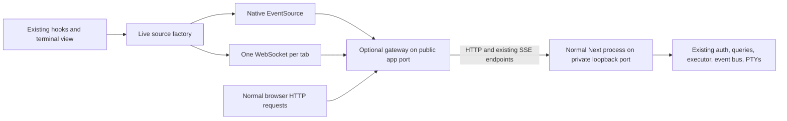

# Optional shared WebSocket transport

Status: Proposed, implementation not started  
Date: 2026-09-09  
Reviewed against: `7797f61`

Independent proposal alongside [Optional built-in HTTP/2](optional-http2-spec.md). Neither spec replaces, requires, or authorizes implementation of the other. WebSockets select how live updates reach the browser. HTTP/2 selects how ordinary HTTP requests and SSE streams share connections. Either feature may be built, enabled, disabled, or removed independently.

## 1. Decision and purpose

Add a removable experiment that carries Ri's existing live event streams over one browser WebSocket per tab. Keep SSE as the default, the fallback, and the reference implementation.

The experiment must be easy to disable without rebuilding the app, changing its data, or rewriting its components. Standalone local use must not require Portless, HTTPS certificates, Electron, or a new database service. If served through an independently selected HTTPS frontend, that frontend owns certificates and this feature uses `wss:`.

Use an optional launcher-managed gateway. It proxies ordinary requests to the normal Next server and relays the existing SSE endpoints through a WebSocket. The gateway does not import the executor, database, event bus, or terminal manager. Those continue to run in the existing Next process.

This deliberately optimizes the browser connection bottleneck first. It does not reduce the backend's SSE subscription count or claim to fix React rendering, expensive computations, or excessive invalidation.

## 2. Scope

Included streams:

| Logical subscription | Existing endpoint | Current consumer |
| --- | --- | --- |
| Global session updates | `/api/sessions/stream` | `use-global-session-stream.ts` |
| One session's events and state | `/api/sessions/:id/stream` | `use-session-stream.ts` |
| One terminal's output | `/api/sessions/:id/terminals/:terminalId/stream` | `execution-terminal-instance.tsx` |

Leave ordinary GETs, mutations, uploads, terminal input and resize, approvals, Next navigation, and preview streams on their existing HTTP paths. In particular, do not move terminal keystrokes onto WebSockets in this experiment. The existing input queue owns their ordering and timeout behavior.

Keep layout consolidation, chat rendering improvements, hover previews, cache fixes, polling changes, and invalidation coalescing in separate changes. They can ship independently. Combining them with this trial would make its performance results hard to interpret.

Do not add HTTP/2, certificate management, cross-tab connection sharing, a transport plugin registry, an Electron IPC implementation, or a generic RPC protocol.

## 3. Architecture and removal boundary



With the experiment disabled at startup, the realtime gateway is absent. Browser requests use the selected HTTP deployment, which is direct Next by default. An independently enabled HTTP/2 gateway remains active.

With the gateway running but the browser switch off, native EventSource requests pass through it normally. This is useful for comparing SSE and WebSockets without changing the backend process or restarting running agents.

The integration consists of one launch branch, a public-URL override through existing helpers, a small client source factory, three source-construction replacements, a terminal-output handover adapter, a capability route, and initial-resume parsing in two SSE routes. No producer should know which browser transport is selected.

This is a moderate implementation because it includes a public proxy and process supervision. Its small coupling surface makes it easy to operate and remove, not a one-line networking change.

Use Node networking in the gateway. Do not use browser/Electron networking for the upstream SSE connections. Separate the ordinary HTTP proxy pool from the long-lived SSE pool so subscriptions cannot exhaust the pool used by normal API calls.

### Independent deployment

The settings are independent, with all four combinations supported once both features exist:

| HTTP/2 | Live transport | Browser behavior |
| --- | --- | --- |
| Off | SSE | Current HTTP/1.1 requests and native SSE |
| Off | WebSocket | HTTP/1.1 requests and one local `ws:` connection for eligible live updates |
| On | SSE | HTTPS HTTP/2 requests and native SSE |
| On | WebSocket | HTTPS HTTP/2 requests and one `wss:` connection for eligible live updates |

For the combined deployment, use explicit proxy composition: browser -> HTTP/2 gateway on the public HTTPS port -> realtime gateway on a private loopback HTTP port -> Next on another private loopback port. The launcher owns one Next process and the enabled gateways. It allocates the chain once rather than invoking two launchers that each start a backend. Each gateway talks to its fixed configured upstream over HTTP/1.1 and needs no imports from the other feature.

The HTTP/2 gateway forwards ordinary WebSocket upgrades to the realtime gateway. The WebSocket need not itself run over HTTP/2. The realtime gateway receives the canonical public HTTPS origin through an explicitly configured trusted loopback proxy, so capabilities, auth, cookies, redirects, and `wss:` use the browser's actual origin. Only the HTTP/2 feature owns local certificate setup.

Implement and validate this proposal on plain local HTTP without the HTTP/2 feature present. Composition checks apply when both features exist and are not a prerequisite for shipping either one alone. Do not introduce a transport framework or make one feature's modules depend on the other's.

## 4. Turning it on and off

### Server controls

Add the following proposed CLI option and environment variable:

```sh
# Use native SSE. No realtime gateway. This remains the default.
ri start --realtime-transport sse

# Start the optional gateway and offer WebSocket transport.
ri start --realtime-transport websocket

# Development uses the same launcher behavior and the dev data root.
ri start --dev --realtime-transport websocket

# Equivalent process-scoped opt-in.
RI_REALTIME_TRANSPORT=websocket ri start
```

Precedence: explicit CLI option, then `RI_REALTIME_TRANSPORT`, then `sse`. Reject invalid values. Do not persist this policy in SQLite or auth configuration. Do not use `NEXT_PUBLIC_*` or require a Next rebuild to change modes.

These controls affect only live transport. They never enable or disable HTTP/2 or change certificate trust. For example, `ri start --http2 --realtime-transport sse` retains HTTP/2 while disabling the realtime gateway, and `ri start --no-http2 --realtime-transport websocket` enables WebSockets over plain local HTTP. These combinations become available once both independent features are implemented.

Keep `pnpm dev`, `pnpm dev:hot`, and normal `next start` working as they do today. Add an explicit development convenience script using the launcher if useful. Do not silently route existing commands through the gateway.

Starting an already-running instance does not change its transport. Report its current mode. Never start a second backend against the same data root to satisfy a different requested mode. Changing server mode requires an ordinary stop/start and should not be disguised as a harmless live setting change.

### Browser controls

Add one switch in General settings using the existing Switch component:

- Label: **Experimental live connection**
- Description: **Use a shared connection for live updates. Turn this off to use the standard connection.**
- Status: **Using shared connection**, **Using standard connection**, or **Standard connection after a connection error**.

When the server offers WebSockets, use them unless this browser has opted out. Save the opt-out per origin using the existing browser-preference pattern. A startup in `sse` mode always overrides browser preferences.

The browser switch takes effect without a page reload, component remount, agent restart, terminal restart, or query-cache clear. Restart only the live subscriptions. Turning the switch back on explicitly retries capability discovery and the WebSocket handshake.

This switch and automatic SSE fallback preserve the current page origin and HTTP deployment. SSE fallback over an HTTP/2 frontend remains SSE over HTTP/2. A separate HTTP/2 mode change requires a server restart and changes the HTTP/HTTPS origin, so per-origin browser preferences may differ afterward.

Provide `?realtime=sse` as an emergency, tab-scoped override that works before settings load. It must bypass WebSocket startup even if local storage is inaccessible. Do not store it as a user-wide preference.

### Capability discovery

Add authenticated `GET /api/realtime/capabilities`, with `Cache-Control: no-store`:

```json
{
  "version": 1,
  "websocket": true,
  "path": "/api/realtime/socket"
}
```

The route reports `websocket: true` only when the realtime gateway is enabled, using a private launcher-set environment marker. Normal Next and HTTP/2-only launches report false. HTTP/2 configuration and negotiation never determine this capability. A marker advertises availability, not proven reachability. Handshake failure still falls back.

Use a relative path. Derive `ws:` or `wss:` from the page's current scheme and host. Never tell a remote browser to connect to localhost or a private backend port. Local HTTP works without certificates. Existing HTTPS proxies continue to use `wss:`.

Capability failure, timeout, an older server returning 404, or unsupported protocol version selects SSE. It must not block initial REST queries, page rendering, or message sending. Bound discovery plus the first handshake to three seconds before choosing SSE. Once connected, bound each subscription's wait for upstream `open` to three seconds as well. An upstream-open timeout cancels that upstream and falls back the tab's experimental sources to SSE.

## 5. Gateway implementation

Build a separate Node entry point under `src/cli/realtime-gateway/`. Use `ws` for WebSocket framing and a maintained streaming HTTP proxy library for ordinary requests and upgrades. Add explicit dependencies through pnpm rather than depending on Next's private bundled packages. The browser uses its native WebSocket API.

When used alone, the realtime gateway owns the public listener. With an outer HTTPS gateway, it listens on a private loopback port instead. The launcher starts exactly one normal `next dev` or `next start` child on a separately allocated private port bound to `127.0.0.1` and supplies its address to the realtime gateway. Do not replace Next's request handler, patch its Upgrade listeners, or add instrumentation hooks to reach the event bus. Proxy all non-experiment upgrades to Next so development HMR retains its normal implementation.

Only `/api/realtime/socket` is handled by the experiment. Proxy normal HTTP methods, status codes, redirects, multiple Set-Cookie headers, streamed bodies, cancellation, and compression headers correctly. Do not buffer whole uploads or responses. Preserve the original public host and scheme under the explicit forwarding policy in section 9. Do not manufacture HTTPS or redirect local HTTP to HTTPS.

Next can construct `NextRequest.url` from its private listening address even when forwarded headers are present. Rewrite a response Location only when its authority matches the known private backend, substituting the validated public origin and retaining its path/query/fragment. Preserve unrelated external OAuth redirects. Test the connector OAuth callback and MCP OAuth callback error paths, which construct redirects from the request origin. Do not attempt arbitrary response-body URL rewriting.

An ordinary HTTP request to the socket path receives a small 426 response. The socket endpoint is not a Next App Router route.

### Public versus private port

Use a launcher-set public base URL override through the existing URL/port helpers. Reuse that generic override if already introduced by another deployment feature rather than adding competing settings. Leave its absence behavior unchanged. Next overwrites `process.env.PORT` with its actual listening port, so passing the public port in `PORT` is insufficient. A port alone also cannot describe an outer HTTPS origin.

Persist the actual reachable local entry point, including scheme and port, for `/api/health`, pairing URLs, `ri stop`, and QR links. Keep any configured remote URL separate. Internal backend requests use their fixed private addresses explicitly. Never derive the private upstream from a browser-supplied host, path, or URL.

Audit `src/lib/auth/port.ts`, `bootstrap.ts`, `auto-tunnel.ts`, and all direct readers of `process.env.PORT`, including harness and preview code. Centralize public URL/port resolution in the existing helpers rather than scattering gateway checks. Reserve every allocated public and private port from preview-server allocation.

If Portless is used as the HTTPS frontend, it wraps the realtime gateway and supplies its listening `PORT`. Next receives a different private port. HTTP tunnel clients can target the realtime gateway directly while its configured public origin remains the external HTTPS URL. Never silently repoint an HTTP-only tunnel client at a TLS listener. Validate the explicit proxy deployment and preserve any HTTP/2 feature's restrictions on additional TLS frontends. The WebSocket feature must not require Portless, a tunnel, or built-in HTTP/2.

### Lifecycle

The launcher/gateway owns the complete child-process tree. Readiness requires Next health through the public listener. On startup failure or timeout, tear down the child before exiting. Never recover a gateway failure by leaving Next running secretly on a private port or starting another backend.

Ordinary stop, Ctrl-C, forced stop, parent failure, and gateway failure must leave no orphan Next process. Extend stop/process supervision as needed, including forced termination of known descendants. Do not rely on a SIGTERM handler for SIGKILL cleanup. Preserve existing voice-service ownership rules.

Add the gateway to the existing build configuration as an independent output without deleting the CLI artifact. The SSE-only launch path must not import or start the realtime gateway, regardless of the independently selected HTTP deployment.

## 6. Client boundary

Introduce `createLiveSource(topic)` under `src/lib/realtime/client/`. Return the small EventSource-compatible surface actually used today:

- `addEventListener` and `removeEventListener`
- `onerror`
- `close`
- `readyState` if needed for diagnostics

Allow one optional source-lifecycle callback, `beforeReconnect`, which returns a promise for the last applied cursor. Ordinary synchronous consumers need no callback. The terminal adapter uses it to drain outstanding writes before source replacement.

Keep event names, `MessageEvent.data` strings, `lastEventId`, and callback ordering compatible. Source creation must let callers register listeners before events can be delivered, including when another subscription has already opened the shared socket.

The SSE adapter wraps native EventSource. The WebSocket adapter shares a tab-local connection manager. The manager owns transport selection, subscription IDs, connection generations, cleanup, and fallback. It does not own TanStack Query or application state.

Replace the three existing `new EventSource(...)` call sites. Retain their cache updates, authoritative refetch on session `open`, terminal `ready` semantics, and close-on-terminal-exit behavior. Also introduce a small terminal-output adapter around `term.write` and `term.reset` to provide the completion boundary described below. Constructor replacement alone cannot provide that boundary. Do not combine this change with a reducer rewrite or new invalidation policy.

Each source instance gets a unique subscription ID. V1 intentionally retains separate logical subscriptions even if two components request the same session. Sharing an upstream subscription would require separate initial snapshots for new consumers, especially terminal views. That is independent of combining browser connections and is not part of this trial.

One browser tab therefore has one WebSocket, potentially containing several subscriptions to the same endpoint. Other browser tabs have their own connections. Source `close()` only cancels that subscription. Close the WebSocket when the last source closes. Make module replacement and provider teardown dispose the old manager so development cannot leak connections.

## 7. Wire protocol: relay existing SSE

Use versioned control envelopes and opaque SSE text chunks. Do not recreate domain payload schemas in the gateway.

Client controls:

```json
{"op":"subscribe","id":"sub-1","topic":{"kind":"session","sessionId":"..."},"lastEventId":"..."}
{"op":"unsubscribe","id":"sub-1"}
{"op":"ack","id":"sub-1","through":7}
```

Topic variants are `global`, `session`, and `terminal`. The terminal variant carries `sessionId` and `terminalId`. The gateway constructs the corresponding allowlisted endpoint and encodes path segments. Clients cannot supply an upstream URL or an arbitrary API path.

Server controls and data:

```json
{"op":"hello","version":1}
{"op":"open","id":"sub-1"}
{"op":"chunk","id":"sub-1","seq":7,"text":"event: runtime\ndata: {\"running\":true}\n\n"}
{"op":"end","id":"sub-1"}
{"op":"error","id":"sub-1","code":"upstream_unavailable"}
```

Negotiate version 1 before subscribing. Send `open` only after the upstream responds with 200 and an SSE content type. Request `Accept: text/event-stream` and `Accept-Encoding: identity` from internal SSE endpoints. Reject unexpected content encoding rather than decoding compressed bytes as text. Forward the body using a streaming UTF-8 decoder. Chunks can split events and lines, so chunk boundaries have no event meaning.

Chunk sequence numbers are increasing within one subscription generation. Acknowledgments replenish delivery credit only, not durable replay history. Reject acknowledgments for unsent sequence numbers. The gateway uses its own recorded encoded byte counts, never a client-reported count.

Use a tested SSE parser in the browser adapter, such as `eventsource-parser`, following the browser event-stream format. It must handle partial UTF-8 input, CR/LF variants, multiline data, named events, comments, `id`, empty IDs, and retry fields. Preserve data text verbatim. Do not parse and reserialize the event's JSON payload in the gateway.

Native EventSource emits `message` for unnamed events. Match that behavior. A named SSE `error` message from a terminal is application data and must not be confused with a gateway transport error. An upstream EOF is not a successful permanent completion unless the consumer has closed its source, for example after terminal exit. Otherwise reconnect/fallback applies.

Forward `Last-Event-ID` to the upstream only from that subscription's validated cursor. Never share one cursor between channels. Never log cookies, event bodies, terminal output, or token-bearing headers.

## 8. Handover, recovery, and known limits

The intended state transitions are simple:

```text
start -> standard SSE
start -> discover -> WebSocket
WebSocket failure -> standard SSE for the rest of this tab's trial
explicit retry -> discover -> WebSocket
explicit off -> standard SSE
```

Do not oscillate between transports in the background. After a WebSocket failure, retain SSE until the user explicitly retries or starts a new page load. Native EventSource continues to own its normal reconnect behavior in fallback mode. Authentication failure is handled separately below.

On any transport replacement, including an explicit attempt to enable WebSockets from SSE:

1. Increment the source generation and stop accepting frames from its old connection.
2. Close/abort old subscriptions and discard incomplete SSE frames.
3. Await any terminal consumption barrier and retain each source's last fully applied event ID.
4. Perform capability discovery if needed, then create the replacement sources with their cursors.
5. Deliver their normal `open` and application `ready` messages through the existing consumers.

Closing the old SSE connections must precede capability discovery on an explicit retry. Otherwise that discovery request can sit behind the exact HTTP/1.1 connection exhaustion the experiment is meant to avoid. The three-second budgets bound attempts to choose the experimental transport. They do not promise that arbitrarily many fallback SSE connections can open simultaneously under the browser's original limits.

A new native EventSource cannot set a custom `Last-Event-ID` header. Add a narrowly scoped `lastEventId` query parameter to the session and terminal SSE routes for this initial handover. A native reconnect's header takes precedence over the query parameter. Use a shared parser, reject control characters and oversized strings, and require a safe nonnegative integer for terminal cursors. A cursor is not an auth credential and never bypasses authentication.

This extension must have identical behavior whether the experimental gateway is running or not. Older servers that ignore the query parameter remain compatible through the existing fresh-connect behavior: session `open` refetches authoritative data, and terminal `ready` resets before its replay.

Preserve terminal `ready -> replay -> live output -> exit` ordering. Off/on must not kill, recreate, resize, or send input to a PTY. Keep the xterm instance mounted. The terminal-output adapter advances its applied cursor from xterm's `write` completion callback, serializes resets with writes, and implements `beforeReconnect` by draining already-accepted output. Fence new old-generation input first. Do not deliver replacement `ready`, reset, or replay until the drain finishes. Generation checks alone cannot cancel bytes already queued inside xterm. If draining exceeds two seconds, keep the replacement paused and report the delayed switch in diagnostics rather than dropping output or pretending the handover completed.

Terminal offsets are JavaScript string code-unit counts. Ring retention is measured in UTF-8 bytes. Do not reinterpret the cursor as a byte offset. A replay gap intentionally resets the view and restores the retained tail, which is not a full serialized terminal screen.

This experiment preserves the existing endpoint recovery semantics. It does not promise exactly-once delivery or unlimited lossless replay. Current chat replay is capped at 1,000 rows, accepts caller-generated event IDs, and does not represent replacements of existing IDs as a durable mutation sequence. The current client also discards repeated IDs. These are existing correctness limitations, not guarantees to copy into a new protocol. Keep the authoritative reconnect refetch and document the limits in validation results. Any fix to durable replay or same-ID updates must be a transport-independent change that applies equally to SSE and WebSockets.

## 9. Authentication and resource isolation

A raw WebSocket Upgrade does not pass through Next's API authentication automatically. Before accepting it, the gateway makes an internal request to the authenticated capability endpoint at its fixed private backend address using the incoming browser's session cookie. Forward only necessary credentials and metadata. A 401/403 rejects the Upgrade. Require a JSON response matching the capability schema, with an 8 KiB body limit and a one-second deadline. Abort the check if the incoming socket closes. Never follow a redirect or treat an arbitrary 200 HTML response as authentication success.

Also require an allowed browser Origin. Build an exact normalized origin allowlist from public localhost/loopback URLs and explicitly configured LAN, remote, and Portless URLs. Use existing path/config helpers and refresh this list when configured public URLs change. Reject missing/null and unexpected Origins for this browser-only V1. Do not accept an Origin merely because it matches an attacker-supplied forwarded header.

The current application does not have a general trusted-proxy policy to reuse. Specify it in the gateway: direct requests use the validated Host and actual connection scheme. Only accept forwarded host/scheme from a loopback proxy connection for an explicitly configured proxy deployment, and only when the resulting public origin is allowlisted. Otherwise strip incoming forwarding hints and write canonical ones. Add other trusted proxy addresses only through an explicit launcher setting if a supported deployment needs them. Keep this policy confined to the optional gateway, and test direct, LAN, Portless, and tunnel requests.

Every subscription is an authenticated GET to an existing SSE route using the same cookie. This keeps session lookup and terminal ownership in the existing application. Do not bypass those checks by importing the PTY registry into the gateway. Abort an upstream immediately on unsubscribe, socket close, authentication loss, or shutdown.

Revalidate long-lived WebSocket authentication at least every 60 seconds through the same authenticated backend endpoint, with the same deadline, body limit, and schema validation as the Upgrade check. On logout, the local manager closes immediately. Revocation/expiry closes all that socket's subscriptions and invokes existing auth recovery. Browser WebSocket errors hide HTTP handshake status, so use the authenticated capability request to distinguish auth loss from network failure rather than inferring 401 from a generic socket error. A backend 401/403 must not trigger endless alternate-transport attempts. Do not put tokens in WebSocket URLs or add a second credential store.

Use explicit, tested V1 limits in one module rather than many user-facing knobs:

- At most 128 subscriptions per socket.
- At most 16 KiB for incoming control messages. No application writes are accepted.
- At most 2 MiB of queued gateway output per socket, including unsent WebSocket data and pending chunks.
- At most 256 KiB of sent but unacknowledged chunk data per subscription, and 2 MiB in aggregate per socket. Stop scheduling that subscription until credit is replenished.
- At most 1 MiB of incomplete SSE event text per parser and 2 MiB of pending parser/dispatch data per tab. Oversized events select the standard transport rather than being truncated.
- Small output frames, approximately 16 KiB, scheduled fairly between subscriptions. A noisy terminal must not monopolize the shared connection's send queue.
- Heartbeats and a bounded dead-peer timeout, including a check on visibility return after laptop sleep. Do not interpret one delayed timer in a background tab as a protocol failure.

WebSocket per-message compression is off initially, and internal SSE uses identity encoding as specified above. Do not add an unbounded SSE parser buffer or browser dispatch queue. Reuse any needed transport backpressure mechanism without changing event order. If a limit is exceeded, close/abort the affected experimental transport and resume through SSE from the last applied cursor. Never silently discard terminal bytes or chat events and continue as if caught up. Do not pause or kill the underlying PTY for other viewers.

The browser WebSocket API does not itself guarantee application-consumer backpressure. Use the `ack` controls above for delivery credit. A partial-event chunk can be acknowledged after admission to the bounded parser. A chunk that completes an event is acknowledged after its synchronous consumers return, or after the terminal's write callback for terminal output. Preserve contiguous acknowledgment order within a subscription. Credits belong to the transport/terminal adapter, not the domain event bus. Bound aggregate retained upstream data as well, and abort upstream reads before their queues can exceed the limit.

## 10. Implementation map

Proposed new files can be consolidated where that makes the implementation smaller:

| Location | Responsibility |
| --- | --- |
| `src/cli/realtime-gateway/` | Optional bootstrap, proxy, allowlisted SSE relay, protocol limits, shutdown |
| `src/lib/realtime/client/` | Source interface, native SSE adapter, WebSocket manager, browser preference |
| `src/lib/terminal/output-consumer.ts` | Small xterm write/reset ordering and handover-completion adapter |
| `src/lib/realtime/transport-protocol.ts` | Control envelope types/validation only, no copied entity types |
| `src/lib/realtime/resume-cursor.ts` | Shared initial-resume parsing for the two existing routes |
| `src/app/api/realtime/capabilities/route.ts` | Authenticated, runtime capability response |

Existing integration points:

- `src/cli/index.ts`, `commands/start.ts`, `lib/server.ts`, and `commands/stop.ts` for optional launch and process ownership.
- `tsup.config.ts` and `package.json` for build output and dependencies.
- `src/lib/auth/port.ts` and verified public-port callers for public/private port separation.
- `src/hooks/use-global-session-stream.ts`, `src/hooks/use-session-stream.ts`, and `src/components/executions/execution-terminal-instance.tsx` for source construction.
- The two session/terminal SSE routes for initial resume query support.
- Existing General settings for the browser switch and effective status.

Keep `queries.ts`, the executor, `bus.ts`, `pty-manager.ts`, entity schemas, optimistic mutation hooks, and domain API contracts free of WebSocket-specific behavior. The gateway's bridge is HTTP, not shared process memory.

## 11. Implementation sequence

1. **Record the baseline.** Capture current direct SSE behavior, open connections, API queue time, idle traffic, terminal memory, and a representative interaction trace. Use isolated test data, not the real production database.
2. **Extract the source boundary.** Add the factory with SSE only, initial cursor support, and parity tests. Keep WebSockets and the gateway absent. Confirm no reconnect, auth, terminal, or cache behavior regression.
3. **Build the optional gateway.** First proxy ordinary HTTP/SSE and HMR correctly. Verify public URL discovery and complete process cleanup before adding multiplexing.
4. **Add WebSocket relay.** Implement protocol framing, source generations, cursor handover, auth, fairness, bounded queues, and automatic SSE fallback. Keep mutations on HTTP.
5. **Add controls and diagnostics.** Runtime flag, browser switch, emergency URL override, actual effective-mode reporting, and explicit retry.
6. **Run correctness and performance comparisons.** Publish the results alongside the implementation. Default remains SSE. Enabling by default requires a separate decision supported by these results.

Each step should be independently reviewable. Do not require landing the unrelated responsiveness work first.

## 12. Acceptance and validation

### Correctness

- Default production and development startup create no realtime gateway or realtime browser WebSocket. An independent HTTP/2 setting does not change this behavior. Existing development HMR is unaffected.
- Opt-in carries every eligible source through one browser WebSocket per tab, with no browser SSE connections for those sources while healthy.
- Normal requests and terminal writes remain HTTP. Subscribing cannot perform mutations.
- SSE-adapter and WebSocket-adapter fixtures emit identical event names, data strings, IDs, and order, including multiline/fragmented events and named `error` events.
- Adding a source to an already-open socket does not deliver its initial events before handlers are registered.
- A healthy WebSocket handshake followed by a stalled upstream subscription reaches bounded fallback. Enabling the experiment while SSE has filled the ordinary connection slots can still complete discovery after releasing those sources.
- Closing one source preserves every other source. Late frames from an old source/generation cannot mutate a new view.
- Terminal reconnect and off/on preserve PTY identity, ordering, and Unicode cursor semantics. A gap follows the existing explicit reset behavior. Exit closes only its own source.
- Handshake rejection, unsupported versions, proxy upgrade failure, server restart, upstream EOF, offline/online, and sleep/wake recover to SSE within the specified connection budget where the HTTP service is available.
- User off/on and automatic fallback keep editors, pending uploads, active agents, and terminal instances mounted. Tests explicitly cover output queued during handover.
- Unauthorized and cross-origin handshakes fail. Credential expiry/revocation terminates access within the defined interval. No credential appears in a URL or diagnostic output.
- A terminal flood cannot starve a small session event indefinitely or cause unbounded gateway/browser memory. Validate multiple viewers so disconnecting one does not affect another's PTY.
- Public health, pairing, stop, auto-tunnel, Portless, dev HMR, API compression, uploads, streamed responses, and OAuth callback redirects work through the gateway. No private backend authority leaks into app redirects.
- Graceful stop, forced stop, startup timeout, and gateway/parent crashes leave no orphan backend or duplicate writer to a data root.
- Existing replay limitations, including more than 1,000 missed chat rows and same-ID event replacements, are tested/documented as shared baseline behavior. Do not describe them as solved by multiplexing.
- Standalone WebSockets build and run on plain local HTTP without the HTTP/2 feature or certificate setup. When both features exist, verify all four setting combinations, independent rollback/removal, same-origin fallback, correct public URLs, and a single backend. Turning off WebSockets must leave HTTP/2 enabled when selected.

### Performance experiment

Compare three modes using the same build, data, open session/terminal set, and machine conditions, with built-in HTTP/2 disabled throughout:

| Mode | Purpose |
| --- | --- |
| Direct Next with SSE | Current deployment baseline |
| Gateway with browser switch off | Isolate gateway overhead |
| Gateway with browser switch on | Isolate the benefit of multiplexing |

If the independent HTTP/2 feature is also present, separately compare SSE and WebSockets while keeping HTTP/2 enabled in both runs. Do not conflate a change of live transport with a simultaneous change of HTTP version or TLS setup.

Use both one tab and several tabs, idle and active agent sessions, multiple terminals, a noisy terminal, and a degraded/blocked WebSocket path. Include Chrome and Safari desktop, and mobile Safari/Chrome for fallback and sleep/resume behavior.

Record API request queue/stall time and p50/p95 end-to-end latency, incoming-event-to-cache-update latency, terminal input-to-echo latency, server/browser CPU and memory, bytes transferred, connection counts, fallback counts, and duplicate/missing visible updates. Do not rely on an isolated health response as proof of interaction performance.

Proposed acceptance targets, to calibrate against baseline variability before implementation:

- One browser WebSocket replaces N eligible persistent browser SSE connections in healthy experimental mode.
- Under connection pressure, interactive API p95 improves by at least 25% with no correctness regression.
- Under light load, the experiment adds no more than 10 ms or 10% to API p95, whichever allows more measurement noise.
- Gateway-only mode meets the same light-load overhead threshold against direct SSE.
- Memory settles after repeated connection/terminal churn. Queues stay within their limits during sustained output.

Treat these as decision criteria, not predicted results. If the benefit is small or the gateway overhead is material, leave SSE as the default or remove the experiment.

Diagnostics should expose effective mode, reason for fallback, active source count, socket count, queued bytes, reconnects, and upstream error categories. Use local diagnostics only. Do not add remote telemetry or per-event production logging.

Run focused transport/proxy/replay/auth tests, browser integration scenarios, `pnpm ts`, `pnpm lint`, and `pnpm build`. Follow existing test-root helpers and never hardcode an application data directory.

## 13. Rollback and deletion

Immediate browser rollback: turn off **Experimental live connection** or open the app with `?realtime=sse`. This restores standard live connections without restarting the backend.

Complete operational rollback: restart Ri with `--realtime-transport sse` or remove the opt-in environment variable, preserving any independent HTTP/2 option. This removes the realtime gateway and restores native SSE over the selected HTTP deployment. An enabled HTTP/2 gateway stays active. With both features disabled, startup is direct Next. No rebuild, database migration, certificate operation, or data conversion is required. An ordinary backend restart has its usual consequences for active processes, so use browser rollback first during an active session.

Complete code removal: remove the realtime gateway launch branch, build entry, dedicated dependencies, capability route, settings control, and WebSocket adapter. The client factory can remain as a small native EventSource wrapper or the three constructors can be restored. Remove the public-URL override and resume query helper only if no other caller uses them. Retain generic launcher support and dependencies still used by other features. The independent HTTP/2 feature must continue building and running if present. No domain model or event producer must be rewritten to complete deletion.

## 14. Future options

If the trial succeeds, a later change may subscribe to the in-process bus directly to remove internal SSE overhead. That requires a separate design because the gateway and Next do not share memory. Do not turn this experiment into that redesign implicitly.

An Electron build can use the standalone realtime gateway over plain HTTP and `ws:` without certificates on localhost. If HTTPS is independently selected, that frontend or shell owns certificate trust and the connection uses `wss:`. A future IPC adapter could implement the small source interface, but is not needed for V1. HTTP/2 remains an independent deployment option and does not become a condition for this feature.

## References

- [Existing global/session event bus](../src/lib/realtime/bus.ts), [session consumer](../src/hooks/use-session-stream.ts), and [terminal replay](../src/lib/terminal/replay.ts) define current app behavior.
- [Next custom server documentation](https://nextjs.org/docs/app/guides/custom-server) describes a different integration route. This spec retains normal Next startup to avoid that dependency.
- [ws documentation](https://github.com/websockets/ws) covers explicit Upgrade authentication, shared HTTP servers, and heartbeat handling. Browser clients use native WebSocket.
- [HTML event-stream specification](https://html.spec.whatwg.org/multipage/server-sent-events.html#parsing-an-event-stream) defines SSE parsing and cursor behavior.
- [eventsource-parser](https://github.com/rexxars/eventsource-parser) provides an existing streaming parser rather than requiring a new SSE implementation.
- [Chromium connection-pool implementation](https://chromium.googlesource.com/chromium/src/+/master/net/socket/client_socket_pool_manager.cc) separates normal HTTP and WebSocket connection pools.

The architecture, commands, thresholds, and rollout policy above are proposed design choices. Implementation has not started, and no performance improvement has been measured for this proposal.
