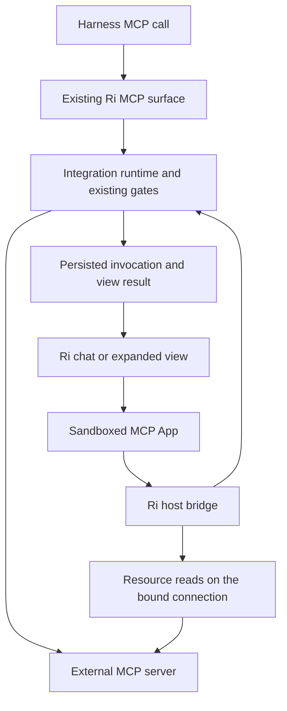

# Ri plugins and embedded views

October 8 connected-app clarification: [the current source/app contract](app-connector-mentions-spec.md#9-connected-mcp-apps-and-a-common-view-host) explicitly retains externally connected MCP apps with UI. The local builder is one origin of apps, and does not replace connected-app hosting. Use the revised contract for shared catalog/mentions, common view protocol, distinct authority/lifecycle and bounded capture. Older renderer, rail and persistence proposals below remain historical.

Historical research and proposal, October 2, 2026. This document is not a current implementation status report.

**October 7 direction, amended October 8:** Start with [the local-apps handoff](local-apps-handoff.md). [Local apps and the built-in builder](local-apps.md) records the owner's revised product direction: local execution, app-owned storage, framework-neutral views, access to Ri capabilities, and self-documenting app packages. Its [implementation contract](local-apps-implementation.md), [Finances integration](local-apps-finance.md), [modularity decision](local-apps-modularity.md) and [app and Connector mentions](app-connector-mentions-spec.md) are the current engineering handoff. They take precedence where they differ from this earlier hosting proposal. Preserve the research and evaluation evidence below, but do not treat its assumptions or milestones as an independently authoritative backlog.

Primary task: `01a0f91f-f818-78ab-9d75-77901a407b06` (Ri Plugin UI). Related naming task: `01a08844-de63-79fa-aa7b-8d3af5abc9db`.

**Historical handoff:** The task above supplied scope for this October 2 proposal. Current owner instructions and the linked local-apps design determine the new direction. The October 2 reconciliation with the skill draft/install lifecycle remains historical context.

## Recommendation

Make **Plugins** a first-class destination in the power rail, replacing **Connect apps**. Bring together the capabilities a person has added and let useful interactive views open alongside their work. Build on Ri's existing integrations and skill system.

Use **plugin** for a capability someone adds to Ri, **integration** for the adapter to an outside service, **connection** for a particular authorized account, and **skill** for reusable instructions. An embedded **view** is optional. A plugin need not contain all of these.

Keep one plugin library. Agent tools, contextual interactive results and a supported launch view are independent capabilities, not mutually exclusive plugin types. A provider can offer several. Skills have their own draft/install lifecycle inside the same library.

The production direction is Ri hosting MCP Apps, preceded by the standalone evaluation below. Publishing Ri into ChatGPT is a separate product/distribution decision and is not a prerequisite. There is no reason to build a second Ri task board to make third-party views work inside Ri.

The product test is whether people can finish a concrete piece of work with less effort: inspect a result, choose a few items, adjust something visually, and continue with their agent. Merely having an extension marketplace or another dashboard does not meet that test.

## Start with a migration-free evaluation

The immediate next step is a hands-on demo. The production design below describes what a supported release would require, not what must be built before evaluating the idea.

Start with the official `basic-host` in an isolated development setup, outside Ri's dependency tree and live Home. Use preset example inputs so the person evaluating it does not have to write tool JSON. Try Excalidraw's real MCP App plus one reference application, such as Scenario Modeler or the interactive map. Excalidraw documents a remote endpoint and interactive editing. Scenario Modeler has sliders and changing charts. These are documentation-verified candidates, not claims of a successful live connection from Ri. [Excalidraw](https://github.com/excalidraw/excalidraw-mcp), [Scenario Modeler](https://github.com/modelcontextprotocol/ext-apps/blob/main/examples/scenario-modeler-server/README.md), [reference host](https://github.com/modelcontextprotocol/ext-apps/blob/main/examples/basic-host/README.md).

This first evaluation needs no Ri schema migration, account migration, package manager, gateway rewrite or chat-history integration. Keep results in memory for the demo session. On reload or expiry show that the session ended, rather than automatically repeating a tool call. Use synthetic inputs and public/example services without importing Ri's credentials or private task data. Retain the reference sandbox in an environment isolated from Ri's authenticated origin. A working demo is evidence about interaction, not production host security or full conversational compatibility.

If the interaction is useful, the next experiment is one development-only view in Ri using the same host component, a temporary capability list and bounded session memory. Reuse the existing runtime gates for any Ri connection. Resource access and original UI metadata still require a small adapter because the current client does not expose them. Keep native sandbox isolation. Start with one local browser surface and show unsupported features honestly. Durable history, global launch behavior, every harness and desktop/remote packaging are release work, not prerequisites to this local evaluation.

The evaluation should answer: which actual workflow is easier, whether opening it from Plugins is useful, and whether a chat result or an expanded view is the better entry point. Record endpoint/revision, successful interactions and limitations before expanding scope.

| Change | Migration requirement |
| --- | --- |
| Promote the existing plugin manager and rename navigation copy | No database migration |
| Standalone reference-host demo | No Ri changes or migration |
| Development-only Ri view with session memory | No schema migration, with explicit loss of the view session on restart/expiry |
| Reopen interactive results after restart and across viewers | Likely a small additive persistence migration, subject to the final storage design |
| Rename stored integration keys or credential directories | Separate migration, excluded from both the demo and initial UI scope |

The current `onActionRun` callback in `src/lib/integrations/runtime.ts` logs a completion summary. Its event type carries previews, not an existing durable private UI-result archive. Therefore a supported replayable view probably needs new persistence, but this does not make a migration necessary for trying the experience.

## What the research establishes

These are documentation and source-code findings, not claims that a live provider or prototype was tested.

| Question | Verified finding | Implication for Ri |
| --- | --- | --- |
| Has OpenAI adopted plugins as the umbrella? | Current official docs describe plugins containing skills, MCP servers, optional UI, and runtime-specific hooks. ChatGPT and Codex share a directory, with surface-specific capabilities. [Plugin architecture](https://developers.openai.com/plugins/concepts/plugins) | The umbrella is reasonable. Matching its terminology does not require implementing its package format or runtime. |
| Has the connection concept disappeared? | OpenAI still describes establishing a connection when configuring a plugin. [Connect and test](https://developers.openai.com/plugins/deploy/connect-chatgpt) | Avoid claiming that accounts, authentication, or connection setup have gone away. Product labels and technical concepts are different. |
| Is Claude's meaning identical? | Claude Code plugins package skills, subagent definitions, hooks, MCP servers and other components as one installed unit. Components can also work independently. [Claude Code plugins](https://code.claude.com/docs/en/plugins) | Share the useful umbrella. Do not promise compatibility with executable hooks or harness-specific components. |
| Is there a portable UI foundation? | MCP Apps specifies tool-associated HTML resources and a host bridge. OpenAI recommends it before optional ChatGPT-specific APIs. [OpenAI UI guide](https://developers.openai.com/plugins/build/chatgpt-ui), [stable MCP Apps specification](https://github.com/modelcontextprotocol/ext-apps/blob/main/specification/2026-01-26/apps.mdx) | Use MCP Apps for views. Keep text/tool workflows functional. |
| Does ChatGPT require separate UI and API plugin categories? | Its documented directory groups plugins by origin and installation, with optional tools and views within them. [ChatGPT plugin guide](https://learn.chatgpt.com/docs/plugins) | Show the actions a plugin supports. Do not force people to select UI versus API. |
| Can Ri obtain a provider's UI over public MCP? | An MCP Apps server associates a tool with `_meta.ui.resourceUri` and serves the HTML through `resources/read`. A host renders it through the standard bridge. [MCP Apps specification](https://github.com/modelcontextprotocol/ext-apps/blob/main/specification/2026-01-26/apps.mdx) | Yes, if the provider exposes that resource, admits Ri's client and supports the needed features. A ChatGPT listing alone proves none of these. |
| Are global navigation entries portable too? | OpenAI defines additional entrypoint metadata, including global and thread entrypoints. Global launch tools must accept `{}`. [OpenAI extension specification](https://github.com/openai/mcp-extensions/blob/main/docs/spec.md#global-entrypoint) | A tool with a UI resource is not automatically a launchable application. Launching needs its own declared contract. |
| Is a React host already available? | MCP-UI's `AppRenderer` handles view lifecycle and accepts resource/tool callbacks without a browser MCP client. [AppRenderer](https://mcpui.dev/guide/client/app-renderer) | Evaluate this component before writing host lifecycle code. Ri still owns authorization and sandbox deployment. |
| Is the original sandbox recommendation sound? | The official basic host uses an outer proxy on a separate origin and an inner sandboxed iframe. [Basic host](https://github.com/modelcontextprotocol/ext-apps/blob/main/examples/basic-host/README.md) | Never inject third-party HTML into Ri's DOM or grant a view Ri's desktop bridge. |
| Can the current examples be installed together blindly? | Current ext-apps main declares split MCP v2 peer packages. Ri currently declares `@modelcontextprotocol/sdk` `^1.29.0`. [ext-apps package manifest](https://github.com/modelcontextprotocol/ext-apps/blob/main/package.json) | Record a tested, pinned dependency combination. This is not evidence that all of Ri must migrate to MCP v2. |

The previous research's references are real and useful. The [React starter](https://github.com/modelcontextprotocol/ext-apps/blob/main/examples/basic-server-react/README.md) is a small fixture candidate. [System Monitor](https://github.com/modelcontextprotocol/ext-apps/blob/main/examples/system-monitor-server/README.md) demonstrates UI-driven refresh. [Bits & Bolts](https://github.com/openai/mcp-extensions/blob/main/plugins/bits-and-bolts/README.md) demonstrates OpenAI-specific host extensions. They answer different questions and should not become one combined feature list.

The previous research also correctly separates refresh from background completion events. [MCP Events](https://developers.openai.com/plugins/build/mcp-events) currently has its own protocol and Work-environment requirements. It is unnecessary for hosting a view in Ri, whose executions already have a lifecycle. Likewise, a [development tunnel](https://developers.openai.com/plugins/deploy/connect-chatgpt) is a testing option for Ri-as-a-plugin, not a reason to introduce a public Ri cloud control plane.

Do not extrapolate OpenAI extension availability across every ChatGPT surface. The [extension docs](https://developers.openai.com/plugins/build/extensions) state rollout limitations, and the repository's launch support matrix has a narrower meaning for web. Ri should advertise capabilities it has tested, rather than compatibility with a product name.

## What Ri already has

Initial architecture review used checkout `7701d5cddcc7` and the connected agentex source. The skill draft/install model was reconciled against `46f1df1`. Recheck these seams before implementation because the working tree is evolving.

| Existing seam | Finding |
| --- | --- |
| `src/components/settings/sections/plugins-section.tsx` | Plugins already exists in Settings, with Integrations and Skills tabs. It is a grouping, not a bundle installer. |
| `src/components/workspaces/rail-footer.tsx` | Connect apps opens that Settings section. The collapsed rail omits the entry. Replace this existing entry instead of adding a duplicate. |
| `src/lib/client/active-view.ts`, `src/types/dashboard.ts`, `src/contexts/dashboard-context.tsx` | URL-owned navigation already supports home, agent, execution and skill views. Extend this mechanism. |
| `docs/skills.md`, `src/lib/skills/manage.ts` | New skills are drafts outside normal harness discovery. Installing determines availability by location. Builder/try chats, ref changes, links and file management already exist. Preserve them. |
| `src/app/api/integrations/[transport]/route.ts` | Ri already acts as an MCP gateway, with calling-chat attribution, workspace access checks and account binding. A new general gateway is unnecessary. |
| `src/lib/integrations/runtime.ts`, `mcp-lifecycle.ts` | Existing runtime handles discovery, OAuth, per-account transports, redaction, approval and revocation. Use the same path for view actions. |
| `packages/integrations/src/mcp/client.ts` | Tool definitions are cloned during discovery, but the typed surface has no UI contract. The client exposes list/call/close, has no resource read surface, and drops result `_meta`. |
| `packages/integrations/src/mcp/ingest.ts`, `serve.ts` | Ingestion preserves `structuredContent` inside its own result wrapper. Serving projects actions to descriptions/schemas and JSON text. It does not forward UI metadata or original MCP result shape. |
| `src/lib/integrations/mcp-capabilities.ts` | Capability fingerprints omit `_meta.ui`, so a UI resource/visibility change is not currently tracked. |
| `src/lib/runner/parse.ts`, `chat_events` | Transcript events include tool call IDs and raw harness events, but normalized tool-result content is a string. This is useful for correlation, not an authoritative UI payload channel. |
| agentex `packages/agent/src/types.ts` | Normalized results similarly expose string content, call identity and raw data. Rendering should not require each harness to preserve UI-private metadata. The reference folder is read-only in this workspace. |

The practical answer to the earlier research's central question is: **Ri sees the upstream call inside its runtime, but its current projections lose UI information before it reaches the transcript.** Extend that existing seam and record the result there.

## Naming and storage decision

I favor **integrations** as the internal domain name. It describes a durable job rather than a vendor's current packaging. It is broad, but not a guarantee against every future naming change. Precision matters more than following a trend.

| Term | Meaning | Example |
| --- | --- | --- |
| Plugin | Something added to extend Ri, presented as one capability | A review workflow, a connected service, or a future bundle |
| Integration | Service adapter and its tools/authentication behavior | Google or a custom MCP server |
| Connection | One configured endpoint/account authorization | Google, personal account |
| Skill | Instructions and supporting resources for a repeatable workflow | Weekly review |
| View | Optional interactive presentation belonging to a tool or launch entry | A selectable result list |
| Harness | Engine running a chat | Claude, Codex, Cursor, OpenCode |

A skill-only plugin has no integration. A public MCP service may need no signed-in account. An integration may support several connections. Multiple future plugins may reuse one integration. These distinctions keep account setup independent of packaging.

**There is no `integrations` table to rename.** The engine persists connections and sealed credentials under `path.join(getConfigDir(), 'integrations')`, including separate server and auth configuration stores. SQLite contains such fields as `workspaces.integrationScopes` and notification-channel references. Skills are filesystem resources. Calling this a database rename understates both the actual storage model and the compatibility surface.

Recommended scope:

1. Use Plugins in primary navigation. Use Accounts for account management within a plugin. Remove Integrations from new user-facing copy. Use Integrations in technical/domain descriptions where necessary.
2. Use integration terminology in new internal APIs and modules. A mechanical rename of existing private symbols/modules can be a separate change, with compilation and persistence regressions.
3. Retain existing serialized keys, encrypted-store location, OAuth callbacks, tool IDs and public orchestrator actions for this feature. The name on disk does not make the product feel stale.
4. Do not add an `integrations` SQLite table just to relabel existing connections, and do not migrate credentials into SQLite for this project.

If a full storage rename is later chosen, treat it as its own migration: stop competing writers, migrate the complete store including the existing encryption key and locks, preserve connection IDs and auth bindings, verify decryptability and pending OAuth returns, and provide failure recovery. Never create a fresh key beside migrated ciphertext. Rename persisted SQLite fields only through appended, rowid-safe migrations. Never rewrite released migration history. Registered callback URLs and learned tool/action names remain compatible even if implementation files change.

## The user experience

### One place to find capabilities

Plugins replaces Connect apps in the rail footer. Expanded rail: Plug icon and Plugins label. Collapsed rail: accessible Plug button with tooltip. Mobile: the same destination from More. Add a command-palette entry using the central command constants. Do not give every installed plugin its own permanent rail entry.

Open a full content view, not an enlarged Settings dialog. It has **Your plugins**, **Add plugins**, and one search field. Your plugins includes existing skills, connected services, custom MCP servers and configurations needing attention. It is not an empty new installation list that asks people to reinstall what they already have. Add plugins reuses the existing service catalog and custom MCP setup, plus the existing New skill flow. It is not a new public marketplace.

Rows show a name, one sentence explaining what it helps with, and an honest state: Draft, Ready, Connect account, Reconnect, Unavailable, or Linked. Draft skills appear in the library but are not Ready or available to ordinary chats. Show Interactive only after compatible UI metadata is discovered. Existing native Google or Microsoft integrations do not acquire a view just because their rows are called plugins.

Clicking a row opens detail. Detail brings together available actions, accounts, access by agents, any associated skills, and supported views. Use the current connection and skill components rather than duplicating their logic. Advanced transport/schema information stays under a details disclosure.

Primary actions depend on what exists:

| Capability | Primary action |
| --- | --- |
| Account access needed | Connect account or Reconnect |
| Declared, supported launch view | Open |
| Tools without a launch view | Use in chat |
| Draft skill | Edit skill and Try it, with Install available once validation has no errors |
| Installed editable skill | Edit skill and Try it, with its existing location/move/uninstall control |
| Externally managed skill | View skill and Copy into Ri, preserving Linked behavior |

Use in chat prepares a removable, named capability reference in the intended composer's draft and focuses it. It does not submit a prompt, change an agent's grants, or silently connect an account. From an active chat, that chat is the target. From the global library, use the user's last active chat where unambiguous and show its name, otherwise offer a target when they invoke this action. Browsing never creates a hidden chat.

For skills, reuse the existing builder and explicit Try flow. Every New skill starts under `<app-root>/skill-drafts` with a `draft:<name>` ref. Its Try chat can explicitly attach that draft, but normal chats cannot discover it. Installation moves it to Ri, Global or a project and follows the changed ref and existing chats. Uninstall returns it to drafts. Route all writes, installs, moves and uninstalls through `src/lib/skills/manage.ts`, with lifecycle moves through `moveSkill`. Do not add a plugin-level enable switch or bypass validation.

Existing `?settings=plugins`, `?settings=integrations`, provider anchors and skill links continue to reach the corresponding surface. OAuth return paths preserve their target. Settings provides a shortcut to the same manager, not an independent second catalog.

### Views appear where they help

The default interaction starts in chat: ask for something, receive useful text and a compact interactive result, select or edit in place, then continue the conversation. Larger results can expand into Ri's work area beside the originating chat. On narrow screens the expanded view uses the main area with a visible return-to-chat action.

An expanded view retains its originating chat and agent scope even if the user navigates to another chat. The header identifies the plugin, account and context. Keep one active expanded view per work area initially. Do not build a plugin window manager.

A launcher uses a declared launch tool that Ri has qualified for opening a screen. Validate its input contract and its actual permission classification. Do not guess a tool by name or run a random read tool with `{}`. A small adapter may consume OpenAI global entrypoint metadata, but that supports only this explicitly tested subset of the extension. Alternatively, a trusted Ri catalog entry can supply the launch contract. Neither grants permission by itself.

Plugins with only contextual UI appear when their tool runs. Their detail page explains that views open in chat. If there is a saved prior result, offer **Open last result**, labeled with its time. Reopening that result never repeats the tool call.

Potential use cases include selecting items from a research result, comparing options, and adjusting a proposed schedule. These are product targets, not assertions that today's connected providers expose those views. A text lookup or existing native Ri calendar may already be the better interface. Do not rebuild each service's full website.

### Account and permission behavior

Connecting a service to Ri does not grant it to every agent. Reuse today's workspace allowlists and account pins. Skills keep their draft/install and Ri/global/project location model, without another overlapping enable/disable matrix.

A view launched from an agent/chat inherits that context's access ceiling. A view launched from the global library acts as the signed-in human with the visibly selected connection. Attaching it to a narrower chat rechecks access and requires a compatible binding. It never carries a broad connection grant into that chat.

Disconnecting an account invalidates active grants and cached transport authority. Historical text may remain like other conversation history, but the old iframe is torn down and cannot continue making calls. Removing a future bundle must not disconnect an account another capability uses, or remove a user's independently owned skills.

## Minimum technical design

The new boundary is a **view host**, not another execution engine. The Home retains connections and enforcement, including when the harness runs on another device. Browser code receives no provider token, Ri session credential, generic MCP client, shell capability or filesystem access.

### Discovery and execution

- Extend the MCP client/ingestion types to represent UI associations, visibility, schemas and result metadata. Add bounded `resources/read`, optional listing, and capability negotiation for the pinned protocol version. Do not require UI resources to appear in `resources/list` if their tool references them directly.
- Preserve definitions per actual connection. Ri currently merges tool names across multiple accounts. That merged model-tool definition is insufficient to choose an account's UI resource or CSP.
- Include UI association and visibility in capability change detection. Validate resource metadata on each load. Tool overrides and disabled services still apply.
- Keep app-only tools out of the harness's tool list. Allow iframe calls only to enabled tools that allow app visibility on the bound server/account. The current engine ingests every enabled tool, so merely preserving `_meta` would not enforce this boundary.
- Run a requested tool once through the current approval, validation, redaction and audit path. Capture its successful original input and MCP result in the Home before the model-facing projection. Keep model-visible content separate from UI-only `_meta`. The latter must not leak into transcript text, prompts, embeddings, generic logs or export DTOs.
- `isError` and canceled calls remain errors. Do not render an apparently successful view from a failure. Approval-required outcomes show the existing approval surface and do not prefill the app with approval-gated arguments.
- Return a harmless invocation reference in Ri's model-facing result envelope. Use that reference, the authenticated calling chat and any harness tool-call ID to correlate the persisted result. Never infer identity by matching tool names and arguments, which fails for concurrent identical calls. If a harness omits the reference, display the Home-recorded result with session-level attribution rather than inventing an exact tool-row match.
- A transcript remount, resource retry, browser refresh or second viewer loads the stored result. None calls the original tool again. A deliberate Refresh is a new permitted read. A timed-out mutation is not auto-retried if its outcome is unknown. This is a no-replay guarantee for rendering, not a claim of distributed exactly-once execution.

### Small durable data model

For v1, derive the plugin catalog from existing provider/server definitions, connection state and canonical skill refs, including `draft:<name>`. Use namespaced identities such as `integration:<providerId>`, `mcp:<serverId>` and `skill:<canonicalRef>`. Skill refs change on rename/install/move/uninstall, so follow the existing ref and builder-chat transition rather than introducing a second permanent identity. Do not copy connections or skill contents into a second registry. A service with multiple accounts is one catalog entry with several connections.

Add one durable invocation/result entity only where the existing action audit cannot supply the required ownership, private payload and replay contract. Proposed name: `integration_invocations`. It records:

- ID and shared timestamps, plus state supplied explicitly by the creator.
- Owner, optional originating chat and workspace, optional correlated chat event/tool-call identity.
- Provider/server and exact connection identity, upstream tool name, transport/capability revision, UI resource URI.
- Redacted original input, model-visible result, separately protected UI result metadata, error/outcome, completion time and optional parent invocation for app actions.

Persist UI-bearing calls and their relevant view actions, not every unrelated integration read. Bound payload size and retention. Keep large blobs out of this row. Use typed queries, derive DB types from the schema, and add a forward migration with invariant timestamp defaults and no boolean/policy defaults. The record stores a result and provenance, not credentials or executable HTML.

Use an authenticated endpoint to load a result and mint a short-lived, view-bound handle. Bind it to the owner, view instance, originating scope and exact connection. Revalidate current grants and transport authority on every resource/tool request. A guessed result ID or handle from another view is not authority. A global human view has no implicit chat binding.

Cache resource HTML by connection, resource URI, relevant capability/credential revision and content hash. Never key it only by URI across accounts. An unavailable/changed resource produces a text fallback or an explicit reload of the resource, never a replay of the originating mutation. A saved result is a snapshot, not a promise that remote UI code will remain available forever.

### Renderer and sandbox

Evaluate `@mcp-ui/client` `AppRenderer` first, supplying backend callbacks and the saved input/result. Put it behind a small Ri-owned `PluginViewHost` boundary. Use the official `AppBridge` directly only if the pinned renderer cannot satisfy the required lifecycle and policy hooks. Do not maintain both rendering stacks or ship legacy remote-DOM support in v1.

Treat the reference host as an example, not production-ready isolation. Ri must package and serve the sandbox proxy, validate messages, enforce resource CSP, and clean up frames and subscriptions.

The deployment contract must be proven before enabling third-party UI: a separate, unprivileged sandbox origin, no Ri/provider credentials, no desktop preload/IPC privileges, and an inner sandbox for third-party HTML. A different localhost port alone does not isolate cookies. Retain Ri's origin/CSRF checks and desktop main-frame authorization. Block host/local-service network targets even if remote metadata asks for them. Validate links and resource requests rather than accepting arbitrary proxy URLs.

For the local Home, package the proxy with the runtime and provision its isolated origin automatically. For a remote HTTPS Home, the proxy must be reachable from the viewer under HTTPS with the same isolation properties. Do not point a remote browser at that browser's localhost or force each user to operate a second server manually. The feasibility milestone must select and test the concrete origin/serving arrangement against Ri's local TLS, desktop and relay paths. If this cannot be delivered simply, ship the library improvement independently and keep embedded views experimental with text fallback. Do not weaken isolation to meet a date.

Start with text messages/context, inline and expanded modes, theme/size changes, controlled external links, resource reads and authorized tool calls. Do not advertise sampling, camera, microphone, arbitrary uploads, file viewers or other host extensions until implemented. Invalid metadata, excessive payloads, protocol errors and slow resources must fail within one view rather than breaking chat.

### Interaction contract

| Bridge operation | Ri behavior |
| --- | --- |
| Read a UI resource | Resolve on the bound, currently authorized server. Validate URI, MIME, limits and CSP. Return only through the isolated host. |
| Call a tool | Use the same runtime gates as harness calls, pinned to this account and scope. Preserve app-only visibility rules. No direct upstream callback bypass. |
| Ask to send a message | Stage attributed text in the originating composer's draft. Preserve existing typed input and require the user's normal Send action. If the bridge contract requires immediate delivery, report that capability as unsupported rather than claiming a send occurred. |
| Update model context | Keep one bounded, replaceable, visibly removable context item per view in its bound chat. Incorporate it as untrusted external context on the next user turn. Never replace system instructions or silently start a turn. |
| Request more space | Expand the same view and saved invocation into Ri's work area. Keep account/context and return path visible. |
| Open a link | Validate the scheme and destination, then use Ri's existing external-link flow. No `javascript:`, arbitrary local paths, or desktop commands. |
| Teardown | Notify when supported, cancel view-owned reads/polling, revoke the view handle and clear transient context. Server work already accepted keeps running. |

App clicks remain visible in the view and the integration audit. Do not flood chat with polling results. Mutations, approvals and messages that affect the conversation get a concise attributed record. Unknown methods receive a normal unsupported response.

A v1 view is not a long-lived document editor. Do not promise arbitrary third-party draft persistence. Ri owns and preserves its composer drafts and explicitly shared context. Treat unsaved editing support as a declared capability to qualify, and do not offer teardown-heavy navigation for a view whose drafts cannot be recovered.

## Compatibility and scope boundaries

V1 supports existing Ri skill drafts and installed skills, existing native service tools, and compatible remote MCP servers with optional MCP Apps views. Native tools continue working as they do today. Standalone public MCP servers need no OAuth ceremony when their protocol does not require one.

Ri connects directly to the provider using credentials authorized for Ri. It does not embed ChatGPT, obtain ChatGPT's connections, or derive a UI from a tool-only endpoint. Qualify four things separately: endpoint reachability, client admission/authentication, actual MCP Apps resources, and the host features the view requires. Publicly reachable does not mean anonymous or universally supported. OpenAI-only navigation and file APIs require explicit adapters or an honest unsupported state.

It does **not** promise installation of anything in the ChatGPT directory or every Claude/Codex plugin. Provider client admission, account plans, authentication and package licensing still matter. Ri's current catalog already distinguishes connectable providers from vendors whose client admission is unestablished. UI protocol compatibility does not override that distinction.

Generic plugin archives, version solving, marketplace submissions, executable hooks, LSP servers and harness-specific subagent definitions are outside v1. The first-class product object can be a projection over existing capabilities before Ri owns a package manager.

If demand for multi-part distribution is demonstrated, add a small versioned bundle manifest mapping skill refs and integration dependencies. Preview what will be added, reuse existing account connections, reject unsupported components explicitly, pin the source/revision, stage installation atomically, and uninstall only bundle-owned material. Keep skill writes through `src/lib/skills/manage.ts`. This is an extension of the model, not permission to flatten someone else's plugin package silently.

Ri-as-a-plugin for ChatGPT belongs to a separate spec covering account linking, remote reachability, execution permissions and distribution. Reuse the existing orchestrator/service layer if pursued. Do not introduce duplicate action names or treat an iframe as the owner of a long-running execution.

## Delivery tasks and acceptance

The immediate deliverable is milestone 0A, a migration-free evaluation. Milestone 0B resolves production feasibility if the interaction is worth bringing into Ri. The complete supported product is milestones 1 through 6. Milestones 7 and 8 are independent follow-on decisions, not hidden requirements for v1.

### 0A. Try real MCP Apps without changing Ri

- [ ] Run a pinned reference host and example dependencies in an isolated development setup with preset tool inputs. Do not modify Ri's schema, lockfile, credentials or live Home for this evaluation.
- [ ] Exercise Excalidraw's documented MCP App and one official reference app. Record what was actually connected and interacted with. If remote client admission fails, a pinned local build can demonstrate the app, with the limitation stated.
- [ ] Use session-memory results and explicit session-ended behavior. Verify reload never automatically replays a tool call. Keep the reference sandbox isolated from authenticated Ri surfaces.
- [ ] Capture the product finding: a useful workflow, the value of a Plugins entry point, and preferred inline/expanded presentation. The demo must be easy to stop and remove.

Exit: the user can interact with real MCP App UI and decide whether it improves their work. No durable history, universal provider compatibility or Ri production-host claim is made. If worthwhile, use a development-only Ri view to assess fit before widening platform support.

### 0B. Prove the production host boundary

- [ ] Pin and record a compatible React 19 / MCP client / ext-apps / renderer dependency set with pnpm. Do not upgrade the entire MCP stack merely to run an example.
- [ ] Render the React starter through Ri-controlled backend callbacks, then render System Monitor to prove app-only refresh and teardown.
- [ ] Prove original-result capture and invocation correlation through the actual Claude and Codex routes. Record behavior for Cursor/OpenCode and keep fallback explicit where correlation is unavailable.
- [ ] Prove a packaged sandbox origin on local web, desktop and remote HTTPS Home. Test cookie, CSRF, main-frame IPC and network isolation, including hostile fixtures.
- [ ] Qualify one accessible third-party workflow for the pilot: exact endpoint/account, UI metadata, useful interaction, supported launch shape and required authentication. A known reference fixture is not evidence of live provider support.

Exit: a working thin slice and a written dependency/origin decision. If the third-party candidate has no UI, choose another candidate or document that the integration stays tool-only. Do not manufacture an Open button.

### 1. Promote the existing manager

- [ ] Add a URL-owned Plugins view to `ActiveView`, navigation/history, dashboard rendering and mobile routing.
- [ ] Replace the footer's Connect apps entry and add collapsed, mobile and command-palette access.
- [ ] Build Your plugins / Add plugins from existing catalog, connection and skill queries. Reuse account setup and skill builder components.
- [ ] Preserve draft visibility, explicit Try, validation before install, Ri/global/project location, ref transitions and uninstall-to-draft through the existing skill manager.
- [ ] Preserve Settings/provider anchors, OAuth returns, skill refs, browser Back, the current chat and typed drafts.
- [ ] Add concise outcome-oriented descriptions, useful empty/error states, accessible focus behavior and keyboard navigation.

Exit: an existing user finds every current capability without migrating or reconnecting. One canonical manager serves old and new entrypoints. No plugin runtime is needed for this milestone.

### 2. Preserve UI contracts in the integration runtime

- [ ] Extend `packages/integrations/src/mcp/{client,ingest,serve}.ts` and runtime types with distinct model and UI result channels, resource access and capability negotiation.
- [ ] Track UI metadata changes in `mcp-capabilities.ts` and the existing server store. Resolve resource/visibility definitions per connection.
- [ ] Enforce model/app visibility independently of whether the current harness can display UI.
- [ ] Preserve current native action behavior, multi-account selection, schema validation, redaction, approval, tool overrides and revocation.

Exit: a fixture with model-only, app-only and shared tools behaves correctly. Neither result `_meta` nor credentials reaches the model channel. No new generic gateway exists.

### 3. Record original invocations and scope view actions

- [ ] Implement the minimal durable invocation store through schema-derived types and `queries.ts`, with forward migrations and explicit creator policies.
- [ ] Capture successful UI results at the existing runtime boundary and return/correlate stable invocation references in the MCP projection.
- [ ] Add authenticated view loading, bounded resource callbacks and view-bound tool callbacks. Validate access on every request, including after account changes and agent-scope changes.
- [ ] Integrate existing approvals with view actions. Attribute grants to the correct initiating context and make approval retries safe.
- [ ] Support concurrent identical calls and multiple viewers without result swaps. Deduplicate persistence of the same delivery without treating every identical new call as a retry.

Exit: remounting and reopening a mutating result does not increase the upstream call counter. Another chat, account or owner cannot read/call through its handle. Disconnect and stale policy take effect immediately.

### 4. Ship the reusable view host

- [ ] Implement `PluginViewHost` with the selected renderer, packaged sandbox and callbacks from milestones 0 and 3.
- [ ] Add inline display, expansion, return navigation, account/context labeling and a text/result fallback.
- [ ] Implement the declared bridge subset, bounded context updates and draft staging without automatic sends.
- [ ] Add timeouts, size limits, CSP enforcement, validated links, teardown, polling cancellation and hidden-view behavior.
- [ ] Ensure protocol errors remain local to a view and that existing desktop sandbox restrictions still hold.

Exit: the same result works inline and expanded on supported web/desktop surfaces. A failed view leaves the tool result and conversation usable. User typing is preserved.

### 5. Connect the library to actual use

- [ ] Resolve qualified launch entries, including an explicitly limited adapter for OpenAI global entrypoints if needed by the pilot.
- [ ] Implement Open, Open last result, Use in chat, Connect account and Edit/Try/Install skill according to capability and lifecycle. Drafts remain unavailable to ordinary chats.
- [ ] Label saved snapshots and unsupported/required-context views accurately. Do not invent a launcher for every UI resource.
- [ ] Make global-human versus agent-scoped bindings visible and recheck access when attaching a view to a chat.
- [ ] Complete the qualified provider's user workflow and record what works live versus only in fixtures.

Exit: a person can discover a useful capability, connect only if needed, open or invoke it, interact with a result, and continue in the intended chat without learning MCP terminology.

### 6. Verify and document the release

- [ ] Run meaningful unit/integration regressions for visibility, metadata separation, malformed resources, payload limits, duplicate delivery, unknown mutation outcomes and cross-account isolation.
- [ ] Run browser/desktop scenarios for iframe escape attempts, wrong-frame messages, cookies, local-network access, IPC denial, CSP, mixed content and teardown.
- [ ] Exercise OAuth cancellation/return/reconnect, multiple accounts, missing permissions, disabled servers, capability changes, remote runners and offline Home behavior.
- [ ] Verify keyboard/focus, narrow layouts, draft preservation, Back/Forward, refresh and opening the same result in two viewers.
- [ ] Run relevant existing integration/skill/navigation suites, `pnpm ts`, appropriate lint and production build. Separate pre-existing failures from new failures with current evidence.
- [ ] Update `docs/skills.md`, the integration/current architecture docs and end-user help. Publish the supported protocol/features and explicitly qualified providers.

Exit: a release record distinguishes tested compatibility from intended support. No reconnect, skill relocation, public tool rename or change to task/execution semantics is required by this release.

### 7. Optional internal naming cleanup

- [ ] Rename private integration modules/types/package references to integrations in one cohesive mechanical change if the maintenance value warrants it.
- [ ] Keep persisted/wire names compatible. If storage names must change, implement and rehearse the independent migration described above, including rollback and decryptability checks.

This is not a blocker for embedded views. There is no reason to combine credential migration with the first third-party iframe release.

### 8. Separate expansion decisions

- [ ] Add bundle install/update/remove only after a real multi-part plugin demonstrates the need.
- [ ] Evaluate Ri inside ChatGPT only against a concrete demand for accessing Ri from there. Specify OAuth, hosting and execution controls before distribution work.
- [ ] Add other extension APIs only for a demonstrated workflow, with explicit capability negotiation and tests.

## How to judge whether this was worth building

During a small pilot, observe whether people can find the capability they need without asking which category it belongs to, complete the chosen visual workflow, and return to work with their context intact. Ask whether the view replaced meaningful manual steps or just duplicated a website. Watch reconnect failures, fallback frequency, repeated setup and abandoned interactions.

Keep these observations local or explicitly consented. No new analytics service is required. If the library helps but embedded views see no meaningful use, retain the improved discovery and avoid expanding the runtime. If views help, extend from the workflows people actually use.
